This is an excellent request. Visualizing this is the best way to cement the understanding.

Here are two Mermaid diagrams.

1. **The Architecture Overview:** Shows the static relationship between tracks, branches, and orgs.
2. **The Hotfix Flow (Sunday Refresh):** Focuses specifically on the lifecycle of that "warm pool" sandbox you liked.

---

### Diagram 1: BUILD & RUN Architecture Overview

This diagram illustrates the separation of concerns.

* **Red Zone (RUN):** Everything related to keeping current Production alive.
* **Blue Zone (BUILD):** Everything related to preparing the next major version.
* **Purple Arrow (Crucial):** The "Back-Propagation" that prevents the Build team from overwriting hotfixes.

---

### Diagram 2: The "Sunday Refresh" Hotfix Lifecycle

This diagram zooms in specifically on the workflow you found valuable: keeping a "warm" sandbox ready for urgent fixes without maintaining a complex Scratch Org template.

```mermaid
sequenceDiagram
    autonumber
    participant PROD as Production Org
    participant HOTFIX_SBX as Hotfix Sandbox (Warm Pool)
    participant DEV as Developer (VSCode + sfdx-hardis)
    participant GIT_MASTER as Git: master branch
    participant GIT_INT as Git: integration branch (BUILD)

    rect rgb(240, 240, 240)
        note over PROD, HOTFIX_SBX: 🔄 SUNDAY AUTOMATION (The "Warm Pool")
        PROD->>HOTFIX_SBX: Automatic Sandbox Refresh (Clones Prod data & metadata)
    end

    rect rgb(255, 230, 230)
        note over PROD, GIT_MASTER: 🔥 TUESDAY: CRITICAL BUG FOUND
        DEV->>GIT_MASTER: Checkout master & Create branch 'fix/critical-bug'
        DEV->>HOTFIX_SBX: sfdx hardis:auth:login
        
        note right of DEV: Crucial Step: Delta Check
        DEV->>HOTFIX_SBX: Check for commits merged since Sunday (Delta Deploy)
        
        note right of DEV: Development
        DEV->>HOTFIX_SBX: Push fix metadata & Inject test data
        DEV->>GIT_MASTER: Commit & Create Pull Request
        GIT_MASTER->>PROD: DEPLOY HOTFIX (via CI/CD pipeline)
    end

    rect rgb(230, 230, 255)
        note right of GIT_INT: 🔄 POST-DEPLOYMENT SYNC
        GIT_MASTER->>GIT_INT: Back-Propagation (Merge master into integration)
        note right of GIT_INT: The BUILD track now contains the fix.
    end

```

To answer directly: **No, "BUILD and RUN" is not a standard industry term** for a branching strategy.

If you go to a general DevOps conference and say "We use the Build and Run strategy," most people will misunderstand you. They will think you are talking about team organization (who manages the server), not how you manage your Git branches.

Here is the breakdown of where the strategy comes from, what it is actually called in the rest of the world, and why the naming confusion exists.

### 1. The "Real" Generic Strategy: Gitflow

The **BUILD and RUN** strategy used in `sfdx-hardis` is essentially a simplified, Salesforce-specific renaming of **Gitflow**.

* **Theorized by:** Vincent Driessen in 2010.
* **The Concept:** It is the most famous branching model for software that has "releases" (like a Salesforce deployment). It relies on two parallel timeline branches:
* **Master (Run):** What is currently in production.
* **Develop (Build):** Where the next version is being built.

Nicolas Vuillamy (creator of `sfdx-hardis`) renamed these concepts to map them to the reality of Salesforce teams, who often think in terms of "Project Mode" (Build) vs. "Maintenance Mode/BAU" (Run).

### 2. The Naming Confusion: "You Build It, You Run It"

The reason "Build and Run" sounds familiar is that it is a famous **organizational** slogan, but it means something completely different in the broader DevOps world.

* **The Expert:** **Werner Vogels** (CTO of Amazon).
* **The Theory (2006):** "You Build It, You Run It."
* **The Meaning:** This is about **responsibility**, not branching. It means the developers who write the code are also the ones who wake up at 3 AM to fix the server if it crashes. They don't hand it off to an "Operations" team.

**Crucial Distinction:**

* **In `sfdx-hardis`:** "Build and Run" are **two separate tracks** (branches) in your Git repository.
* **In Amazon/General DevOps:** "Build and Run" is **one team's responsibility** for the whole lifecycle.

### 3. Comparison: Hardis vs. The World

Here is how you can translate the `sfdx-hardis` dialect to standard DevOps language if you are speaking to a non-Salesforce DevOps engineer:

| sfdx-hardis Term | Standard DevOps Term (Gitflow) | Salesforce Context |
| --- | --- | --- |
| **Run Track** | `master` + `hotfix` branches | **BAU (Business As Usual):** Fixing bugs and making small tweaks to the live org. |
| **Build Track** | `develop` branch | **Project Mode:** Preparing "V2" or a major quarterly release in a separate sandbox. |
| **Back-Propagation** | Merging `master` into `develop` | **Syncing:** Ensuring the hotfix you deployed today doesn't get overwritten by the project release next month. |

### 4. Is it used elsewhere?

While the *name* is unique to Hardis, the *pattern* is extremely common in:

1. **Legacy Enterprise Software:** Any system where you can't just release 50 times a day (like banking software or SAP) uses this "Dual Track" approach.
2. **Mobile App Development:** You have the version live in the App Store (Run) and the version you are building for next month (Build). You can't just push code instantly; you have to manage two versions at once.

### Summary

* **Is it generic?** The *mechanism* (Gitflow) is generic and standard. The *name* is a specific rebranding for Salesforce simplicity.
* **Who theorized the mechanics?** **Vincent Driessen** (Gitflow).
* **Who coined the name "Build and Run"?** In this context, **Nicolas Vuillamy**. In the broader context, it's borrowed from Amazon's cultural philosophy but applied to branching.

### Next Step

Would you like to see a comparison of this strategy against **Trunk-Based Development** (the strategy Salesforce.com actually recommends for advanced teams) to see which fits your team better?

---

As a GitOps/DevOps expert specializing in Salesforce and `sfdx-hardis`, the initialization of this **"Hotfix" (or "RUN") Sandbox** is the most critical step to ensure you don't accidentally break Production while trying to fix it.

If this sandbox is not initialized correctly, you risk "polluting" your fix with future features from the Project (Build) track.

Here is the **ideal initialization strategy**, broken down by Metadata, Data, and Lifecycle.

### 1. The Golden Rule: Isolation

The "Hotfix" sandbox must be a **time capsule of Production**. It must **never** contain code from the "Integration" or "UAT" (Build) branches.

### 2. Initialization Strategy (The "How-To")

#### A. Source of Truth (The Clone)

* **Ideally:** You should use a **Scratch Org** created from a shape of Production.
* *Why?* It guarantees a clean slate every single time.
* *Reality Check:* Many `sfdx-hardis` users have complex "Happy Soup" orgs (metadata dependencies are messy) where Scratch Orgs are hard to set up.

* **Realistically (The Standard):** You use a **Developer Sandbox**.
* **Clone Source:** Strictly **Production**.
* *Never* clone from Integration or UAT. If you do, you will see "V2" fields or validation rules that don't exist in Prod yet. If you build your fix on top of those, your deployment to Prod will fail (or worse, deploy invisible dependencies).

#### B. Git Synchronization (The "Reset")

Even if you just cloned Production, you must align the sandbox with your Git `master` branch.

1. **Checkout:** In VSCode, checkout the `master` branch (or `main`).
2. **Create Branch:** Create a new branch `fix/my-critical-bug`.
3. **Delta Deploy:** Run a deployment check. Ideally, the "diff" should be zero.
* *Expert Tip:* If you see differences immediately after cloning, it means someone did a "quick fix" in Production directly without Git. You must **back-promote** (retrieve) these changes into Git immediately before starting your work, or you will overwrite them.

#### C. Data Strategy (The "Fuel")

A hotfix is usually triggered by a data-specific bug (e.g., "This specific Opportunity won't close"). A customized empty sandbox is useless here.

* **The "Rich" Way:** Use a **Partial Copy Sandbox** as your Hotfix environment. It gives you a sample of real production data automatically.
* **The "DevOps" Way (Recommended):** Use a standard Developer Sandbox and inject data using a tool.
* `sfdx-hardis` integrates well with **SFDMU (Salesforce Data Move Utility)**.
* You should have a "recipe" (CSV/mapping) that grabs the specific records related to the bug from Production and pushes them into your Hotfix sandbox.
* *Why?* It keeps the sandbox lightweight and GDPR/compliance friendly (if you mask data during the move).

### 3. Summary of the Ideal "Hotfix" Sandbox

| Component | Ideal State | Why? |
| --- | --- | --- |
| **Sandbox Type** | **Developer** (or Scratch Org if mature) | Fast to spin up, cheap, disposable. |
| **Clone Source** | **Production** | Must match the exact state of the live environment. |
| **Git Branch** | `fix/xxx` branched from `master` | Ensures you are strictly editing the current version, not the future "V2". |
| **Lifespan** | **Ephemeral (Short-lived)** | **Crucial:** Once the hotfix is deployed, this sandbox should be **refreshed or destroyed**. Do not keep a "permanent" hotfix sandbox; it will drift and become a "Frankenstein" org. |

### 4. What happens if you get it wrong?

If you initialize this sandbox from `UAT` (which contains the unreleased "Project V2") instead of Production:

1. You write a fix for a bug.
2. Your fix accidentally references a new "V2" field that is in the sandbox.
3. You deploy to Production.
4. **CRASH:** Deployment fails because that V2 field doesn't exist in Production yet.
5. You waste hours untangling dependencies.

**Next Step:**
Would you like the command specifically for `sfdx-hardis` to **back-propagate** (sync) your hotfix into the Build branch after you finish? (This is the step most teams forget!)

---

You hit the nail on the head. That is the exact "Catch-22" of Salesforce DevOps: **The Code (Git) is not enough if the Container (Org) doesn't match.**

If you are a pure "GitOps" purist, you want to spin up an empty container (Scratch Org) and push your source code into it. But in Salesforce, if your `master` branch relies on older metadata that isn't compatible with a fresh Scratch Org (the "Happy Soup" problem), or if you lack a perfect **Org Shape**, your deployment will fail immediately.

Here is why your intuition about the **Production Clone being the pragmatic winner** (and how to handle it in `sfdx-hardis`) is correct.

### 1. The "Utopia" vs. "Reality"

* **The Utopia (Scratch Orgs):**
* **Requirement:** You need a perfect `project-scratch-def.json` and likely **Org Shape** (a beta feature that copies settings/features from Prod to Scratch).
* **The Problem:** If your Prod org is 10 years old, it has "gremlins" (enabled features, specific licenses, hidden settings) that are not in the standard Scratch Org definition.
* **Result:** You push your `master` branch to the scratch org, and it explodes with 500 errors like `Field is not writeable: [Lead].CleanStatus` or `Feature 'HighVolumePortal' not enabled`.

* **The Reality (Sandbox Clones):**
* **Why it wins:** A Sandbox clone copies the "gremlins" automatically. You don't need to define them in JSON. It is an exact replica of the environment where the bug was found.
* **The Trade-off:** It takes hours to refresh, whereas a Scratch Org takes minutes.

### 2. How `sfdx-hardis` Bridges the Gap

Since `sfdx-hardis` is designed for "Real World" Salesforce (often brownfield/legacy), it favors a workflow that handles the Sandbox Clone gracefully.

Here is the precise "Hardis" workflow to initialize that Hotfix environment effectively, assuming you **cannot** use Scratch Orgs:

#### **Step 1: The Physical Layer (The Sandbox)**

* **Action:** Refresh a Developer Sandbox from **Production**.
* **Name:** `hotfix` or `dev-hotfix`.
* **Wait:** (The painful part) Wait for Salesforce to finish the copy.

#### **Step 2: The Logical Layer (The Connection)**

This is where `sfdx-hardis` shines. You don't need to "deploy" your branch (because the sandbox is already a clone of Prod). You just need to **sync the timeline**.

* **Command:** `sfdx hardis:auth:login` (Authorize the new sandbox).
* **Git Check:** Ensure you are on the `master` branch locally.

#### **Step 3: The "Delta" Safeguard (Crucial)**

This is the step that makes the "Production Clone" safe.

* **The Risk:** Between the time you clicked "Refresh" and the time you started working, someone might have merged a *different* hotfix into `master`.
* **The Hardis Fix:** You run a **check-only deployment** of the *difference* between your local `master` and the org.
* **Why?** To confirm that your Git `master` and your Sandbox `metadata` are 100% aligned. If `sfdx-hardis` detects a "diff" (e.g., a field exists in Git but not in the Sandbox because it was merged yesterday), you must deploy that delta *to the sandbox* before starting your new fix.

### 3. Summary: When to use which?

| Scenario | Recommended "Hotfix" Strategy |
| --- | --- |
| **New / Clean Org** | **Scratch Org.** Use `sfdx hardis:scratch:create`. It is fast, clean, and enforces strict discipline. |
| **Old / Complex Org** | **Sandbox Clone.** It is safer. Use `sfdx hardis:work:new` (if configured) or manually authorize. The "overhead" of maintaining a Scratch Org template for a legacy org often costs more time than just waiting for a sandbox refresh. |

### Expert Tip

If you are stuck with Sandboxes but hate the "Refresh Wait Time," keep a **"Warm Pool"**.
Maintain a dedicated Developer Sandbox that you refresh **automatically every Sunday night** (using a Jenkins/CI job).

* **Monday Morning:** If a bug appears, the sandbox is fresh enough.
* **Delta:** You just deploy the small delta of "commits since Sunday" (using `sfdx-hardis`) to bring it up to the minute.

**Would you like the specific CI script snippet (GitHub Action) to automate that "Sunday Refresh" so your Hotfix org is always ready?**

---

