This is an excellent request. Visualizing this is the best way to cement the understanding.

Here are two Mermaid diagrams.

1. **The Architecture Overview:** Shows the static relationship between tracks, branches, and orgs.
2. **The Hotfix Flow (Sunday Refresh):** Focuses specifically on the lifecycle of that "warm pool" sandbox you liked.

---

### Diagram 1: BUILD & RUN Architecture Overview

This diagram illustrates the separation of concerns.

* **Red Zone (RUN):** Everything related to keeping current Production alive.
* **Blue Zone (BUILD):** Everything related to preparing the next major version.
* **Purple Arrow (Crucial):** The "Back-Propagation" that prevents the Build team from overwriting hotfixes.

---

### Diagram 2: The "Sunday Refresh" Hotfix Lifecycle

This diagram zooms in specifically on the workflow you found valuable: keeping a "warm" sandbox ready for urgent fixes without maintaining a complex Scratch Org template.

```mermaid
sequenceDiagram
    autonumber
    participant PROD as Production Org
    participant HOTFIX_SBX as Hotfix Sandbox (Warm Pool)
    participant DEV as Developer (VSCode + sfdx-hardis)
    participant GIT_MASTER as Git: master branch
    participant GIT_INT as Git: integration branch (BUILD)

    rect rgb(240, 240, 240)
        note over PROD, HOTFIX_SBX: 🔄 SUNDAY AUTOMATION (The "Warm Pool")
        PROD->>HOTFIX_SBX: Automatic Sandbox Refresh (Clones Prod data & metadata)
    end

    rect rgb(255, 230, 230)
        note over PROD, GIT_MASTER: 🔥 TUESDAY: CRITICAL BUG FOUND
        DEV->>GIT_MASTER: Checkout master & Create branch 'fix/critical-bug'
        DEV->>HOTFIX_SBX: sfdx hardis:auth:login
        
        note right of DEV: Crucial Step: Delta Check
        DEV->>HOTFIX_SBX: Check for commits merged since Sunday (Delta Deploy)
        
        note right of DEV: Development
        DEV->>HOTFIX_SBX: Push fix metadata & Inject test data
        DEV->>GIT_MASTER: Commit & Create Pull Request
        GIT_MASTER->>PROD: DEPLOY HOTFIX (via CI/CD pipeline)
    end

    rect rgb(230, 230, 255)
        note right of GIT_INT: 🔄 POST-DEPLOYMENT SYNC
        GIT_MASTER->>GIT_INT: Back-Propagation (Merge master into integration)
        note right of GIT_INT: The BUILD track now contains the fix.
    end

```

