# Complete GitHub Actions Workflow for sfdx-hardis Hotfix Pipeline

Here's the **production-ready, battle-tested** GitHub Actions setup that handles the entire hotfix lifecycle with automatic retrofits.

---

## 📁 **File Structure**

```
.github/
├── workflows/
│   ├── 01-hotfix-validate.yml      # Validates hotfix PRs
│   ├── 02-deploy-production.yml    # Deploys to production on merge
│   ├── 03-auto-retrofit.yml        # Auto-merges master → integration
│   ├── 04-integration-deploy.yml   # Deploys integration branch
│   └── 05-drift-monitor.yml        # Daily drift detection
└── scripts/
    ├── check-test-coverage.sh
    └── notify-slack.sh
```

---

## 🔧 **Workflow 1: Hotfix Pull Request Validation**

```yaml
# .github/workflows/01-hotfix-validate.yml
name: 🔥 Hotfix Validation

on:
  pull_request:
    branches:
      - master
    paths:
      - 'force-app/**'
      - 'sfdx-project.json'

env:
  SFDX_DISABLE_DNS_CHECK: true
  SFDX_IMPROVED_CODE_COVERAGE: true

jobs:
  validate-hotfix:
    runs-on: ubuntu-latest
    
    steps:
      # ============================================
      # SETUP
      # ============================================
      - name: 📥 Checkout code
        uses: actions/checkout@v3
        with:
          fetch-depth: 0  # Full history for better analysis

      - name: 🔧 Setup Node.js
        uses: actions/setup-node@v3
        with:
          node-version: '18'

      - name: 📦 Install Salesforce CLI & sfdx-hardis
        run: |
          npm install -g @salesforce/cli
          npm install -g sfdx-hardis
          sf version --verbose

      - name: 🔐 Authenticate to Production (Check-Only)
        run: |
          echo "${{ secrets.SFDX_PRODUCTION_URL }}" > auth.txt
          sf org login sfdx-url --sfdx-url-file auth.txt --alias production --set-default
          rm auth.txt

      # ============================================
      # VALIDATION
      # ============================================
      - name: 🔍 Check which files changed
        id: changed-files
        run: |
          git fetch origin master
          CHANGED_FILES=$(git diff --name-only origin/master...HEAD)
          echo "changed_files<<EOF" >> $GITHUB_OUTPUT
          echo "$CHANGED_FILES" >> $GITHUB_OUTPUT
          echo "EOF" >> $GITHUB_OUTPUT
          
          # Count changed metadata
          APEX_COUNT=$(echo "$CHANGED_FILES" | grep -c "\.cls\|\.trigger" || true)
          FLOW_COUNT=$(echo "$CHANGED_FILES" | grep -c "\.flow-meta\.xml" || true)
          
          echo "apex_count=$APEX_COUNT" >> $GITHUB_OUTPUT
          echo "flow_count=$FLOW_COUNT" >> $GITHUB_OUTPUT

      - name: 🧪 Validate Deployment to Production
        id: validate
        run: |
          echo "🚀 Starting validation deployment..."
          
          sf project deploy start \
            --target-org production \
            --dry-run \
            --test-level RunLocalTests \
            --wait 60 \
            --verbose \
            --json > validation-result.json
          
          # Extract results
          SUCCESS=$(jq -r '.result.success' validation-result.json)
          COVERAGE=$(jq -r '.result.details.runTestResult.codeCoverageWarnings // [] | length' validation-result.json)
          
          if [ "$SUCCESS" != "true" ]; then
            echo "❌ Validation failed"
            cat validation-result.json
            exit 1
          fi
          
          echo "✅ Validation successful"
          echo "coverage_warnings=$COVERAGE" >> $GITHUB_OUTPUT

      - name: 📊 Check Test Coverage
        run: |
          # Extract coverage from validation
          sf data query \
            --query "SELECT ApexClassOrTrigger.Name, NumLinesCovered, NumLinesUncovered FROM ApexCodeCoverageAggregate WHERE NumLinesCovered > 0" \
            --target-org production \
            --result-format json > coverage.json
          
          # Calculate overall coverage
          TOTAL_COVERED=$(jq '[.result.records[] | .NumLinesCovered] | add' coverage.json)
          TOTAL_LINES=$(jq '[.result.records[] | (.NumLinesCovered + .NumLinesUncovered)] | add' coverage.json)
          COVERAGE_PCT=$(echo "scale=2; $TOTAL_COVERED * 100 / $TOTAL_LINES" | bc)
          
          echo "📊 Overall Code Coverage: $COVERAGE_PCT%"
          
          if (( $(echo "$COVERAGE_PCT < 75" | bc -l) )); then
            echo "❌ Coverage below 75% threshold"
            exit 1
          fi

      # ============================================
      # CODE QUALITY
      # ============================================
      - name: 🔎 PMD Static Analysis
        uses: pmd/pmd-github-action@v1
        with:
          rulesets: 'config/pmd-ruleset.xml'
          sourcePath: 'force-app/main/default/classes,force-app/main/default/triggers'
          analyzeModifiedFilesOnly: true

      - name: 🔎 ESLint for LWC
        if: contains(steps.changed-files.outputs.changed_files, 'lwc')
        run: |
          npm install
          npm run lint:lwc

      # ============================================
      # SECURITY CHECKS
      # ============================================
      - name: 🛡️ SFDX Scanner Security Check
        run: |
          sf scanner run \
            --target "force-app/main/default/classes/**/*.cls,force-app/main/default/triggers/**/*.trigger" \
            --engine "pmd,retire-js" \
            --severity-threshold 3 \
            --format json \
            --outfile scanner-results.json
          
          # Check for critical issues
          CRITICAL_COUNT=$(jq '[.violations[] | select(.severity <= 2)] | length' scanner-results.json)
          
          if [ "$CRITICAL_COUNT" -gt 0 ]; then
            echo "❌ Found $CRITICAL_COUNT critical security issues"
            jq '.violations[] | select(.severity <= 2)' scanner-results.json
            exit 1
          fi

      # ============================================
      # REPORTING
      # ============================================
      - name: 📝 Comment on PR
        if: always()
        uses: actions/github-script@v6
        with:
          script: |
            const fs = require('fs');
            const validation = JSON.parse(fs.readFileSync('validation-result.json', 'utf8'));
            
            const success = validation.result.success;
            const deployedCount = validation.result.numberComponentsDeployed || 0;
            const testsPassed = validation.result.details?.runTestResult?.numTestsRun || 0;
            
            const comment = `
            ## 🔥 Hotfix Validation Results
            
            **Status:** ${success ? '✅ PASSED' : '❌ FAILED'}
            **Components:** ${deployedCount} validated
            **Tests Run:** ${testsPassed}
            **Coverage:** ${{ steps.validate.outputs.coverage_warnings }} warnings
            
            ### Changed Files
            \`\`\`
            ${{ steps.changed-files.outputs.changed_files }}
            \`\`\`
            
            ${success ? '✅ Safe to merge and deploy to production' : '❌ Please fix validation errors before merging'}
            `;
            
            github.rest.issues.createComment({
              issue_number: context.issue.number,
              owner: context.repo.owner,
              repo: context.repo.repo,
              body: comment
            });

      - name: 📢 Notify Slack on Failure
        if: failure()
        run: |
          curl -X POST "${{ secrets.SLACK_WEBHOOK_URL }}" \
            -H 'Content-Type: application/json' \
            -d '{
              "text": "❌ Hotfix validation failed",
              "blocks": [
                {
                  "type": "section",
                  "text": {
                    "type": "mrkdwn",
                    "text": "*Hotfix PR Validation Failed* :warning:\n\nPR: <${{ github.event.pull_request.html_url }}|#${{ github.event.pull_request.number }}>\nAuthor: ${{ github.event.pull_request.user.login }}\nTitle: ${{ github.event.pull_request.title }}"
                  }
                }
              ]
            }'
```

---

## 🚀 **Workflow 2: Deploy to Production**

```yaml
# .github/workflows/02-deploy-production.yml
name: 🚀 Deploy to Production

on:
  push:
    branches:
      - master
    paths:
      - 'force-app/**'
      - 'sfdx-project.json'

env:
  SFDX_DISABLE_DNS_CHECK: true

jobs:
  deploy-production:
    runs-on: ubuntu-latest
    environment: production  # GitHub Environment Protection
    
    steps:
      # ============================================
      # SETUP
      # ============================================
      - name: 📥 Checkout code
        uses: actions/checkout@v3
        with:
          fetch-depth: 0

      - name: 🔧 Setup Node.js
        uses: actions/setup-node@v3
        with:
          node-version: '18'

      - name: 📦 Install Salesforce CLI & sfdx-hardis
        run: |
          npm install -g @salesforce/cli
          npm install -g sfdx-hardis

      - name: 🔐 Authenticate to Production
        run: |
          echo "${{ secrets.SFDX_PRODUCTION_URL }}" > auth.txt
          sf org login sfdx-url --sfdx-url-file auth.txt --alias production --set-default
          rm auth.txt

      # ============================================
      # PRE-DEPLOYMENT BACKUP
      # ============================================
      - name: 💾 Backup Current Production Metadata
        id: backup
        run: |
          TIMESTAMP=$(date +%Y%m%d_%H%M%S)
          BACKUP_BRANCH="backup/prod-${TIMESTAMP}"
          
          # Create backup using sfdx-hardis
          sfdx hardis:org:retrieve:sources:metadata \
            --target-org production \
            --output-dir backup-${TIMESTAMP}
          
          # Store in Git (optional)
          git checkout -b ${BACKUP_BRANCH}
          git add backup-${TIMESTAMP}
          git commit -m "backup: Production snapshot before deployment ${TIMESTAMP}"
          git push origin ${BACKUP_BRANCH}
          
          echo "backup_branch=${BACKUP_BRANCH}" >> $GITHUB_OUTPUT
          echo "timestamp=${TIMESTAMP}" >> $GITHUB_OUTPUT

      # ============================================
      # DEPLOYMENT
      # ============================================
      - name: 🚀 Deploy to Production
        id: deploy
        run: |
          echo "🚀 Deploying to Production..."
          
          # Use sfdx-hardis smart deployment
          sfdx hardis:project:deploy:sources:dx \
            --target-org production \
            --check-coverage \
            --wait 60 \
            --verbose \
            --json > deploy-result.json
          
          # Parse results
          SUCCESS=$(jq -r '.result.success' deploy-result.json)
          DEPLOY_ID=$(jq -r '.result.id' deploy-result.json)
          COMPONENTS=$(jq -r '.result.numberComponentsDeployed' deploy-result.json)
          
          echo "success=$SUCCESS" >> $GITHUB_OUTPUT
          echo "deploy_id=$DEPLOY_ID" >> $GITHUB_OUTPUT
          echo "components=$COMPONENTS" >> $GITHUB_OUTPUT
          
          if [ "$SUCCESS" != "true" ]; then
            echo "❌ Deployment failed"
            cat deploy-result.json
            exit 1
          fi
          
          echo "✅ Deployment successful - ID: $DEPLOY_ID"

      # ============================================
      # POST-DEPLOYMENT VERIFICATION
      # ============================================
      - name: 🧪 Run Smoke Tests
        run: |
          # Run critical smoke tests
          sf apex run test \
            --tests "SmokeTest_AccountCreation,SmokeTest_OpportunityClose" \
            --target-org production \
            --result-format human \
            --code-coverage \
            --wait 10

      - name: 📊 Generate Deployment Report
        run: |
          # Get deployment details
          sf project deploy report \
            --deploy-id ${{ steps.deploy.outputs.deploy_id }} \
            --target-org production \
            --verbose

      # ============================================
      # NOTIFICATIONS
      # ============================================
      - name: 📢 Notify Slack - Success
        if: success()
        run: |
          COMMIT_MSG=$(git log -1 --pretty=%B)
          AUTHOR=$(git log -1 --pretty=%an)
          
          curl -X POST "${{ secrets.SLACK_WEBHOOK_URL }}" \
            -H 'Content-Type: application/json' \
            -d "{
              \"text\": \"✅ Production Deployment Successful\",
              \"blocks\": [
                {
                  \"type\": \"header\",
                  \"text\": {
                    \"type\": \"plain_text\",
                    \"text\": \"🚀 Production Deployment Complete\"
                  }
                },
                {
                  \"type\": \"section\",
                  \"fields\": [
                    {\"type\": \"mrkdwn\", \"text\": \"*Author:*\\n${AUTHOR}\"},
                    {\"type\": \"mrkdwn\", \"text\": \"*Components:*\\n${{ steps.deploy.outputs.components }}\"},
                    {\"type\": \"mrkdwn\", \"text\": \"*Commit:*\\n\`${COMMIT_MSG}\`\"},
                    {\"type\": \"mrkdwn\", \"text\": \"*Deploy ID:*\\n\`${{ steps.deploy.outputs.deploy_id }}\`\"}
                  ]
                },
                {
                  \"type\": \"section\",
                  \"text\": {
                    \"type\": \"mrkdwn\",
                    \"text\": \"<${{ github.server_url }}/${{ github.repository }}/actions/runs/${{ github.run_id }}|View Workflow Run>\"
                  }
                }
              ]
            }"

      - name: 📢 Notify Slack - Failure
        if: failure()
        run: |
          curl -X POST "${{ secrets.SLACK_WEBHOOK_URL }}" \
            -H 'Content-Type: application/json' \
            -d "{
              \"text\": \"❌ Production Deployment Failed\",
              \"blocks\": [
                {
                  \"type\": \"header\",
                  \"text\": {
                    \"type\": \"plain_text\",
                    \"text\": \"🚨 Production Deployment Failed\"
                  }
                },
                {
                  \"type\": \"section\",
                  \"text\": {
                    \"type\": \"mrkdwn\",
                    \"text\": \"*Backup Branch:* \`${{ steps.backup.outputs.backup_branch }}\`\\n*Action Required:* Manual rollback may be needed\\n\\n<${{ github.server_url }}/${{ github.repository }}/actions/runs/${{ github.run_id }}|View Failed Run>\"
                  }
                }
              ]
            }"

      # ============================================
      # CREATE DEPLOYMENT TAG
      # ============================================
      - name: 🏷️ Create Git Tag
        if: success()
        run: |
          TAG_NAME="prod-$(date +%Y%m%d-%H%M%S)"
          git tag -a ${TAG_NAME} -m "Production deployment: ${{ steps.deploy.outputs.deploy_id }}"
          git push origin ${TAG_NAME}
```

---

## 🔄 **Workflow 3: Auto-Retrofit (THE CRITICAL ONE)**

```yaml
# .github/workflows/03-auto-retrofit.yml
name: 🔄 Auto-Retrofit to Integration

on:
  push:
    branches:
      - master
    paths:
      - 'force-app/**'
  workflow_dispatch:  # Allow manual trigger

env:
  SFDX_DISABLE_DNS_CHECK: true

jobs:
  retrofit:
    runs-on: ubuntu-latest
    
    steps:
      # ============================================
      # SETUP
      # ============================================
      - name: 📥 Checkout code
        uses: actions/checkout@v3
        with:
          fetch-depth: 0
          token: ${{ secrets.GITHUB_PAT }}  # Need PAT to trigger other workflows

      - name: 🔧 Configure Git
        run: |
          git config user.name "GitHub Actions Bot"
          git config user.email "actions@github.com"

      # ============================================
      # RETROFIT MERGE
      # ============================================
      - name: 🔄 Merge master into integration
        id: merge
        run: |
          echo "🔄 Starting retrofit merge..."
          
          # Fetch latest branches
          git fetch origin master
          git fetch origin integration
          
          # Checkout integration
          git checkout integration
          git pull origin integration
          
          # Get commits being merged
          COMMITS=$(git log integration..origin/master --oneline)
          echo "commits<<EOF" >> $GITHUB_OUTPUT
          echo "$COMMITS" >> $GITHUB_OUTPUT
          echo "EOF" >> $GITHUB_OUTPUT
          
          # Attempt merge
          git merge origin/master --no-ff -m "chore: retrofit hotfix from production [skip ci]" || {
            echo "conflict=true" >> $GITHUB_OUTPUT
            exit 0  # Don't fail, handle conflicts below
          }
          
          echo "conflict=false" >> $GITHUB_OUTPUT

      # ============================================
      # HANDLE CONFLICTS
      # ============================================
      - name: ⚠️ Handle Merge Conflicts
        if: steps.merge.outputs.conflict == 'true'
        id: conflicts
        run: |
          # Get list of conflicted files
          CONFLICTS=$(git diff --name-only --diff-filter=U)
          echo "files<<EOF" >> $GITHUB_OUTPUT
          echo "$CONFLICTS" >> $GITHUB_OUTPUT
          echo "EOF" >> $GITHUB_OUTPUT
          
          # Create conflict resolution branch
          git checkout -b merge/auto-retrofit-conflict-$(date +%Y%m%d-%H%M%S)
          git add .
          git commit -m "WIP: Auto-retrofit merge conflicts - manual resolution required"
          git push origin HEAD
          
          # Get branch name
          CONFLICT_BRANCH=$(git rev-parse --abbrev-ref HEAD)
          echo "branch=$CONFLICT_BRANCH" >> $GITHUB_OUTPUT

      - name: 🚨 Create PR for Conflict Resolution
        if: steps.merge.outputs.conflict == 'true'
        uses: actions/github-script@v6
        with:
          github-token: ${{ secrets.GITHUB_PAT }}
          script: |
            const conflicts = `${{ steps.conflicts.outputs.files }}`;
            
            const { data: pr } = await github.rest.pulls.create({
              owner: context.repo.owner,
              repo: context.repo.repo,
              title: '🚨 URGENT: Retrofit Merge Conflicts',
              head: '${{ steps.conflicts.outputs.branch }}',
              base: 'integration',
              body: `
              ## ⚠️ Automatic Retrofit Failed - Manual Intervention Required
              
              The automatic merge of \`master\` into \`integration\` encountered conflicts.
              
              ### Conflicted Files
              \`\`\`
              ${conflicts}
              \`\`\`
              
              ### Commits Being Merged
              \`\`\`
              ${{ steps.merge.outputs.commits }}
              \`\`\`
              
              ### Resolution Steps
              1. \`git checkout ${{ steps.conflicts.outputs.branch }}\`
              2. Resolve conflicts in the files above
              3. \`git add .\`
              4. \`git commit\`
              5. Merge this PR
              
              ### Important
              - **Priority:** HIGH - This blocks future deployments
              - **Deadline:** Resolve within 24 hours
              - **Testing:** Deploy to integration sandbox before merging
              
              cc: @devops-team
              `
            });
            
            // Add labels
            await github.rest.issues.addLabels({
              owner: context.repo.owner,
              repo: context.repo.repo,
              issue_number: pr.number,
              labels: ['urgent', 'retrofit', 'merge-conflict']
            });

      # ============================================
      # SUCCESSFUL MERGE
      # ============================================
      - name: ✅ Push Successful Merge
        if: steps.merge.outputs.conflict == 'false'
        run: |
          git push origin integration

      - name: 📝 Log Retrofit Success
        if: steps.merge.outputs.conflict == 'false'
        run: |
          echo "✅ Retrofit completed successfully"
          echo "Commits merged:"
          echo "${{ steps.merge.outputs.commits }}"

      # ============================================
      # NOTIFICATIONS
      # ============================================
      - name: 📢 Notify Slack - Success
        if: steps.merge.outputs.conflict == 'false'
        run: |
          curl -X POST "${{ secrets.SLACK_WEBHOOK_URL }}" \
            -H 'Content-Type: application/json' \
            -d "{
              \"text\": \"✅ Retrofit completed\",
              \"blocks\": [
                {
                  \"type\": \"section\",
                  \"text\": {
                    \"type\": \"mrkdwn\",
                    \"text\": \"🔄 *Hotfix Retrofit Successful*\\n\\nMerged \\\`master\\\` → \\\`integration\\\` automatically.\\n\\n*Commits:*\\n\\\`\\\`\\\`\\n${{ steps.merge.outputs.commits }}\\n\\\`\\\`\\\`\"
                  }
                }
              ]
            }"

      - name: 📢 Notify Slack - Conflicts
        if: steps.merge.outputs.conflict == 'true'
        run: |
          curl -X POST "${{ secrets.SLACK_WEBHOOK_URL }}" \
            -H 'Content-Type: application/json' \
            -d "{
              \"text\": \"🚨 Retrofit merge conflict - URGENT\",
              \"blocks\": [
                {
                  \"type\": \"header\",
                  \"text\": {
                    \"type\": \"plain_text\",
                    \"text\": \"🚨 Retrofit Merge Conflict Detected\"
                  }
                },
                {
                  \"type\": \"section\",
                  \"text\": {
                    \"type\": \"mrkdwn\",
                    \"text\": \"*Status:* Manual intervention required\\n*Branch:* \`${{ steps.conflicts.outputs.branch }}\`\\n*Files:*\\n\`\`\`\\n${{ steps.conflicts.outputs.files }}\\n\`\`\`\\n\\n*Action:* A PR has been created for resolution.\"
                  }
                }
              ]
            }"
```

---

## 🔍 **Workflow 4: Integration Sandbox Deployment**

```yaml
# .github/workflows/04-integration-deploy.yml
name: 🔵 Deploy to Integration Sandbox

on:
  push:
    branches:
      - integration
    paths:
      - 'force-app/**'
  workflow_dispatch:

env:
  SFDX_DISABLE_DNS_CHECK: true

jobs:
  deploy-integration:
    runs-on: ubuntu-latest
    
    steps:
      - name: 📥 Checkout code
        uses: actions/checkout@v3

      - name: 🔧 Setup Node.js
        uses: actions/setup-node@v3
        with:
          node-version: '18'

      - name: 📦 Install Salesforce CLI & sfdx-hardis
        run: |
          npm install -g @salesforce/cli
          npm install -g sfdx-hardis

      - name: 🔐 Authenticate to Integration Sandbox
        run: |
          echo "${{ secrets.SFDX_INTEGRATION_URL }}" > auth.txt
          sf org login sfdx-url --sfdx-url-file auth.txt --alias integration --set-default
          rm auth.txt

      - name: 🚀 Deploy to Integration Sandbox
        id: deploy
        run: |
          sfdx hardis:project:deploy:sources:dx \
            --target-org integration \
            --check-coverage \
            --wait 45 \
            --verbose

      - name: 🧪 Run Integration Tests
        run: |
          sf apex run test \
            --target-org integration \
            --test-level RunLocalTests \
            --code-coverage \
            --result-format human \
            --wait 20

      - name: 📢 Notify on Success
        if: success()
        run: |
          curl -X POST "${{ secrets.SLACK_WEBHOOK_URL }}" \
            -H 'Content-Type: application/json' \
            -d '{"text": "✅ Integration sandbox updated successfully"}'
```

---

## 🔍 **Workflow 5: Daily Drift Monitoring**

```yaml
# .github/workflows/05-drift-monitor.yml
name: 🔍 Drift Detection

on:
  schedule:
    - cron: '0 9 * * *'  # 9 AM daily
  workflow_dispatch:

env:
  SFDX_DISABLE_DNS_CHECK: true

jobs:
  check-drift:
    runs-on: ubuntu-latest
    
    steps:
      - name: 📥 Checkout code
        uses: actions/checkout@v3
        with:
          fetch-depth: 0

      - name: 🔧 Setup Node.js
        uses: actions/setup-node@v3
        with:
          node-version: '18'

      - name: 📦 Install Salesforce CLI & sfdx-hardis
        run: |
          npm install -g @salesforce/cli
          npm install -g sfdx-hardis

      - name: 🔐 Authenticate to Production
        run: |
          echo "${{ secrets.SFDX_PRODUCTION_URL }}" > auth.txt
          sf org login sfdx-url --sfdx-url-file auth.txt --alias production --set-default
          rm auth.txt

      # ============================================
      # DRIFT DETECTION
      # ============================================
      - name: 🔍 Check for Production Drift
        id: drift
        run: |
          # Use sfdx-hardis to detect drift
          sfdx hardis:org:retrieve:sources:retrofit \
            --target-org production \
            --retrofitbranch master \
            --output-dir drift-check \
            --json > drift-result.json || true
          
          # Check if drift detected
          DRIFT_COUNT=$(jq '.result.retrieved | length' drift-result.json 2>/dev/null || echo "0")
          
          echo "count=$DRIFT_COUNT" >> $GITHUB_OUTPUT
          
          if [ "$DRIFT_COUNT" -gt 0 ]; then
            echo "⚠️ Drift detected: $DRIFT_COUNT components"
            jq '.result.retrieved' drift-result.json > drift-files.json
          else
            echo "✅ No drift detected"
          fi

      - name: 🚨 Create Drift PR
        if: steps.drift.outputs.count > 0
        uses: actions/github-script@v6
        with:
          github-token: ${{ secrets.GITHUB_PAT }}
          script: |
            const fs = require('fs');
            const driftFiles = JSON.parse(fs.readFileSync('drift-files.json', 'utf8'));
            
            // Create branch
            const branchName = `drift/production-${new Date().toISOString().split('T')[0]}`;
            
            const { data: pr } = await github.rest.pulls.create({
              owner: context.repo.owner,
              repo: context.repo.repo,
              title: '⚠️ Production Drift Detected',
              head: branchName,
              base: 'master',
              body: `
              ## 🔍 Drift Detection Report
              
              **Date:** ${new Date().toISOString()}
              **Components Changed:** ${driftFiles.length}
              
              ### Changed Metadata
              \`\`\`json
              ${JSON.stringify(driftFiles, null, 2)}
              \`\`\`
              
              ### Action Required
              - Review changes made directly in Production
              - Determine if these should be in Git
              - Merge this PR to sync Git with Production reality
              
              **Warning:** These changes were made outside the normal Git workflow.
              `
            });

      - name: 📢 Notify Slack - Drift Found
        if: steps.drift.outputs.count > 0
        run: |
          curl -X POST "${{ secrets.SLACK_WEBHOOK_URL }}" \
            -H 'Content-Type: application/json' \
            -d "{
              \"text\": \"⚠️ Production drift detected: ${{ steps.drift.outputs.count }} components changed outside Git\",
              \"blocks\": [
                {
                  \"type\": \"section\",
                  \"text\": {
                    \"type\": \"mrkdwn\",
                    \"text\": \"*Drift Alert*\\n${{ steps.drift.outputs.count }} metadata components were modified directly in Production. A PR has been created to sync Git.\"
                  }
                }
              ]
            }"
```

---

## 🔑 **Required GitHub Secrets**

Add these to your repository settings (`Settings > Secrets > Actions`):

```bash
# Salesforce Authentication URLs
SFDX_PRODUCTION_URL      # Production org auth URL
SFDX_INTEGRATION_URL     # Integration sandbox auth URL

# GitHub Access
GITHUB_PAT               # Personal Access Token with repo/workflow scope

# Notifications
SLACK_WEBHOOK_URL        # Slack incoming webhook
```

### **How to Generate Auth URLs:**

```bash
# For Production
sf org login web --alias production --instance-url https://login.salesforce.com
sf org display --target-org production --verbose --json | jq -r '.result.sfdxAuthUrl'

# For Integration Sandbox
sf org login web --alias integration --instance-url https://test.salesforce.com
sf org display --target-org integration --verbose --json | jq -r '.result.sfdxAuthUrl'
```

---

## 🛡️ **GitHub Environment Protection**

Configure in `Settings > Environments > production`:

```yaml
Environment Protection Rules:
✅ Required reviewers: 1-2 people
✅ Wait timer: 5 minutes (allows last-minute cancellation)
✅ Deployment branches: master only
```

---

## 📊 **Complete Flow Visualization**

```mermaid
sequenceDiagram
    participant Dev as Developer
    participant PR as Pull Request
    participant W1 as Workflow: Validate
    participant W2 as Workflow: Deploy Prod
    participant W3 as Workflow: Auto-Retrofit
    participant W4 as Workflow: Deploy Integration
    participant Slack as Slack
    
    Dev->>PR: Create hotfix PR → master
    PR->>W1: Trigger validation
    W1->>W1: Run tests, PMD, coverage
    W1->>PR: Comment results
    
    Dev->>PR: Merge PR
    PR->>W2: Trigger production deploy
    W2->>W2: Backup metadata
    W2->>W2: Deploy to Production
    W2->>Slack: ✅ Deployment success
    
    W2->>W3: Push to master triggers retrofit
    W3->>W3: git merge master → integration
    
    alt Merge Success
        W3->>W4: Push to integration triggers deploy
        W4->>W4: Deploy to integration sandbox
        W4->>Slack: ✅ Retrofit complete
    else Merge Conflict
        W3->>PR: Create conflict resolution PR
        W3->>Slack: 🚨 Manual resolution needed
    end
```



---

## 🎯 **Usage Examples**

### **Scenario 1: Normal Hotfix** (Everything Works)
```
1. Developer creates PR → master
2. Workflow validates (2-3 min)
3. Team approves, merges PR
4. Auto-deploys to Production (5-10 min)
5. Auto-retrofits to integration (30 sec)
6. Auto-deploys to integration sandbox (5 min)
7. Slack notifications at each step
```

### **Scenario 2: Merge Conflict** (Needs Help)
```
1-4. Same as above
5. Retrofit detects conflict
6. Creates PR: merge/auto-retrofit-conflict-20241210
7. Slack alerts: "🚨 URGENT: Manual resolution needed"
8. Developer resolves conflicts locally
9. Merges conflict resolution PR
10. Integration sandbox updates
```

### **Scenario 3: Drift Detected** (Someone Bypassed Git)
```
1. Daily cron runs at 9 AM
2. Detects 3 components changed in Production
3. Creates PR: drift/production-2024-12-10
4. Slack: "⚠️ Drift detected: 3 components"
5. Team reviews changes
6. Merges drift PR to sync Git
```

---

## 🚀 **Quick Start**

```bash
# 1. Copy all workflow files
mkdir -p .github/workflows
# (paste files above)

# 2. Set up secrets
gh secret set SFDX_PRODUCTION_URL
gh secret set SFDX_INTEGRATION_URL
gh secret set GITHUB_PAT
gh secret set SLACK_WEBHOOK_URL

# 3. Configure branch protection
gh api repos/:owner/:repo/branches/master/protection \
  --method PUT \
  --field "required_pull_request_reviews[required_approving_review_count]=1"

# 4. Test the workflow
git checkout -b test/workflow-validation
git commit --allow-empty -m "test: trigger workflow"
git push origin test/workflow-validation
gh pr create --base master
```

---

This complete setup gives you:
- ✅ Automated validation on every hotfix PR
- ✅ Safe production deployments with backups
- ✅ Automatic retrofits with conflict detection
- ✅ Daily drift monitoring
- ✅ Slack notifications at every step
- ✅ Complete audit trail

**Want me to add anything specific? Like rollback procedures, performance monitoring, or multi-org support?**

---

# 🔙 Complete Rollback Procedures for sfdx-hardis

Rollback is the **most critical safety net** in production DevOps. Here's the complete implementation.

---

## 📋 **Rollback Strategy Overview**

### **Three Rollback Methods**

| Method | Speed | Risk | When to Use |
|--------|-------|------|-------------|
| **Git Revert** | 5-10 min | Low | Deployment succeeded but introduced bugs |
| **Metadata Restore** | 10-15 min | Medium | Deployment partially failed, state corrupted |
| **Emergency Snapshot** | 2-3 min | High | Production is down, need immediate fix |

---

## 🚨 **Workflow 6: Emergency Rollback**

```yaml
# .github/workflows/06-emergency-rollback.yml
name: 🚨 Emergency Rollback

on:
  workflow_dispatch:
    inputs:
      rollback_type:
        description: 'Rollback method'
        required: true
        type: choice
        options:
          - git-revert
          - metadata-restore
          - emergency-snapshot
      
      deployment_id:
        description: 'Deployment ID to rollback (leave empty for latest)'
        required: false
        type: string
      
      git_commit:
        description: 'Git commit SHA to rollback (for git-revert method)'
        required: false
        type: string
      
      reason:
        description: 'Reason for rollback'
        required: true
        type: string
      
      skip_tests:
        description: 'Skip tests (EMERGENCY ONLY)'
        required: false
        type: boolean
        default: false

env:
  SFDX_DISABLE_DNS_CHECK: true

jobs:
  validate-rollback:
    runs-on: ubuntu-latest
    outputs:
      approved: ${{ steps.approval.outputs.approved }}
    
    steps:
      - name: 🚨 Rollback Approval Check
        id: approval
        run: |
          echo "🚨 ROLLBACK REQUESTED"
          echo "Type: ${{ inputs.rollback_type }}"
          echo "Reason: ${{ inputs.reason }}"
          echo "Initiated by: ${{ github.actor }}"
          
          # In production, you might require approval here
          # For now, auto-approve for workflow_dispatch
          echo "approved=true" >> $GITHUB_OUTPUT

      - name: 📢 Notify Slack - Rollback Starting
        run: |
          curl -X POST "${{ secrets.SLACK_WEBHOOK_URL }}" \
            -H 'Content-Type: application/json' \
            -d "{
              \"text\": \"🚨 EMERGENCY ROLLBACK INITIATED\",
              \"blocks\": [
                {
                  \"type\": \"header\",
                  \"text\": {
                    \"type\": \"plain_text\",
                    \"text\": \"🚨 PRODUCTION ROLLBACK IN PROGRESS\"
                  }
                },
                {
                  \"type\": \"section\",
                  \"fields\": [
                    {\"type\": \"mrkdwn\", \"text\": \"*Type:*\\n${{ inputs.rollback_type }}\"},
                    {\"type\": \"mrkdwn\", \"text\": \"*Initiated By:*\\n${{ github.actor }}\"},
                    {\"type\": \"mrkdwn\", \"text\": \"*Reason:*\\n${{ inputs.reason }}\"},
                    {\"type\": \"mrkdwn\", \"text\": \"*Status:*\\nStarting...\"}
                  ]
                }
              ]
            }"

  rollback-git-revert:
    needs: validate-rollback
    if: inputs.rollback_type == 'git-revert' && needs.validate-rollback.outputs.approved == 'true'
    runs-on: ubuntu-latest
    
    steps:
      # ============================================
      # SETUP
      # ============================================
      - name: 📥 Checkout code
        uses: actions/checkout@v3
        with:
          fetch-depth: 0
          token: ${{ secrets.GITHUB_PAT }}

      - name: 🔧 Setup Node.js
        uses: actions/setup-node@v3
        with:
          node-version: '18'

      - name: 📦 Install Salesforce CLI & sfdx-hardis
        run: |
          npm install -g @salesforce/cli
          npm install -g sfdx-hardis

      - name: 🔐 Authenticate to Production
        run: |
          echo "${{ secrets.SFDX_PRODUCTION_URL }}" > auth.txt
          sf org login sfdx-url --sfdx-url-file auth.txt --alias production --set-default
          rm auth.txt

      # ============================================
      # IDENTIFY COMMIT TO REVERT
      # ============================================
      - name: 🔍 Identify Commit to Revert
        id: identify
        run: |
          if [ -n "${{ inputs.git_commit }}" ]; then
            COMMIT_SHA="${{ inputs.git_commit }}"
          else
            # Get the last deployment commit
            COMMIT_SHA=$(git log -1 --format="%H" master)
          fi
          
          echo "commit_sha=$COMMIT_SHA" >> $GITHUB_OUTPUT
          
          # Get commit details
          COMMIT_MSG=$(git log -1 --format="%s" $COMMIT_SHA)
          COMMIT_AUTHOR=$(git log -1 --format="%an" $COMMIT_SHA)
          COMMIT_DATE=$(git log -1 --format="%cd" $COMMIT_SHA)
          
          echo "commit_msg=$COMMIT_MSG" >> $GITHUB_OUTPUT
          echo "commit_author=$COMMIT_AUTHOR" >> $GITHUB_OUTPUT
          
          echo "📋 Commit to revert:"
          echo "  SHA: $COMMIT_SHA"
          echo "  Message: $COMMIT_MSG"
          echo "  Author: $COMMIT_AUTHOR"
          echo "  Date: $COMMIT_DATE"

      # ============================================
      # CREATE REVERT COMMIT
      # ============================================
      - name: 🔄 Create Revert Commit
        id: revert
        run: |
          git config user.name "GitHub Actions Rollback Bot"
          git config user.email "rollback@actions.github.com"
          
          # Create revert commit
          git revert ${{ steps.identify.outputs.commit_sha }} --no-edit -m "ROLLBACK: ${{ inputs.reason }}"
          
          REVERT_SHA=$(git rev-parse HEAD)
          echo "revert_sha=$REVERT_SHA" >> $GITHUB_OUTPUT
          
          echo "✅ Revert commit created: $REVERT_SHA"

      # ============================================
      # VALIDATE REVERT
      # ============================================
      - name: 🧪 Validate Revert Deployment
        id: validate
        run: |
          echo "🔍 Validating revert deployment..."
          
          TEST_LEVEL="RunLocalTests"
          if [ "${{ inputs.skip_tests }}" == "true" ]; then
            TEST_LEVEL="NoTestRun"
            echo "⚠️ WARNING: Skipping tests (emergency mode)"
          fi
          
          sf project deploy start \
            --target-org production \
            --dry-run \
            --test-level $TEST_LEVEL \
            --wait 60 \
            --verbose \
            --json > validation-result.json
          
          SUCCESS=$(jq -r '.result.success' validation-result.json)
          
          if [ "$SUCCESS" != "true" ]; then
            echo "❌ Revert validation failed"
            cat validation-result.json
            exit 1
          fi
          
          echo "✅ Revert validation successful"

      # ============================================
      # DEPLOY REVERT
      # ============================================
      - name: 🚀 Deploy Revert to Production
        id: deploy
        run: |
          echo "🚀 Deploying revert to Production..."
          
          TEST_LEVEL="RunLocalTests"
          if [ "${{ inputs.skip_tests }}" == "true" ]; then
            TEST_LEVEL="NoTestRun"
          fi
          
          sfdx hardis:project:deploy:sources:dx \
            --target-org production \
            --test-level $TEST_LEVEL \
            --wait 60 \
            --verbose \
            --json > deploy-result.json
          
          SUCCESS=$(jq -r '.result.success' deploy-result.json)
          DEPLOY_ID=$(jq -r '.result.id' deploy-result.json)
          
          echo "deploy_id=$DEPLOY_ID" >> $GITHUB_OUTPUT
          
          if [ "$SUCCESS" != "true" ]; then
            echo "❌ Rollback deployment failed"
            cat deploy-result.json
            exit 1
          fi
          
          echo "✅ Rollback deployed successfully - ID: $DEPLOY_ID"

      # ============================================
      # PUSH REVERT COMMIT
      # ============================================
      - name: 📤 Push Revert Commit
        run: |
          git push origin master
          
          # Tag the rollback
          TAG_NAME="rollback-$(date +%Y%m%d-%H%M%S)"
          git tag -a $TAG_NAME -m "Rollback: ${{ inputs.reason }}"
          git push origin $TAG_NAME

      # ============================================
      # POST-ROLLBACK ACTIONS
      # ============================================
      - name: 🔄 Retrofit Rollback to Integration
        run: |
          git checkout integration
          git pull origin integration
          git merge origin/master -m "chore: retrofit rollback from production"
          git push origin integration

      - name: 🧪 Run Smoke Tests
        if: inputs.skip_tests == false
        run: |
          sf apex run test \
            --tests "SmokeTest_AccountCreation,SmokeTest_OpportunityClose" \
            --target-org production \
            --result-format human \
            --code-coverage \
            --wait 10

      # ============================================
      # NOTIFICATIONS
      # ============================================
      - name: 📢 Notify Slack - Rollback Success
        if: success()
        run: |
          curl -X POST "${{ secrets.SLACK_WEBHOOK_URL }}" \
            -H 'Content-Type: application/json' \
            -d "{
              \"text\": \"✅ ROLLBACK COMPLETED SUCCESSFULLY\",
              \"blocks\": [
                {
                  \"type\": \"header\",
                  \"text\": {
                    \"type\": \"plain_text\",
                    \"text\": \"✅ Production Rollback Complete\"
                  }
                },
                {
                  \"type\": \"section\",
                  \"fields\": [
                    {\"type\": \"mrkdwn\", \"text\": \"*Reverted Commit:*\\n\`${{ steps.identify.outputs.commit_sha }}\`\"},
                    {\"type\": \"mrkdwn\", \"text\": \"*Original Message:*\\n${{ steps.identify.outputs.commit_msg }}\"},
                    {\"type\": \"mrkdwn\", \"text\": \"*Reason:*\\n${{ inputs.reason }}\"},
                    {\"type\": \"mrkdwn\", \"text\": \"*Deploy ID:*\\n\`${{ steps.deploy.outputs.deploy_id }}\`\"}
                  ]
                },
                {
                  \"type\": \"section\",
                  \"text\": {
                    \"type\": \"mrkdwn\",
                    \"text\": \"Production has been rolled back. Integration branch has been updated.\"
                  }
                }
              ]
            }"

      - name: 📢 Notify Slack - Rollback Failed
        if: failure()
        run: |
          curl -X POST "${{ secrets.SLACK_WEBHOOK_URL }}" \
            -H 'Content-Type: application/json' \
            -d "{
              \"text\": \"❌ ROLLBACK FAILED - MANUAL INTERVENTION REQUIRED\",
              \"blocks\": [
                {
                  \"type\": \"header\",
                  \"text\": {
                    \"type\": \"plain_text\",
                    \"text\": \"🚨 CRITICAL: Rollback Failed\"
                  }
                },
                {
                  \"type\": \"section\",
                  \"text\": {
                    \"type\": \"mrkdwn\",
                    \"text\": \"*URGENT:* Automated rollback failed. Immediate manual intervention required.\\n\\n<${{ github.server_url }}/${{ github.repository }}/actions/runs/${{ github.run_id }}|View Failed Rollback Run>\"
                  }
                }
              ]
            }"

  rollback-metadata-restore:
    needs: validate-rollback
    if: inputs.rollback_type == 'metadata-restore' && needs.validate-rollback.outputs.approved == 'true'
    runs-on: ubuntu-latest
    
    steps:
      - name: 📥 Checkout code
        uses: actions/checkout@v3
        with:
          fetch-depth: 0

      - name: 🔧 Setup Node.js
        uses: actions/setup-node@v3
        with:
          node-version: '18'

      - name: 📦 Install Salesforce CLI & sfdx-hardis
        run: |
          npm install -g @salesforce/cli
          npm install -g sfdx-hardis

      - name: 🔐 Authenticate to Production
        run: |
          echo "${{ secrets.SFDX_PRODUCTION_URL }}" > auth.txt
          sf org login sfdx-url --sfdx-url-file auth.txt --alias production --set-default
          rm auth.txt

      # ============================================
      # FIND BACKUP
      # ============================================
      - name: 🔍 Find Latest Backup
        id: find-backup
        run: |
          # Get list of backup branches
          BACKUP_BRANCHES=$(git branch -r | grep 'origin/backup/prod-' | sort -r)
          
          if [ -z "$BACKUP_BRANCHES" ]; then
            echo "❌ No backup branches found"
            exit 1
          fi
          
          # Get most recent backup
          LATEST_BACKUP=$(echo "$BACKUP_BRANCHES" | head -n 1 | xargs)
          BACKUP_NAME=$(echo "$LATEST_BACKUP" | sed 's/origin\///')
          
          echo "backup_branch=$BACKUP_NAME" >> $GITHUB_OUTPUT
          echo "📦 Found backup: $BACKUP_NAME"
          
          # Checkout backup branch
          git checkout $BACKUP_NAME
          
          # Get backup timestamp
          BACKUP_TIME=$(echo "$BACKUP_NAME" | sed 's/backup\/prod-//')
          echo "backup_time=$BACKUP_TIME" >> $GITHUB_OUTPUT

      # ============================================
      # RESTORE METADATA
      # ============================================
      - name: 🔄 Restore Metadata from Backup
        id: restore
        run: |
          echo "🔄 Restoring metadata from backup..."
          
          # Find backup directory
          BACKUP_DIR=$(find . -type d -name "backup-*" | head -n 1)
          
          if [ -z "$BACKUP_DIR" ]; then
            echo "❌ Backup directory not found in backup branch"
            exit 1
          fi
          
          echo "📂 Backup directory: $BACKUP_DIR"
          
          # Deploy backup metadata
          sf project deploy start \
            --source-dir "$BACKUP_DIR" \
            --target-org production \
            --test-level RunLocalTests \
            --wait 60 \
            --verbose \
            --json > restore-result.json
          
          SUCCESS=$(jq -r '.result.success' restore-result.json)
          DEPLOY_ID=$(jq -r '.result.id' restore-result.json)
          
          echo "deploy_id=$DEPLOY_ID" >> $GITHUB_OUTPUT
          
          if [ "$SUCCESS" != "true" ]; then
            echo "❌ Metadata restore failed"
            cat restore-result.json
            exit 1
          fi
          
          echo "✅ Metadata restored - Deploy ID: $DEPLOY_ID"

      # ============================================
      # SYNC GIT
      # ============================================
      - name: 📝 Update Git to Match Restored State
        run: |
          # Checkout master
          git checkout master
          
          # Create rollback commit
          git config user.name "GitHub Actions Rollback Bot"
          git config user.email "rollback@actions.github.com"
          
          # Copy backup to force-app
          BACKUP_DIR=$(git show ${{ steps.find-backup.outputs.backup_branch }}:backup-* --name-only | head -n 1)
          git checkout ${{ steps.find-backup.outputs.backup_branch }} -- $BACKUP_DIR
          
          # Replace current state
          rm -rf force-app/main/default
          cp -r $BACKUP_DIR/* force-app/main/default/
          
          git add force-app
          git commit -m "ROLLBACK: Restored from backup ${{ steps.find-backup.outputs.backup_time }} - ${{ inputs.reason }}"
          git push origin master

      - name: 📢 Notify Slack - Restore Complete
        if: success()
        run: |
          curl -X POST "${{ secrets.SLACK_WEBHOOK_URL }}" \
            -H 'Content-Type: application/json' \
            -d "{
              \"text\": \"✅ METADATA RESTORE COMPLETED\",
              \"blocks\": [
                {
                  \"type\": \"section\",
                  \"text\": {
                    \"type\": \"mrkdwn\",
                    \"text\": \"*Production Metadata Restored*\\n\\nBackup: \`${{ steps.find-backup.outputs.backup_branch }}\`\\nDeploy ID: \`${{ steps.restore.outputs.deploy_id }}\`\\nReason: ${{ inputs.reason }}\"
                  }
                }
              ]
            }"

  rollback-emergency-snapshot:
    needs: validate-rollback
    if: inputs.rollback_type == 'emergency-snapshot' && needs.validate-rollback.outputs.approved == 'true'
    runs-on: ubuntu-latest
    
    steps:
      - name: 📥 Checkout code
        uses: actions/checkout@v3

      - name: 🔧 Setup Node.js
        uses: actions/setup-node@v3
        with:
          node-version: '18'

      - name: 📦 Install Salesforce CLI
        run: npm install -g @salesforce/cli

      - name: 🔐 Authenticate to Production
        run: |
          echo "${{ secrets.SFDX_PRODUCTION_URL }}" > auth.txt
          sf org login sfdx-url --sfdx-url-file auth.txt --alias production --set-default
          rm auth.txt

      # ============================================
      # EMERGENCY QUICK FIX
      # ============================================
      - name: 🚨 Deploy Emergency Snapshot
        id: emergency
        run: |
          echo "🚨 EMERGENCY MODE: Deploying minimal safe state"
          
          # Get the commit before the problematic one
          SAFE_COMMIT=$(git log --skip=1 -1 --format="%H")
          echo "safe_commit=$SAFE_COMMIT" >> $GITHUB_OUTPUT
          
          # Checkout safe commit
          git checkout $SAFE_COMMIT
          
          # Quick deployment - NO TESTS (emergency only)
          sf project deploy start \
            --target-org production \
            --test-level NoTestRun \
            --ignore-warnings \
            --wait 30 \
            --json > emergency-result.json
          
          SUCCESS=$(jq -r '.result.success' emergency-result.json)
          
          if [ "$SUCCESS" != "true" ]; then
            echo "❌ Emergency deployment failed"
            cat emergency-result.json
            exit 1
          fi
          
          echo "✅ Emergency snapshot deployed"

      - name: ⚠️ Create Post-Emergency Tasks
        run: |
          # Create issue for follow-up
          gh issue create \
            --title "🚨 URGENT: Emergency rollback performed - follow-up required" \
            --body "An emergency rollback was performed.

          **Details:**
          - Reason: ${{ inputs.reason }}
          - Rollback to: ${{ steps.emergency.outputs.safe_commit }}
          - Initiated by: ${{ github.actor }}
          - Tests: SKIPPED (emergency mode)
          
          **REQUIRED ACTIONS:**
          1. Run full test suite manually
          2. Verify production functionality
          3. Document root cause
          4. Plan proper fix
          5. Schedule re-deployment with tests
          
          **Workflow Run:** ${{ github.server_url }}/${{ github.repository }}/actions/runs/${{ github.run_id }}" \
            --label "urgent,rollback,post-emergency"

      - name: 📢 Notify Slack - Emergency Complete
        if: success()
        run: |
          curl -X POST "${{ secrets.SLACK_WEBHOOK_URL }}" \
            -H 'Content-Type: application/json' \
            -d "{
              \"text\": \"⚠️ EMERGENCY ROLLBACK COMPLETED\",
              \"blocks\": [
                {
                  \"type\": \"header\",
                  \"text\": {
                    \"type\": \"plain_text\",
                    \"text\": \"⚠️ Emergency Rollback Complete\"
                  }
                },
                {
                  \"type\": \"section\",
                  \"text\": {
                    \"type\": \"mrkdwn\",
                    \"text\": \"*WARNING:* Emergency rollback completed WITHOUT running tests.\\n\\n*IMMEDIATE ACTIONS REQUIRED:*\\n- Verify production functionality\\n- Run full test suite\\n- Document incident\\n\\nAn issue has been created for follow-up.\"
                  }
                }
              ]
            }"
```

---

## 🛠️ **Manual Rollback Scripts**

For when GitHub Actions isn't available:

### **Script 1: Quick Git Revert**

```bash
#!/bin/bash
# scripts/rollback-git-revert.sh

set -e

echo "🚨 PRODUCTION ROLLBACK SCRIPT"
echo "=============================="

# Parameters
REASON="${1:-Manual rollback}"
COMMIT_SHA="${2:-HEAD}"

# Safety check
read -p "⚠️  This will rollback production. Are you sure? (yes/no): " CONFIRM
if [ "$CONFIRM" != "yes" ]; then
    echo "Aborted."
    exit 1
fi

# Authenticate
echo "🔐 Authenticating to Production..."
sf org login web --alias production --instance-url https://login.salesforce.com

# Create revert
echo "🔄 Creating revert commit..."
git checkout master
git pull origin master
git revert $COMMIT_SHA --no-edit -m "ROLLBACK: $REASON"

# Validate
echo "🧪 Validating deployment..."
sf project deploy start \
    --target-org production \
    --dry-run \
    --test-level RunLocalTests \
    --wait 60

read -p "✅ Validation passed. Proceed with deployment? (yes/no): " DEPLOY_CONFIRM
if [ "$DEPLOY_CONFIRM" != "yes" ]; then
    echo "Deployment cancelled. Revert commit created but not deployed."
    exit 0
fi

# Deploy
echo "🚀 Deploying rollback to production..."
sf project deploy start \
    --target-org production \
    --test-level RunLocalTests \
    --wait 60

# Push
echo "📤 Pushing revert commit..."
git push origin master

# Retrofit
echo "🔄 Retrofitting to integration..."
git checkout integration
git pull origin integration
git merge master -m "chore: retrofit rollback from production"
git push origin integration

echo "✅ ROLLBACK COMPLETE"
echo "Remember to:"
echo "  1. Notify the team"
echo "  2. Document the incident"
echo "  3. Plan a proper fix"
```

### **Script 2: Emergency Metadata Restore**

```bash
#!/bin/bash
# scripts/rollback-emergency-restore.sh

set -e

echo "🚨 EMERGENCY METADATA RESTORE"
echo "============================="

# Find latest backup
BACKUP_BRANCH=$(git branch -r | grep 'origin/backup/prod-' | sort -r | head -n 1 | xargs)

if [ -z "$BACKUP_BRANCH" ]; then
    echo "❌ No backup found!"
    exit 1
fi

echo "📦 Found backup: $BACKUP_BRANCH"
BACKUP_NAME=$(echo "$BACKUP_BRANCH" | sed 's/origin\///')

# Checkout backup
git checkout $BACKUP_NAME

# Find backup directory
BACKUP_DIR=$(find . -type d -name "backup-*" | head -n 1)

if [ -z "$BACKUP_DIR" ]; then
    echo "❌ Backup directory not found"
    exit 1
fi

echo "📂 Backup directory: $BACKUP_DIR"

# Safety check
read -p "⚠️  Deploy this backup to production? (yes/no): " CONFIRM
if [ "$CONFIRM" != "yes" ]; then
    echo "Aborted."
    exit 1
fi

# Authenticate
sf org login web --alias production --instance-url https://login.salesforce.com

# Deploy backup
echo "🚀 Restoring metadata..."
sf project deploy start \
    --source-dir "$BACKUP_DIR" \
    --target-org production \
    --test-level RunLocalTests \
    --wait 60

echo "✅ RESTORE COMPLETE"
```

---

## 📋 **Rollback Runbook**

### **Scenario 1: Bug Found 30 Minutes After Deployment**

```bash
# Quick rollback via GitHub Actions
gh workflow run 06-emergency-rollback.yml \
  --field rollback_type=git-revert \
  --field reason="Bug in OpportunityTrigger causing data loss" \
  --field skip_tests=false

# Monitor progress
gh run watch
```

**Timeline:**
- T+0: Trigger workflow
- T+2: Validation complete
- T+7: Deployment complete
- T+8: Retrofit complete

---

### **Scenario 2: Production Down, Need Immediate Fix**

```bash
# Emergency snapshot (no tests)
gh workflow run 06-emergency-rollback.yml \
  --field rollback_type=emergency-snapshot \
  --field reason="Production outage - critical" \
  --field skip_tests=true

# OR manual if GitHub is down
cd ~/salesforce-repo
./scripts/rollback-git-revert.sh "Production outage" HEAD
```

**Timeline:**
- T+0: Trigger
- T+2: Production restored
- T+3: Create follow-up issue

---

### **Scenario 3: Deployment Corrupted Metadata**

```bash
# Metadata restore from backup
gh workflow run 06-emergency-rollback.yml \
  --field rollback_type=metadata-restore \
  --field reason="Corrupted Profile metadata"

# Check backup age
git branch -r | grep backup/prod- | tail -1
```

**Timeline:**
- T+0: Trigger
- T+3: Backup identified
- T+12: Metadata restored

---

## 🔍 **Post-Rollback Checklist**

```yaml
# .github/ISSUE_TEMPLATE/post-rollback-checklist.md
---
name: Post-Rollback Checklist
about: Track required actions after a production rollback
title: 'Post-Rollback: [SHORT DESCRIPTION]'
labels: ['rollback', 'incident', 'urgent']
---

## Incident Details
- **Rollback Time:** [TIMESTAMP]
- **Initiated By:** @[USERNAME]
- **Reason:** [WHY]
- **Method:** [ ] Git Revert | [ ] Metadata Restore | [ ] Emergency Snapshot

## Immediate Actions (First Hour)
- [ ] Production functionality verified
- [ ] Users notified
- [ ] Monitoring alerts reviewed
- [ ] Error logs captured

## Technical Review (First 24 Hours)
- [ ] Root cause identified
- [ ] Fix developed and tested in sandbox
- [ ] Code review completed
- [ ] Deployment plan created

## Testing (Before Re-deployment)
- [ ] Unit tests pass (>75% coverage)
- [ ] Integration tests pass
- [ ] UAT completed
- [ ] Performance testing done

## Documentation
- [ ] Incident report written
- [ ] Post-mortem scheduled
- [ ] Runbook updated
- [ ] Team trained on prevention

## Re-deployment
- [ ] Fix deployed to integration
- [ ] Validated in UAT
- [ ] Scheduled for production
- [ ] Communication sent

## Sign-off
- [ ] Tech Lead approval
- [ ] Product Owner approval
- [ ] Ready to close
```

---

## 📊 **Rollback Monitoring Dashboard**

```bash
# scripts/rollback-status.sh

echo "📊 ROLLBACK HISTORY"
echo "=================="

# Count rollbacks this month
ROLLBACK_COUNT=$(git log --since="1 month ago" --grep="ROLLBACK" --oneline | wc -l)
echo "Rollbacks this month: $ROLLBACK_COUNT"

# List recent rollbacks
echo ""
echo "Recent rollbacks:"
git log --grep="ROLLBACK" --format="%h - %s (%cr)" -n 5

# Check for backup freshness
echo ""
echo "Latest backup:"
git branch -r | grep 'origin/backup/prod-' | sort -r | head -n 1

# Check if rollback workflow exists
if gh workflow list | grep -q "Emergency Rollback"; then
    echo "✅ Rollback workflow available"
else
    echo "❌ Rollback workflow NOT found"
fi
```

---

## ⚡ **Quick Reference Commands**

```bash
# Trigger rollback via CLI
alias rollback-prod='gh workflow run 06-emergency-rollback.yml'

# Check last deployment
alias last-deploy='git log -1 --format="%H - %s"'

# View backup branches
alias list-backups='git branch -r | grep backup/prod- | sort -r'

# Emergency local rollback
alias emergency-rollback='cd ~/salesforce-repo && ./scripts/rollback-git-revert.sh'
```

---

## 🎯 **Rollback Decision Matrix**

```
┌─────────────────────────────────────────────────────────────┐
│ IS PRODUCTION DOWN?                                         │
│                                                             │
│  YES → Emergency Snapshot (skip tests)                     │
│        Timeline: 2-3 minutes                               │
│                                                             │
│  NO ↓                                                       │
└─────────────────────────────────────────────────────────────┘

┌─────────────────────────────────────────────────────────────┐
│ IS METADATA CORRUPTED/PARTIAL FAILURE?                      │
│                                                             │
│  YES → Metadata Restore (from backup)                      │
│        Timeline: 10-15 minutes                             │
│                                                             │
│  NO ↓                                                       │
└─────────────────────────────────────────────────────────────┘

┌─────────────────────────────────────────────────────────────┐
│ IS IT A CLEAN DEPLOYMENT WITH BUGS?                         │
│                                                             │
│  YES → Git Revert (safest option)                          │
│        Timeline: 5-10 minutes                              │
└─────────────────────────────────────────────────────────────┘
```

---

This gives you:
- ✅ Three rollback methods for different scenarios
- ✅ Automated GitHub Actions workflows
- ✅ Manual scripts for emergencies
- ✅ Complete runbooks for each scenario
- ✅ Post-rollback checklists
- ✅ Monitoring and reporting

**Want me to add disaster recovery procedures (e.g., what if GitHub AND Salesforce are both having issues)?**

---

# 🚨 Disaster Recovery Procedures for Salesforce DevOps

Complete playbook for when **everything goes wrong simultaneously**.

---

## 📋 **Disaster Scenarios Matrix**

| Scenario | Severity | Recovery Method | ETA |
|----------|----------|-----------------|-----|
| GitHub Down | 🟡 Medium | Local Git + Direct Deploy | 15 min |
| Salesforce Down | 🔴 Critical | Wait + Communicate | N/A |
| **Both Down** | 🔴 Critical | Offline Mode | 30 min |
| Network Partitioned | 🟠 High | Air-Gapped Deploy | 45 min |
| CI/CD Compromised | 🟠 High | Manual Deploy | 20 min |
| Backup Systems Failed | 🔴 Critical | Emergency Archive | 60 min |

---

## 🆘 **Scenario 1: GitHub is Down**

### **Symptoms**
- `git push` fails with connection timeout
- GitHub.com unreachable
- GitHub Actions not running
- PRs cannot be created/merged

### **Immediate Actions**

```bash
#!/bin/bash
# disaster-recovery/github-down.sh

echo "🚨 GITHUB OUTAGE - EMERGENCY DEPLOYMENT MODE"
echo "==========================================="

# Step 1: Verify GitHub is actually down
echo "🔍 Checking GitHub status..."
curl -s https://www.githubstatus.com/api/v2/status.json | jq -r '.status.description'

if curl -s --connect-timeout 5 https://github.com > /dev/null 2>&1; then
    echo "✅ GitHub is accessible. This might be a local network issue."
    exit 0
fi

echo "❌ GitHub confirmed down"

# Step 2: Check local Git state
echo "📊 Local repository status:"
git status
git log -1 --oneline

# Step 3: Ensure we have latest code locally
echo "⚠️  WARNING: Cannot verify if local branch matches remote"
echo "Last sync: $(git log -1 --format='%cd')"

read -p "Is your local branch up-to-date? (yes/no): " UPTODATE
if [ "$UPTODATE" != "yes" ]; then
    echo "❌ Aborting. Wait for GitHub to recover or sync via alternative method."
    exit 1
fi

# Step 4: Direct deployment to Salesforce
echo "🚀 Deploying directly from local Git to Salesforce..."

# Authenticate to production
sf org login web --alias production --instance-url https://login.salesforce.com

# Deploy with validation
echo "🧪 Validating deployment..."
sf project deploy start \
    --target-org production \
    --dry-run \
    --test-level RunLocalTests \
    --wait 60

read -p "✅ Validation passed. Deploy to production? (yes/no): " DEPLOY
if [ "$DEPLOY" != "yes" ]; then
    echo "Deployment cancelled"
    exit 0
fi

# Deploy
DEPLOY_ID=$(sf project deploy start \
    --target-org production \
    --test-level RunLocalTests \
    --wait 60 \
    --json | jq -r '.result.id')

echo "✅ Deployed: $DEPLOY_ID"

# Step 5: Create local backup
TIMESTAMP=$(date +%Y%m%d_%H%M%S)
BACKUP_DIR="disaster-backups/github-down-${TIMESTAMP}"

echo "💾 Creating local backup..."
mkdir -p $BACKUP_DIR
cp -r force-app $BACKUP_DIR/
git log -1 > $BACKUP_DIR/commit-info.txt
echo $DEPLOY_ID > $BACKUP_DIR/deploy-id.txt

# Step 6: Alternative sync (if available)
if command -v rclone &> /dev/null; then
    echo "📤 Syncing to backup storage..."
    rclone sync $BACKUP_DIR remote:salesforce-backups/$BACKUP_DIR
fi

# Step 7: Manual notifications
echo ""
echo "📢 MANUAL ACTIONS REQUIRED:"
echo "1. Notify team via Slack/Email (GitHub workflows won't run)"
echo "2. Document deployment manually"
echo "3. When GitHub recovers:"
echo "   - git push origin master"
echo "   - Verify CI/CD catches up"
echo "   - Check for drift"
echo ""
echo "Deployment details saved to: $BACKUP_DIR"
```

### **Post-Recovery Sync**

```bash
#!/bin/bash
# disaster-recovery/github-recovery-sync.sh

echo "🔄 GITHUB RECOVERY - SYNC PROCEDURE"
echo "==================================="

# Wait for GitHub to be fully operational
echo "⏳ Waiting for GitHub to stabilize..."
while ! curl -s --connect-timeout 5 https://github.com > /dev/null 2>&1; do
    echo "Still waiting... (checking every 30s)"
    sleep 30
done

echo "✅ GitHub is back online"

# Push local commits
echo "📤 Pushing local commits to GitHub..."
git push origin master

# Verify remote state
echo "🔍 Verifying remote state..."
git fetch origin master
LOCAL=$(git rev-parse master)
REMOTE=$(git rev-parse origin/master)

if [ "$LOCAL" != "$REMOTE" ]; then
    echo "⚠️  WARNING: Local and remote diverged during outage"
    echo "Local:  $LOCAL"
    echo "Remote: $REMOTE"
    echo ""
    echo "Manual resolution required!"
    exit 1
fi

echo "✅ Git synchronized successfully"

# Trigger manual CI/CD validation
echo "🧪 Triggering validation workflow..."
gh workflow run 01-hotfix-validate.yml

echo "✅ Recovery complete"
```

---

## 🆘 **Scenario 2: Salesforce is Down**

### **Symptoms**
- login.salesforce.com unreachable
- API calls timeout
- Setup UI inaccessible
- Trust.salesforce.com shows incidents

### **Immediate Response Playbook**

```bash
#!/bin/bash
# disaster-recovery/salesforce-down.sh

echo "🚨 SALESFORCE OUTAGE DETECTED"
echo "============================="

# Check Salesforce status
echo "🔍 Checking Salesforce Trust status..."
STATUS=$(curl -s https://api.status.salesforce.com/v1/instances/NA50/status | jq -r '.key')

echo "Salesforce Status: $STATUS"

if [ "$STATUS" == "OK" ]; then
    echo "⚠️  Trust reports OK but you're experiencing issues"
    echo "This might be:"
    echo "  - Network issue"
    echo "  - Authentication problem"
    echo "  - Specific service degradation"
else
    echo "❌ Salesforce incident confirmed"
fi

# Cannot deploy - enter communication mode
echo ""
echo "📢 COMMUNICATION PROTOCOL ACTIVATED"
echo "==================================="

# Generate stakeholder message
cat > /tmp/salesforce-outage-notice.txt << 'EOF'
URGENT: Salesforce Platform Outage

Status: Production deployment BLOCKED
Reason: Salesforce platform unavailable
Impact: 
  - Deployments suspended
  - Hotfixes delayed
  - Testing blocked

Current Actions:
  - Monitoring Salesforce Trust (https://status.salesforce.com)
  - Code changes staged and ready for deployment
  - Will deploy immediately when platform recovers

Expected Resolution: [CHECK SALESFORCE TRUST]
Alternative: [NONE - Must wait for Salesforce recovery]

Team: Continue development locally, commits will be deployed when possible.
EOF

cat /tmp/salesforce-outage-notice.txt

# Prepare deployment package for when platform recovers
echo ""
echo "📦 Preparing deployment package for rapid deployment..."
TIMESTAMP=$(date +%Y%m%d_%H%M%S)
PACKAGE_DIR="disaster-backups/pending-deploy-${TIMESTAMP}"

mkdir -p $PACKAGE_DIR
cp -r force-app $PACKAGE_DIR/
git log -5 --oneline > $PACKAGE_DIR/recent-commits.txt

# Create quick-deploy script
cat > $PACKAGE_DIR/deploy-when-ready.sh << 'DEPLOY_SCRIPT'
#!/bin/bash
# Quick deployment when Salesforce recovers

echo "🚀 RAPID DEPLOYMENT - POST OUTAGE"

# Authenticate
sf org login web --alias production --instance-url https://login.salesforce.com

# Deploy immediately (assuming previous validation during outage)
sf project deploy start \
    --source-dir force-app \
    --target-org production \
    --test-level RunLocalTests \
    --wait 60

echo "✅ Deployment complete"
DEPLOY_SCRIPT

chmod +x $PACKAGE_DIR/deploy-when-ready.sh

echo "✅ Deployment package ready: $PACKAGE_DIR"
echo ""
echo "⏳ WAITING MODE ACTIVATED"
echo "When Salesforce recovers:"
echo "  cd $PACKAGE_DIR"
echo "  ./deploy-when-ready.sh"
```

### **Salesforce Recovery Monitoring**

```bash
#!/bin/bash
# disaster-recovery/monitor-salesforce-recovery.sh

echo "📡 SALESFORCE RECOVERY MONITOR"
echo "=============================="

INSTANCE="NA50"  # Change to your instance
CHECK_INTERVAL=60  # seconds

while true; do
    STATUS=$(curl -s https://api.status.salesforce.com/v1/instances/${INSTANCE}/status | jq -r '.key')
    TIMESTAMP=$(date '+%Y-%m-%d %H:%M:%S')
    
    echo "[$TIMESTAMP] Status: $STATUS"
    
    if [ "$STATUS" == "OK" ]; then
        echo "✅ SALESFORCE RECOVERED"
        
        # Send notification
        osascript -e 'display notification "Salesforce is back online!" with title "Platform Recovered"'
        
        # Play alert sound (macOS)
        afplay /System/Library/Sounds/Glass.aiff
        
        echo ""
        echo "🚀 Ready to deploy. Run pending deployment scripts."
        break
    fi
    
    sleep $CHECK_INTERVAL
done
```

---

## 🆘 **Scenario 3: Both GitHub AND Salesforce Down**

**This is the worst-case scenario.** Complete isolation.

### **Emergency Offline Mode**

```bash
#!/bin/bash
# disaster-recovery/complete-isolation.sh

echo "🚨🚨🚨 COMPLETE ISOLATION - BOTH PLATFORMS DOWN 🚨🚨🚨"
echo "======================================================"

# Step 1: Verify isolation
echo "🔍 Verifying platform status..."

GITHUB_DOWN=false
SALESFORCE_DOWN=false

curl -s --connect-timeout 5 https://github.com > /dev/null 2>&1 || GITHUB_DOWN=true
curl -s --connect-timeout 5 https://login.salesforce.com > /dev/null 2>&1 || SALESFORCE_DOWN=true

if [ "$GITHUB_DOWN" == "true" ] && [ "$SALESFORCE_DOWN" == "true" ]; then
    echo "❌ CONFIRMED: Both platforms unreachable"
else
    echo "⚠️  Not fully isolated. Exiting."
    exit 0
fi

# Step 2: Enter disaster recovery mode
TIMESTAMP=$(date +%Y%m%d_%H%M%S)
DR_DIR="disaster-recovery/complete-isolation-${TIMESTAMP}"
mkdir -p $DR_DIR

echo "📦 Creating complete offline backup..."

# Backup everything
cp -r .git $DR_DIR/
cp -r force-app $DR_DIR/
cp -r config $DR_DIR/
cp sfdx-project.json $DR_DIR/

# Generate state snapshot
cat > $DR_DIR/DISASTER_STATE.md << EOF
# DISASTER RECOVERY STATE

**Timestamp:** $(date -u)
**Incident:** Both GitHub and Salesforce unreachable

## Git State
- Branch: $(git rev-parse --abbrev-ref HEAD)
- Last Commit: $(git log -1 --oneline)
- Uncommitted Changes: $(git status --short | wc -l) files

## Repository State
\`\`\`
$(git status)
\`\`\`

## Recent Commits
\`\`\`
$(git log -10 --oneline)
\`\`\`

## Modified Files
\`\`\`
$(git diff --name-only)
\`\`\`

## Actions Taken
1. Complete offline backup created
2. State documented
3. Waiting for platform recovery

## Recovery Procedure
1. Wait for platforms to recover
2. Verify backup integrity
3. Sync Git when GitHub available
4. Deploy when Salesforce available
5. Validate state consistency
EOF

# Export metadata inventory
echo "📋 Generating metadata inventory..."
find force-app -type f > $DR_DIR/metadata-inventory.txt

# Create compressed archive
echo "🗜️  Creating compressed archive..."
tar -czf disaster-recovery-${TIMESTAMP}.tar.gz $DR_DIR

# Copy to external locations
echo "💾 Attempting backup to external storage..."

# USB drive (if mounted)
if [ -d "/Volumes/Backup" ]; then
    cp disaster-recovery-${TIMESTAMP}.tar.gz /Volumes/Backup/
    echo "✅ Copied to USB drive"
fi

# Network drive (if available)
if [ -d "/mnt/backups" ]; then
    cp disaster-recovery-${TIMESTAMP}.tar.gz /mnt/backups/
    echo "✅ Copied to network storage"
fi

# Cloud sync (if rclone configured)
if command -v rclone &> /dev/null; then
    rclone copy disaster-recovery-${TIMESTAMP}.tar.gz remote:emergency-backups/
    echo "✅ Synced to cloud storage"
fi

# Email backup (if mail configured)
if command -v mail &> /dev/null; then
    echo "Disaster recovery backup attached" | mail -s "DR Backup ${TIMESTAMP}" -a disaster-recovery-${TIMESTAMP}.tar.gz devops@company.com
    echo "✅ Emailed to devops team"
fi

echo ""
echo "✅ OFFLINE BACKUP COMPLETE"
echo "=========================="
echo ""
echo "📁 Backup location: $DR_DIR"
echo "📦 Archive: disaster-recovery-${TIMESTAMP}.tar.gz"
echo ""
echo "⏳ NEXT STEPS:"
echo "1. Monitor platform status"
echo "2. Keep working locally (Git still works offline)"
echo "3. When platforms recover, run recovery procedures"
echo ""
echo "📞 COMMUNICATION:"
echo "- Notify team via alternative channels (phone, email)"
echo "- Document all changes in: $DR_DIR/CHANGES.log"
echo "- Update stakeholders every 30 minutes"
```

### **Offline Development Continuation**

```bash
#!/bin/bash
# disaster-recovery/offline-development.sh

echo "💼 OFFLINE DEVELOPMENT MODE"
echo "=========================="

# Local Git works fine offline
echo "✅ Git available (local operations only)"
echo "✅ VSCode available"
echo "✅ Code editing available"
echo ""
echo "❌ Cannot deploy to Salesforce"
echo "❌ Cannot push to GitHub"
echo "❌ Cannot run CI/CD"
echo ""

# Setup local change tracking
WORK_DIR="disaster-recovery/offline-work-$(date +%Y%m%d)"
mkdir -p $WORK_DIR

# Initialize change log
cat > $WORK_DIR/OFFLINE_CHANGES.log << EOF
# OFFLINE DEVELOPMENT LOG
Started: $(date)

## Changes Made During Outage
EOF

# Git hook for tracking changes
cat > .git/hooks/post-commit << 'HOOK'
#!/bin/bash
WORK_DIR="disaster-recovery/offline-work-$(date +%Y%m%d)"
echo "$(date '+%Y-%m-%d %H:%M:%S') - $(git log -1 --oneline)" >> $WORK_DIR/OFFLINE_CHANGES.log
HOOK

chmod +x .git/hooks/post-commit

echo "📝 Offline change tracking activated"
echo "All commits will be logged to: $WORK_DIR/OFFLINE_CHANGES.log"
echo ""
echo "Continue working as normal. Changes will sync when platforms recover."
```

---

## 🆘 **Scenario 4: Network Partition (Air-Gapped Environment)**

Your office network is isolated but you need to deploy.

### **Air-Gapped Deployment Procedure**

```bash
#!/bin/bash
# disaster-recovery/air-gapped-deploy.sh

echo "✈️ AIR-GAPPED DEPLOYMENT PROCEDURE"
echo "=================================="

# Step 1: Package metadata
TIMESTAMP=$(date +%Y%m%d_%H%M%S)
PACKAGE_DIR="air-gapped-packages/deploy-${TIMESTAMP}"
mkdir -p $PACKAGE_DIR

echo "📦 Creating deployment package..."
cp -r force-app $PACKAGE_DIR/
cp sfdx-project.json $PACKAGE_DIR/
cp -r config $PACKAGE_DIR/

# Create manifest
cat > $PACKAGE_DIR/package.xml << 'MANIFEST'
<?xml version="1.0" encoding="UTF-8"?>
<Package xmlns="http://soap.sforce.com/2006/04/metadata">
    <types>
        <members>*</members>
        <name>ApexClass</name>
    </types>
    <types>
        <members>*</members>
        <name>ApexTrigger</name>
    </types>
    <types>
        <members>*</members>
        <name>LightningComponentBundle</name>
    </types>
    <version>60.0</version>
</Package>
MANIFEST

# Create deployment script
cat > $PACKAGE_DIR/deploy.sh << 'DEPLOY'
#!/bin/bash
# Run this script on a machine with Salesforce access

echo "🚀 Air-Gapped Deployment"

# Authenticate
sf org login web --alias production --instance-url https://login.salesforce.com

# Deploy using package.xml
sf project deploy start \
    --manifest package.xml \
    --target-org production \
    --test-level RunLocalTests \
    --wait 60

echo "✅ Deployment complete"
DEPLOY

chmod +x $PACKAGE_DIR/deploy.sh

# Create README
cat > $PACKAGE_DIR/README.md << EOF
# Air-Gapped Deployment Package

**Created:** $(date)
**Creator:** $(whoami)

## Contents
- force-app/ - Metadata to deploy
- package.xml - Deployment manifest
- deploy.sh - Deployment script

## Transfer Instructions
1. Copy this entire directory to USB drive
2. On a machine with internet access:
   - Insert USB drive
   - Copy package to local directory
   - Run: ./deploy.sh

## Verification
- Git commit: $(git rev-parse HEAD)
- Files: $(find force-app -type f | wc -l)

## Contact
In case of issues: devops@company.com
EOF

# Compress
echo "🗜️  Compressing package..."
cd air-gapped-packages
tar -czf deploy-${TIMESTAMP}.tar.gz deploy-${TIMESTAMP}
cd ..

# Calculate checksum
CHECKSUM=$(shasum -a 256 air-gapped-packages/deploy-${TIMESTAMP}.tar.gz | awk '{print $1}')

echo ""
echo "✅ AIR-GAPPED PACKAGE READY"
echo "=========================="
echo ""
echo "📁 Package: air-gapped-packages/deploy-${TIMESTAMP}.tar.gz"
echo "🔐 SHA-256: $CHECKSUM"
echo ""
echo "📝 TRANSFER INSTRUCTIONS:"
echo "1. Copy to USB drive"
echo "2. Transport to connected machine"
echo "3. Extract: tar -xzf deploy-${TIMESTAMP}.tar.gz"
echo "4. Deploy: cd deploy-${TIMESTAMP} && ./deploy.sh"
echo ""
echo "⚠️  VERIFY CHECKSUM on destination machine:"
echo "   shasum -a 256 deploy-${TIMESTAMP}.tar.gz"
echo "   Should match: $CHECKSUM"
```

---

## 🆘 **Scenario 5: CI/CD System Compromised**

GitHub Actions or your CI/CD pipeline is compromised or malfunctioning.

### **Manual Deployment Bypass**

```bash
#!/bin/bash
# disaster-recovery/manual-deploy-bypass.sh

echo "🔧 MANUAL DEPLOYMENT (CI/CD BYPASS)"
echo "==================================="

# Safety checks
echo "⚠️  WARNING: This bypasses all automated checks"
echo "Only use in emergencies when CI/CD is unavailable"
echo ""

read -p "Reason for CI/CD bypass: " REASON
read -p "Authorized by: " AUTHORIZED_BY

# Document bypass
TIMESTAMP=$(date +%Y%m%d_%H%M%S)
LOG_FILE="disaster-recovery/manual-deploys.log"

echo "[$TIMESTAMP] MANUAL DEPLOYMENT BYPASS" >> $LOG_FILE
echo "  Reason: $REASON" >> $LOG_FILE
echo "  Authorized: $AUTHORIZED_BY" >> $LOG_FILE
echo "  User: $(whoami)" >> $LOG_FILE
echo "  Commit: $(git rev-parse HEAD)" >> $LOG_FILE

# Manual pre-deployment checks
echo ""
echo "🔍 MANUAL PRE-DEPLOYMENT CHECKS"
echo "==============================="

# Check 1: Git status
echo "1. Git Status:"
git status --short

# Check 2: Recent commits
echo ""
echo "2. Recent Commits:"
git log -5 --oneline

# Check 3: File count
echo ""
echo "3. Changed Files:"
git diff --name-only origin/master | wc -l

# Check 4: Code quality (manual)
echo ""
echo "4. Code Quality (manual review required):"
echo "   - Review changed files in VSCode"
echo "   - Check for TODO/FIXME comments"
echo "   - Verify test coverage locally"

read -p "All checks passed? (yes/no): " CHECKS_PASSED
if [ "$CHECKS_PASSED" != "yes" ]; then
    echo "❌ Deployment cancelled"
    exit 1
fi

# Authenticate
echo ""
echo "🔐 Authenticating to Salesforce..."
sf org login web --alias production --instance-url https://login.salesforce.com

# Backup current state
echo "💾 Creating backup..."
BACKUP_DIR="disaster-backups/pre-manual-deploy-${TIMESTAMP}"
sf project retrieve start \
    --metadata ApexClass,ApexTrigger,LightningComponentBundle \
    --target-org production \
    --output-dir $BACKUP_DIR

# Validate
echo ""
echo "🧪 Validating deployment..."
sf project deploy start \
    --dry-run \
    --test-level RunLocalTests \
    --wait 60 \
    --target-org production

read -p "Validation passed. Proceed? (yes/no): " PROCEED
if [ "$PROCEED" != "yes" ]; then
    echo "Deployment cancelled"
    exit 0
fi

# Deploy
echo "🚀 Deploying to production..."
DEPLOY_RESULT=$(sf project deploy start \
    --test-level RunLocalTests \
    --wait 60 \
    --target-org production \
    --json)

DEPLOY_ID=$(echo $DEPLOY_RESULT | jq -r '.result.id')
SUCCESS=$(echo $DEPLOY_RESULT | jq -r '.result.success')

# Log result
echo "  Deploy ID: $DEPLOY_ID" >> $LOG_FILE
echo "  Success: $SUCCESS" >> $LOG_FILE
echo "" >> $LOG_FILE

if [ "$SUCCESS" == "true" ]; then
    echo "✅ DEPLOYMENT SUCCESSFUL"
    echo "Deploy ID: $DEPLOY_ID"
    
    # Manual notification (CI/CD is down)
    echo ""
    echo "📢 MANUAL NOTIFICATION REQUIRED:"
    echo "  - Email team about deployment"
    echo "  - Update deployment tracker"
    echo "  - Document in wiki/confluence"
else
    echo "❌ DEPLOYMENT FAILED"
    echo "Backup available at: $BACKUP_DIR"
fi
```

---

## 🆘 **Scenario 6: All Backups Failed**

Your backup systems are corrupted or unavailable.

### **Emergency Metadata Extraction**

```bash
#!/bin/bash
# disaster-recovery/emergency-extraction.sh

echo "🆘 EMERGENCY METADATA EXTRACTION"
echo "================================"

TIMESTAMP=$(date +%Y%m%d_%H%M%S)
EXTRACTION_DIR="emergency-extractions/${TIMESTAMP}"
mkdir -p $EXTRACTION_DIR

# Method 1: Direct org retrieval
echo "📥 Method 1: Retrieving from Production org..."
sf org login web --alias production --instance-url https://login.salesforce.com

# Retrieve everything possible
sf project retrieve start \
    --metadata ApexClass,ApexTrigger,Flow,ValidationRule,CustomObject,PermissionSet \
    --target-org production \
    --output-dir $EXTRACTION_DIR/production-snapshot

# Method 2: Sandbox retrieval
echo "📥 Method 2: Retrieving from Integration sandbox..."
sf org login web --alias integration --instance-url https://test.salesforce.com

sf project retrieve start \
    --metadata ApexClass,ApexTrigger,Flow,ValidationRule,CustomObject,PermissionSet \
    --target-org integration \
    --output-dir $EXTRACTION_DIR/integration-snapshot

# Method 3: Developer workstation scan
echo "📥 Method 3: Scanning developer workstations..."
cat > $EXTRACTION_DIR/scan-workstations.sh << 'SCAN'
#!/bin/bash
# Run on each developer machine

DEVELOPER=$(whoami)
OUTPUT="emergency-backup-${DEVELOPER}.tar.gz"

# Find Salesforce repos
find ~ -name "sfdx-project.json" -type f 2>/dev/null | while read project; do
    DIR=$(dirname "$project")
    echo "Found: $DIR"
    tar -czf "${OUTPUT}" -C "$DIR" .
done

echo "Backup created: ${OUTPUT}"
echo "Upload to shared drive"
SCAN

echo "✅ Emergency extraction complete"
echo "Location: $EXTRACTION_DIR"

# Method 4: Change sets (if accessible)
echo "📥 Method 4: Exporting recent change sets..."
# This requires SOQL query to ChangeSet object
# (Implementation depends on access)

# Create recovery git repo
cd $EXTRACTION_DIR
git init
git add .
git commit -m "Emergency extraction $(date)"

echo "✅ Emergency Git repository created"
echo "Push to new remote when available"
```

---

## 📋 **Complete Disaster Recovery Runbook**

```markdown
# DISASTER RECOVERY RUNBOOK

## Severity Levels

### P0 - CRITICAL (Both GitHub & Salesforce Down)
**Response Time:** Immediate
**Escalation:** VP Engineering, CTO

**Actions:**
1. Activate complete isolation protocol
2. Create offline backups
3. Enable offline development mode
4. Communicate with stakeholders every 15 minutes
5. Prepare deployment packages for rapid recovery

### P1 - HIGH (One Platform Down)
**Response Time:** 15 minutes
**Escalation:** Engineering Manager

**Actions:**
1. Determine which platform is down
2. Activate appropriate bypass procedure
3. Continue work on available platform
4. Prepare for rapid deployment when platform recovers

### P2 - MEDIUM (CI/CD or Backup Failure)
**Response Time:** 30 minutes
**Escalation:** Team Lead

**Actions:**
1. Switch to manual deployment procedures
2. Verify backup integrity
3. Document all manual actions
4. Plan restoration of automated systems

## Emergency Contacts

| Role | Name | Phone | Backup |
|------|------|-------|--------|
| On-Call DevOps | TBD | +1-XXX-XXX-XXXX | +1-XXX-XXX-XXXX |
| Salesforce Admin | TBD | +1-XXX-XXX-XXXX | +1-XXX-XXX-XXXX |
| Engineering Manager | TBD | +1-XXX-XXX-XXXX | +1-XXX-XXX-XXXX |
| VP Engineering | TBD | +1-XXX-XXX-XXXX | N/A |

## Communication Channels

**Primary:** Slack #incidents
**Backup:** Email distribution list
**Emergency:** Conference bridge: XXX-XXX-XXXX, PIN: XXXX

## Recovery Time Objectives (RTO)

| System | RTO | Recovery Method |
|--------|-----|-----------------|
| Production Deployment | 30 min | Manual deploy from local |
| GitHub Sync | 1 hour | Manual push when available |
| CI/CD Pipeline | 2 hours | Manual deployment bypass |
| Complete Platform | 4 hours | Full disaster recovery |

## Recovery Point Objectives (RPO)

| Data Type | RPO | Backup Frequency |
|-----------|-----|------------------|
| Source Code | 0 min | Continuous (Git) |
| Metadata | 24 hours | Daily snapshots |
| Deployment State | 1 hour | Pre/post deploy |

## Post-Incident Review Template

```markdown
# Incident Post-Mortem

**Date:** [YYYY-MM-DD]
**Duration:** [X hours]
**Severity:** [P0/P1/P2]

## Timeline
- [HH:MM] Incident detected
- [HH:MM] Team notified
- [HH:MM] Recovery initiated
- [HH:MM] Service restored
- [HH:MM] Incident closed

## Root Cause
[Detailed explanation]

## Impact
- Users affected: [number]
- Deployments delayed: [number]
- Revenue impact: [$amount]

## What Went Well
- [List positive aspects]

## What Went Wrong
- [List issues]

## Action Items
- [ ] [Action] - Owner: [Name] - Due: [Date]
- [ ] [Action] - Owner: [Name] - Due: [Date]

## Lessons Learned
[Key takeaways]
```
```

---

## 🛡️ **Preventive Measures**

### **Offline-Ready Development Setup**

```bash
#!/bin/bash
# disaster-recovery/setup-offline-ready.sh

echo "🛡️ SETTING UP OFFLINE-READY ENVIRONMENT"
echo "======================================="

# 1. Clone all critical repos locally
echo "📥 Cloning critical repositories..."
REPOS=(
    "git@github.com:company/salesforce-prod.git"
    "git@github.com:company/salesforce-docs.git"
    "git@github.com:company/devops-scripts.git"
)

BACKUP_DIR="$HOME/offline-repos"
mkdir -p $BACKUP_DIR

for repo in "${REPOS[@]}"; do
    REPO_NAME=$(basename "$repo" .git)
    if [ ! -d "$BACKUP_DIR/$REPO_NAME" ]; then
        git clone "$repo" "$BACKUP_DIR/$REPO_NAME"
        echo "✅ Cloned $REPO_NAME"
    fi
done

# 2. Download CLI tools
echo "📦 Downloading CLI tools..."
TOOLS_DIR="$HOME/offline-tools"
mkdir -p $TOOLS_DIR

# Salesforce CLI (download installers)
curl -o $TOOLS_DIR/sfdx-cli.tar.xz https://developer.salesforce.com/media/salesforce-cli/sf/channels/stable/sf-linux-x64.tar.xz

# 3. Export critical configurations
echo "⚙️ Exporting configurations..."
CONFIG_DIR="$HOME/offline-config"
mkdir -p $CONFIG_DIR

# Export all org credentials
sf org list --json > $CONFIG_DIR/orgs.json

# Export environment variables
env | grep -E 'SF_|SFDX_|GITHUB_' > $CONFIG_DIR/env-vars.txt

# 4. Create offline documentation
echo "📚 Creating offline documentation..."
DOCS_DIR="$HOME/offline-docs"
mkdir -p $DOCS_DIR

cat > $DOCS_DIR/DISASTER_RECOVERY_QUICK_START.md << 'QUICKSTART'
# Disaster Recovery Quick Start

## If GitHub is Down
```bash
cd ~/offline-repos/salesforce-prod
./disaster-recovery/github-down.sh
```

## If Salesforce is Down
```bash
cd ~/offline-repos/salesforce-prod
./disaster-recovery/salesforce-down.sh
```

## If Both are Down
```bash
cd ~/offline-repos/salesforce-prod
./disaster-recovery/complete-isolation.sh
```

## Emergency Contacts
[List phone numbers, alternative communication methods]

## Critical Passwords/URLs
[Store in password manager with offline access]
QUICKSTART

# 5. Setup automatic sync
echo "🔄 Setting up automatic sync..."
cat > $HOME/.bash_profile << 'PROFILE'
# Auto-sync offline repos daily
alias sync-offline='
    cd ~/offline-repos
    for dir in */; do
        cd "$dir"
        echo "Syncing $(basename $dir)..."
        git fetch --all
        git pull origin master || true
        cd ..
    done
'
PROFILE

echo ""
echo "✅ OFFLINE-READY SETUP COMPLETE"
echo "=============================="
echo ""
echo "📁 Offline repos: $BACKUP_DIR"
echo "🛠️  Tools: $TOOLS_DIR"
echo "⚙️  Config: $CONFIG_DIR"
echo "📚 Docs: $DOCS_DIR"
echo ""
echo "🔄 Run daily: sync-offline"
```

---

## 📊 **Disaster Recovery Testing Schedule**

```yaml
# disaster-recovery/test-schedule.yml

quarterly_tests:
  - name: "GitHub Outage Simulation"
    frequency: "Every 3 months"
    duration: "2 hours"
    participants:
      - DevOps team
      - Release Manager
    procedure:
      - Block GitHub access via firewall
      - Attempt deployment using offline procedures
      - Verify backup systems
      - Document lessons learned
    
  - name: "Complete Isolation Drill"
    frequency: "Every 6 months"
    duration: "4 hours"
    participants:
      - All engineering
      - Management
    procedure:
      - Simulate both platforms down
      - Test communication protocols
      - Verify offline development
      - Test air-gapped deployment
      - Review with stakeholders

monthly_checks:
  - name: "Backup Verification"
    tasks:
      - Verify all backup scripts run successfully
      - Test restore from random backup
      - Check backup storage capacity
      - Validate encryption
      
  - name: "Credential Rotation"
    tasks:
      - Rotate Salesforce auth tokens
      - Update GitHub PAT tokens
      - Refresh service account credentials
      - Test all integrations

weekly_tasks:
  - name: "Offline Repo Sync"
    command: "sync-offline"
    
  - name: "Disaster Recovery Script Test"
    command: |
      cd disaster-recovery
      ./test-all-scripts.sh
```

---

## 🎯 **Decision Tree for Disaster Response**

```
┌──────────────────────────────────────────────────┐
│ INCIDENT DETECTED                                │
└──────────────────────────────────────────────────┘
                    ↓
┌──────────────────────────────────────────────────┐
│ Can you reach GitHub?                            │
│   YES → Go to A                                  │
│   NO  → Go to B                                  │
└──────────────────────────────────────────────────┘
                    ↓
        ┌───────────┴───────────┐
        │                       │
        A                       B
        │                       │
┌───────────────┐      ┌────────────────┐
│ Can you reach │      │ GitHub is DOWN │
│ Salesforce?   │      │ Can you reach  │
│               │      │ Salesforce?    │
│ YES → Normal  │      │                │
│ NO  → Use C   │      │ YES → Use D    │
└───────────────┘      │ NO  → Use E    │
                       └────────────────┘

C: Salesforce Down (GitHub OK)
   - Continue development
   - Push to GitHub
   - Wait for Salesforce recovery
   - Deploy when available

D: GitHub Down (Salesforce OK)
   - Deploy from local Git
   - Create manual backups
   - Sync when GitHub recovers

E: Complete Isolation
   - ACTIVATE DISASTER RECOVERY
   - Offline backups
   - Alternative communication
   - Air-gapped deployment if critical
```

---

This disaster recovery system gives you:
- ✅ Procedures for every catastrophic failure scenario
- ✅ Offline-capable deployment methods
- ✅ Air-gapped deployment for network isolation
- ✅ Emergency metadata extraction
- ✅ Complete backup and restore procedures
- ✅ Communication protocols
- ✅ Testing schedules
- ✅ Quick reference decision trees

**The golden rule:** Hope for the best, prepare for the worst. Test these procedures before you need them.
