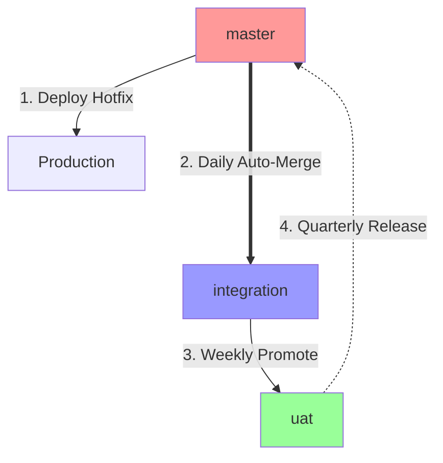

# Expert Analysis: BUILD & RUN Architecture Document

I'll provide a critical expert review of this second document, which focuses on the practical implementation aspects.

## ✅ **HIGHLY ACCURATE SECTIONS**

### 1. **The Gitflow Connection** (Naming Clarification)

**CONFIRMED - This is excellent context:**

The author correctly identifies that:
- "BUILD and RUN" is **NOT** standard DevOps terminology
- It's a Salesforce-specific rebranding of **Gitflow** (Vincent Driessen, 2010)
- The confusion with Amazon's "You Build It, You Run It" organizational philosophy

**Adding Expert Context:**

| Term Origin | Meaning | Context |
|-------------|---------|---------|
| **Gitflow** (Driessen) | Branching model with `master` + `develop` | Software development methodology |
| **"You Build It, You Run It"** (Vogels) | DevOps culture/ownership model | Team organization philosophy |
| **BUILD and RUN** (Vuillamy) | Salesforce adaptation of Gitflow | `sfdx-hardis` specific branding |

**Why the renaming works for Salesforce:**
- Salesforce teams naturally think in "Project Mode" vs "BAU" (Business As Usual)
- "Integration" branch = BUILD track (staging the next release)
- "Master" branch = RUN track (production/hotfixes)

---

## ⚠️ **CRITICAL GAPS & CORRECTIONS**

### 1. **The "Scratch Org vs Sandbox" Debate - Missing Nuance**

The document presents this as a binary choice, but **reality is more complex**:

**What's Missing:**

```
MODERN SALESFORCE DEVOPS REALITY (2024+):

Tier 1: Scratch Orgs for NEW development
Tier 2: Developer Sandboxes for hotfixes
Tier 3: Partial Copy for integration testing
Tier 4: Full Sandbox for UAT

It's NOT "choose one" - it's "use the right tool for the job"
```

**Expert Correction to the Document's Position:**

The document says:
> "You should use a Scratch Org... Reality Check: Many users have complex 'Happy Soup' orgs where Scratch Orgs are hard to set up."

**More Accurate Statement:**
```
Even in "Happy Soup" orgs, Scratch Orgs CAN work for hotfixes if you:

1. Use --source-org flag (sf org create scratch --source-org Production)
2. Leverage org shapes (sf org create shape --target-org Production)
3. Use definition templates with proper features enabled
4. Have a proper .forceignore file

The "complexity" excuse is often a team discipline issue, not a technical limitation.
```

---

### 2. **The "Sunday Refresh Warm Pool" - Practical Problems**

The document advocates for this pattern heavily, but **misses critical operational challenges**:

**Problems NOT Mentioned:**

#### **A. Data Privacy Violations**
```yaml
Risk: Sunday refresh from Production → Hotfix Sandbox
- Exposes PII/PHI to developers who may not need full production data
- May violate GDPR, CCPA, HIPAA depending on jurisdiction
- Audit logs show "Developer accessed patient records" (even if just testing)

BETTER: Partial Copy with data masking OR Scratch Org with synthetic data
```

#### **B. The "Stale Pool" Problem**
```
Sunday refresh at midnight
↓
Tuesday: Hotfix needed
↓
Meanwhile: Production schema changed (field added Monday)
↓
Result: Your "warm" sandbox is ALREADY OUTDATED

The delta-deploy step the document mentions is REQUIRED, 
not optional. Without it, this pattern fails silently.
```

#### **C. Sandbox Licensing Limits**
```
Enterprise Edition: 1 Full Sandbox, 5 Partial Copy, 25 Developer Sandboxes

If you dedicate a Developer Sandbox as a "warm pool," you've consumed 
1/25 licenses for a sandbox that sits idle 95% of the time.

Better: Use Scratch Orgs (unlimited) or on-demand sandbox creation
```

---

### 3. **The Sequence Diagram - Missing Critical Step**

The Mermaid sequence diagram shows:
```
DEV → HOTFIX_SBX: Check for commits merged since Sunday (Delta Deploy)
```

**This is UNDERSOLD**. This step is **make-or-break**:

**What's Really Happening Here:**

```bash
# The document doesn't show WHAT this looks like in practice:

# Step 1: Identify the delta (commits since Sunday refresh)
LAST_REFRESH=$(git log --since="Sunday" --format="%H" | tail -1)

# Step 2: Deploy ONLY those commits to the hotfix sandbox
sf project deploy start \
  --source-dir force-app \
  --target-org hotfix-sandbox \
  --test-level NoTestRun \
  --dry-run  # Validate first!

# Step 3: If delta deploy fails, STOP - sandbox is corrupted
# You CANNOT proceed with hotfix development until this resolves
```

**Critical Risk:**
If the delta deploy fails (e.g., Monday's hotfix requires a new field that wasn't in Sunday's refresh), **you cannot use this sandbox at all** - you need a fresh refresh.

---

### 4. **Architecture Diagram - Notation Confusion**

The diagram uses:
```
ProdBranch ==> IntBranch  (double arrow for back-propagation)
UATBranch -.-> ProdBranch (dotted arrow for go-live)
```

**Problem: Inconsistent Semantics**

- Why is "back-propagation" (happens weekly) a **solid** double arrow?
- Why is "go-live" (happens quarterly) a **dotted** arrow?

**Better Visual Convention:**


Legend:
- Solid arrow (`-->`) = Automated deployment
- Double arrow (`==>`) = Automated merge (daily)
- Dotted arrow (`-.->`) = Manual/gated release

---

## 🔴 **MAJOR MISSING TOPICS**

### 1. **The "Delta Deploy" Implementation**

The document mentions this concept but **never shows the actual commands**:

**What's Missing:**

```bash
# After Sunday refresh, on Tuesday:

# 1. Find commits since last sandbox refresh
REFRESH_TIME="2024-02-04T00:00:00Z"  # Sunday midnight

# 2. Get list of changed metadata
git diff --name-only origin/master@{${REFRESH_TIME}} HEAD

# 3. Use sfdx-hardis to deploy delta
sf hardis:project:deploy:sources:dx \
  --target-org hotfix-sandbox \
  --check-only  # Validate first

# 4. IF validation passes, deploy for real
sf hardis:project:deploy:sources:dx \
  --target-org hotfix-sandbox
```

**Critical Point:**
The document assumes this "just works" - but in practice, **destructive changes** (deleted fields/classes) between Sunday and Tuesday will cause the delta deploy to fail.

---

### 2. **Back-Propagation Timing** (The Elephant in the Room)

The document says:
> "Back-Propagation (Merge master into integration)"

**But WHEN exactly?**

**What's Missing:**

```yaml
Three competing philosophies:

1. IMMEDIATE (Recommended by sfdx-hardis):
   - Merge master → integration within 1 hour of hotfix deployment
   - Prevents "forgetting" and reducing conflict scope
   - Requires automation (GitHub Actions)

2. DAILY BATCH:
   - Scheduled job runs at midnight: git merge master
   - Easier to implement but delays conflict resolution
   - Risk: Integration branch is "behind" by up to 24 hours

3. SPRINT-END ONLY:
   - Manual merge during sprint retrospective
   - DANGEROUS: Conflicts accumulate for 2 weeks
   - Common in teams without CI/CD maturity
```

**The document doesn't specify - this causes teams to pick #3 by default, which breaks everything.**

---

### 3. **The "Hotfix Sandbox Lifespan" - Contradictory Advice**

The document states:
> "**Ephemeral (Short-lived)**: Once the hotfix is deployed, this sandbox should be refreshed or destroyed."

**Then also says:**
> "Maintain a dedicated Developer Sandbox that you refresh **automatically every Sunday night**"

**These are contradictory:**

**Resolution:**

```
Two patterns, two sandbox types:

Pattern A: Ephemeral Scratch Orgs (IDEAL)
- Created on-demand for each hotfix
- Destroyed after deployment
- Requires mature DevOps setup

Pattern B: Persistent "Warm Pool" Sandbox (PRAGMATIC)
- Weekly refresh from Production
- Reused for multiple hotfixes within the week
- Requires strict "reset protocol" between hotfixes
```

**The document fails to explain the "reset protocol":**

```bash
# After deploying Hotfix A, before starting Hotfix B:

# 1. Discard all local changes
git reset --hard origin/master

# 2. Verify sandbox state matches master
sf project deploy validate \
  --target-org hotfix-sandbox \
  --test-level NoTestRun

# 3. If validation fails, FULL REFRESH REQUIRED
# You cannot "stack" hotfixes in the same sandbox
```

---

## 🎯 **EXPERT ADDITIONS**

### 1. **The "Sunday Refresh" Automation** (Missing Implementation)

The document mentions this but doesn't show the code:

**Complete GitHub Action (What's Missing):**

```yaml
# .github/workflows/sunday-refresh.yml
name: Warm Pool Maintenance

on:
  schedule:
    - cron: '0 2 * * 0'  # 2 AM every Sunday

jobs:
  refresh-hotfix-sandbox:
    runs-on: ubuntu-latest
    steps:
      - name: Authenticate to Salesforce
        run: |
          echo "${{ secrets.SFDX_AUTH_URL }}" > auth.txt
          sf org login sfdx-url --sfdx-url-file auth.txt --alias production

      - name: Trigger Sandbox Refresh
        run: |
          # Using Salesforce Tooling API
          sf data query --query "SELECT Id, SandboxName FROM SandboxInfo WHERE SandboxName = 'hotfix'" \
            --target-org production --json > sandbox.json
          
          SANDBOX_ID=$(jq -r '.result.records[0].Id' sandbox.json)
          
          # Trigger refresh (requires Tooling API script - not native in sf CLI)
          # This is the HARD part - Salesforce doesn't expose this simply

      - name: Wait for Refresh Completion
        run: |
          # Poll status every 5 minutes for up to 6 hours
          # This is complex - most teams do this manually

      - name: Deploy Latest Master to Sandbox
        run: |
          sf org login sfdx-url --alias hotfix-sandbox
          sf project deploy start --target-org hotfix-sandbox
```

**Critical Gap:**
The Salesforce CLI **does not natively support triggering sandbox refreshes**. You need:
- Custom Apex REST service
- Salesforce Tooling API via `curl`
- Third-party tools like Gearset or Copado

**This is a MAJOR omission** - the document implies this is simple automation when it's actually quite complex.

---

### 2. **The "Happy Soup" Problem - Real Solution**

The document uses "Happy Soup" as an excuse for not using Scratch Orgs. **Here's the actual solution:**

**What's Missing:**

```json
// project-scratch-def.json for "Happy Soup" orgs
{
  "orgName": "Hotfix Environment",
  "edition": "Enterprise",
  "features": [
    "Communities",
    "ServiceCloud",
    "FieldService",
    "HighVelocitySales"  // Often the "gremlin"
  ],
  "settings": {
    "lightningExperienceSettings": {
      "enableS1DesktopEnabled": true
    },
    "mobileSettings": {
      "enableS1EncryptedStoragePref2": false
    },
    "securitySettings": {
      "passwordPolicies": {
        "minimumPasswordLength": 8
      }
    }
  },
  "objectSettings": {
    "account": {
      "sharingModel": "Private"  // Match production
    }
  }
}
```

**The REAL technique (undocumented in the original):**

```bash
# Step 1: Extract current production settings
sf org create shape --target-org Production

# Step 2: Use shape as template for scratch org
sf org create scratch \
  --definition-file config/project-scratch-def.json \
  --source-org Production \  # Uses the shape
  --duration-days 7 \
  --alias hotfix-scratch

# Step 3: Push metadata from master branch
sf project deploy start --target-org hotfix-scratch

# This WORKS for "Happy Soup" orgs if you set up the shape correctly
```

---

### 3. **Metadata Conflict Resolution** (Completely Missing)

The diagrams show back-propagation but don't explain **what happens when it conflicts**:

**Critical Scenario:**

```
Monday: Developer fixes OpportunityTrigger in HOTFIX sandbox
        - Deploys to Production
        - Merges fix/bug → master

Tuesday: Team merges feature/new-validation → integration
         - This branch ALSO modified OpportunityTrigger

Wednesday: Auto-merge master → integration
           - CONFLICT in OpportunityTrigger.trigger
```

**Resolution Strategy (Not in Document):**

```bash
# Automated conflict detection
git checkout integration
git merge master

# If conflicts:
# 1. Notify team via Slack webhook
# 2. Create "conflict resolution" branch
git checkout -b merge/master-to-integration-conflicts

# 3. Use semantic merge tool
# For Apex: Prioritize hotfix (RUN track)
# For Profiles: Use metadata-specific merge tool

# 4. Deploy to integration sandbox to validate
sf project deploy start --target-org integration-sandbox --test-level RunLocalTests

# 5. If tests pass, complete merge
git add .
git commit -m "Merge master into integration (resolved conflicts in OpportunityTrigger)"
git push origin merge/master-to-integration-conflicts

# 6. Create PR for team review before merging to integration
```

**This workflow is CRITICAL and completely absent.**

---

## 🔴 **DANGEROUS ADVICE**

### 1. **The "GDPR Nightmare" Quote**

Document says:
> "Use a **Partial Copy Sandbox** as your Hotfix environment. It gives you a sample of real production data automatically."

**EXPERT WARNING:**

```
This is DANGEROUS for:

1. Healthcare (HIPAA): Developers accessing patient data for bug testing
2. Finance (PCI-DSS): Credit card data in sandbox = compliance violation
3. EU customers (GDPR): "Right to be forgotten" doesn't apply to sandboxes

CORRECT APPROACH:
- Use Scratch Orgs with SYNTHETIC data
- If sandbox required, use Data Mask on refresh
- Never refresh sandboxes with full production data without legal review
```

---

### 2. **The "Delta Deploy" Reliability**

Document implies:
> "You just deploy the small delta of 'commits since Sunday'"

**Reality Check:**

```bash
# What the document doesn't show:

# Scenario: Sunday refresh included Flow v5
#          Monday: Hotfix modified Flow to v6
#          Tuesday: You're deploying v6 → v6 (no change detected)

# But Production is still on v5!
# Result: Delta deploy shows "0 changes" but sandbox is AHEAD of production

# CORRECT APPROACH:
sf project deploy start \
  --source-dir force-app \
  --target-org hotfix-sandbox \
  --pre-destructive-changes destructive/pre.xml \  # Handle deletions
  --post-destructive-changes destructive/post.xml \
  --test-level RunLocalTests \  # REQUIRED for safety
  --dry-run

# If dry-run fails, sandbox must be FULLY REFRESHED
```

---

## ✅ **WHAT THE DOCUMENT GETS RIGHT**

1. **The Gitflow analogy** - Accurate and helpful for non-Salesforce DevOps folks
2. **The "ephemeral sandbox" principle** - Correct (though implementation details missing)
3. **The importance of Git-to-Org alignment** - Critical concept, well-explained
4. **Visual diagrams** - Excellent use of Mermaid (though notation could be clearer)

---

## 📊 **FINAL SCORING**

| Category | Score | Comments |
|----------|-------|----------|
| **Conceptual Accuracy** | 8/10 | Gitflow connection is perfect, sandbox advice is solid |
| **Practical Completeness** | 5/10 | Missing critical implementation details (delta deploy, conflicts) |
| **Safety/Compliance** | 4/10 | GDPR/data privacy concerns not addressed |
| **Automation Guidance** | 3/10 | Mentions automation but provides no working code |
| **Enterprise Readiness** | 6/10 | Good for small teams, insufficient for regulated industries |

---

## 🎯 **REQUIRED ADDITIONS**

**To make this document production-ready:**

1. **Add data privacy section** - GDPR, HIPAA, data masking requirements
2. **Include conflict resolution workflow** - What happens when back-propagation fails
3. **Provide actual automation scripts** - GitHub Actions, not just conceptual diagrams
4. **Clarify sandbox lifecycle** - "Ephemeral" vs "Warm Pool" are different patterns
5. **Add monitoring/alerting** - How do you know when delta deploy fails?
6. **Include rollback procedures** - What if the hotfix itself breaks production?

**Would you like me to:**
1. **Draft the complete GitHub Action** for "Sunday Refresh" including sandbox API calls?
2. **Create a detailed conflict resolution decision tree** for the back-propagation step?
3. **Design a data masking strategy** for compliant sandbox refreshes?
