# GitOps Delivery Comparison: sfdx-hardis vs Gearset (GitHub Focus)

## Executive Summary

This document compares two Salesforce DevOps approaches for managing deliveries with long-lived branches and permanent orgs (INT, UAT, PROD) using **GitHub** as the version control platform. Both tools support GitHub Actions and Pull Requests (PRs) but differ significantly in implementation, philosophy, and feature sets.

---

## 1. Branch Strategy Overview

### 1.1 sfdx-hardis: Long Branches with Permanent Orgs

sfdx-hardis uses a **BUILD/RUN** separation model with long-lived branches mapped to permanent Salesforce orgs. GitHub Actions workflows are auto-generated during setup.

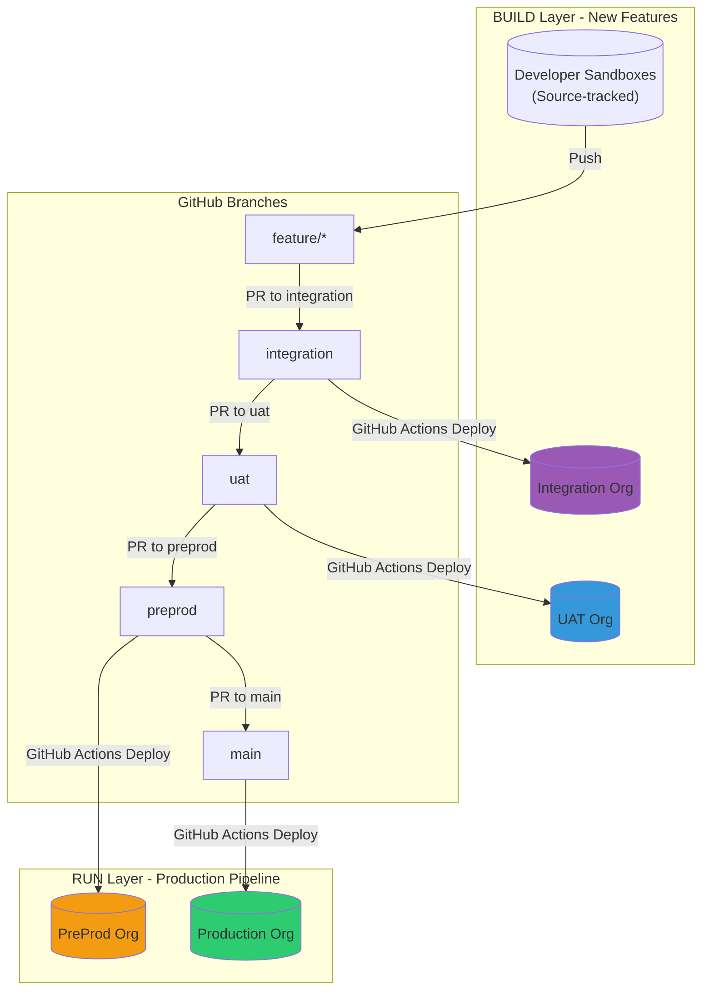

### 1.2 Gearset: Expanded Branching Model

Gearset uses an **expanded branching model** with promotion branches and automatic back-propagation. Integrates natively with GitHub for PR management.

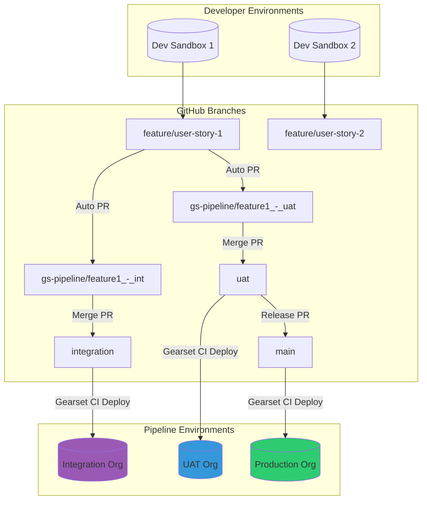

---

## 2. Retrofit vs Back-Propagation

### 2.1 sfdx-hardis Retrofit Process

The retrofit mechanism in sfdx-hardis retrieves production changes and propagates them back to lower environments (typically preprod/uat) via automated GitHub PRs.

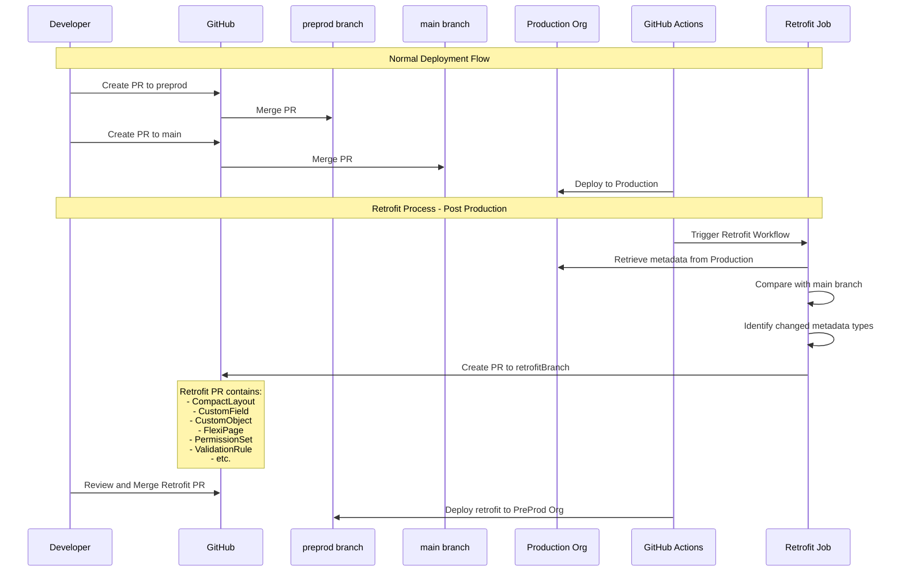

**sfdx-hardis Retrofit Configuration (.sfdx-hardis.yml):**
```yaml
productionBranch: main
retrofitBranch: preprod
sourcesToRetrofit:
  - CompactLayout
  - CustomApplication
  - CustomField
  - CustomLabel
  - CustomMetadata
  - CustomObject
  - FlexiPage
  - Layout
  - PermissionSet
  - ValidationRule
retrofitIgnoredFiles:
  - force-app/main/default/flexipages/Dashboard.flexipage-meta.xml
```

**GitHub Actions Workflow (auto-generated):**
```yaml
name: Retrofit from Production
on:
  workflow_dispatch:
  schedule:
    - cron: '0 6 * * *'  # Daily at 6 AM
jobs:
  retrofit:
    runs-on: ubuntu-latest
    steps:
      - uses: actions/checkout@v4
      - name: Run Retrofit
        run: sf hardis:org:retrieve:sources:retrofit
```

### 2.2 Gearset Back-Propagation Process

Gearset automatically creates back-propagation PRs in GitHub after changes are merged to main, keeping all upstream environments synchronized.

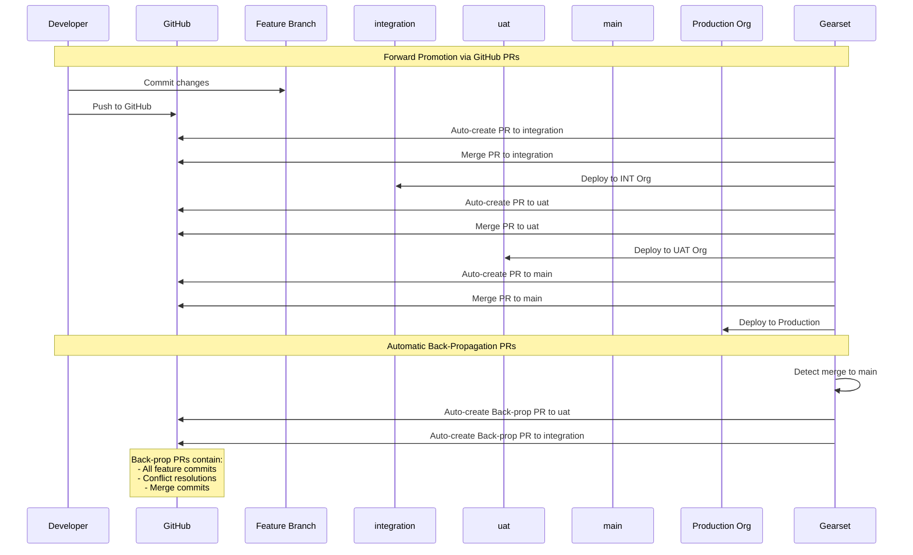

---

## 3. Release Branch Model Comparison

### 3.1 sfdx-hardis: UAT-based Release with GitHub PRs

In sfdx-hardis, the release is essentially the state of the UAT branch at a given point, which then flows to preprod and production via sequential GitHub PRs.

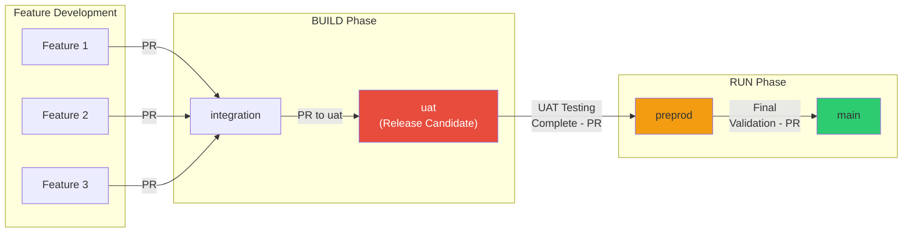

**GitHub Branch Protection Rules (recommended):**
```
main:
  - Require PR reviews: 2 approvers
  - Require status checks: deployment validation
  - No direct pushes

preprod:
  - Require PR reviews: 1 approver
  - Require status checks: deployment validation

uat:
  - Require status checks: deployment validation

integration:
  - Require status checks: deployment validation
```

### 3.2 Gearset: Explicit Release Branch with GitHub Integration

Gearset provides an explicit release branch mechanism for bundling multiple features into a single coordinated release, all managed via GitHub PRs.

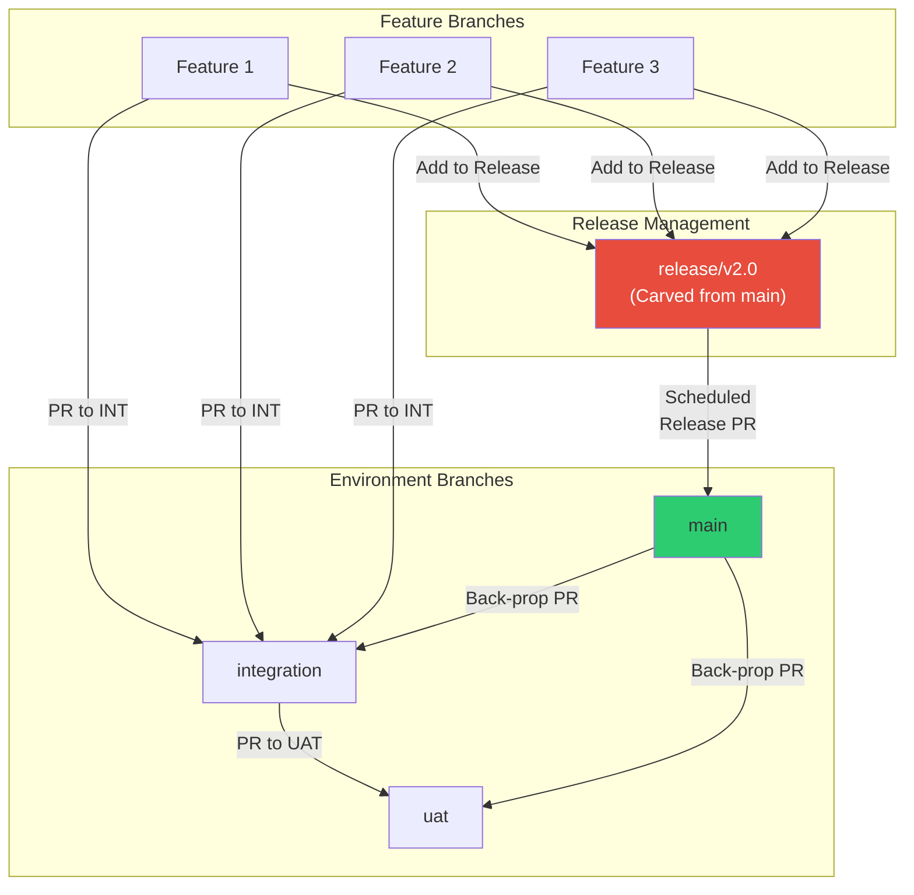

---

## 4. Complete GitHub Workflow Diagrams

### 4.1 sfdx-hardis Complete GitHub Actions Flow

```mermaid
flowchart TB
    subgraph "Developer Workflow"
        START((Start))
        CREATE_SB[Create Source-tracked<br/>Sandbox from INT]
        DEVELOP[Develop in Sandbox]
        PULL[Pull changes to local]
        COMMIT[Commit to feature branch]
        PUSH[Push to GitHub]
        CREATE_PR[Create Pull Request<br/>to integration]
    end
    
    subgraph "GitHub Actions - BUILD"
        VALIDATE_INT[Validate against INT<br/>on PR open]
        MERGE_INT[Merge PR to integration]
        DEPLOY_INT[Deploy to INT Org]
        
        CREATE_PR_UAT[Create PR to uat]
        VALIDATE_UAT[Validate against UAT]
        MERGE_UAT[Merge PR to uat]
        DEPLOY_UAT[Deploy to UAT Org]
    end
    
    subgraph "GitHub Actions - RUN"
        CREATE_PR_PREPROD[Create PR to preprod]
        VALIDATE_PREPROD[Validate against PreProd]
        MERGE_PREPROD[Merge PR to preprod]
        DEPLOY_PREPROD[Deploy to PreProd Org]
        
        CREATE_PR_MAIN[Create PR to main]
        VALIDATE_PROD[Validate against PROD]
        MERGE_MAIN[Merge PR to main]
        DEPLOY_PROD[Deploy to Production]
    end
    
    subgraph "Retrofit via GitHub Actions"
        TRIGGER_RETROFIT[Scheduled/Manual Trigger]
        RETRIEVE_PROD[Retrieve from Production]
        CREATE_RETROFIT_PR[Create Retrofit PR<br/>to preprod]
        MERGE_RETROFIT[Review and Merge PR]
    end
    
    START --> CREATE_SB --> DEVELOP --> PULL --> COMMIT --> PUSH --> CREATE_PR
    CREATE_PR --> VALIDATE_INT
    VALIDATE_INT -->|Pass| MERGE_INT --> DEPLOY_INT
    DEPLOY_INT --> CREATE_PR_UAT --> VALIDATE_UAT
    VALIDATE_UAT -->|Pass| MERGE_UAT --> DEPLOY_UAT
    DEPLOY_UAT --> CREATE_PR_PREPROD --> VALIDATE_PREPROD
    VALIDATE_PREPROD -->|Pass| MERGE_PREPROD --> DEPLOY_PREPROD
    DEPLOY_PREPROD --> CREATE_PR_MAIN --> VALIDATE_PROD
    VALIDATE_PROD -->|Pass| MERGE_MAIN --> DEPLOY_PROD
    
    DEPLOY_PROD --> TRIGGER_RETROFIT
    TRIGGER_RETROFIT --> RETRIEVE_PROD --> CREATE_RETROFIT_PR --> MERGE_RETROFIT
```

**Example GitHub Actions Workflow (.github/workflows/deploy.yml):**
```yaml
name: Deploy to Salesforce
on:
  pull_request:
    branches: [integration, uat, preprod, main]
  push:
    branches: [integration, uat, preprod, main]

jobs:
  validate:
    if: github.event_name == 'pull_request'
    runs-on: ubuntu-latest
    container: hardisgroupcom/sfdx-hardis:latest
    steps:
      - uses: actions/checkout@v4
      - name: Validate Deployment
        run: sf hardis:project:deploy:sources:dx --check

  deploy:
    if: github.event_name == 'push'
    runs-on: ubuntu-latest
    container: hardisgroupcom/sfdx-hardis:latest
    steps:
      - uses: actions/checkout@v4
      - name: Deploy to Org
        run: sf hardis:project:deploy:sources:dx
```

### 4.2 Gearset Complete GitHub Pipeline Flow

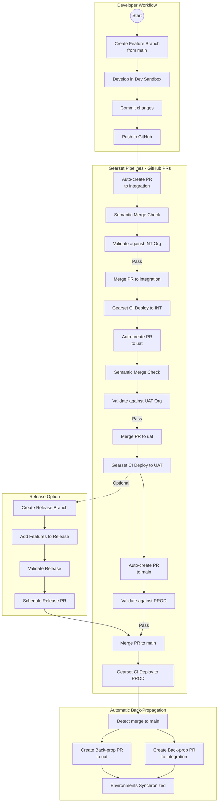

---

## 5. Hotfix Handling Comparison (GitHub)

### 5.1 sfdx-hardis Hotfix Process

```mermaid
flowchart LR
    subgraph "Hotfix in RUN Layer"
        ISSUE[Production Issue]
        CREATE_HF[Create hotfix branch<br/>from preprod]
        FIX[Apply fix]
        PR_PREPROD[PR to preprod]
        DEPLOY_PP[GitHub Actions<br/>Deploy to PreProd]
        PR_MAIN[PR to main]
        DEPLOY_PROD[GitHub Actions<br/>Deploy to Production]
    end
    
    subgraph "Retrofit to BUILD"
        RETROFIT[Retrofit GitHub Action]
        PR_INT[PR to integration]
        SYNC[Sync BUILD layer]
    end
    
    ISSUE --> CREATE_HF --> FIX --> PR_PREPROD --> DEPLOY_PP
    DEPLOY_PP --> PR_MAIN --> DEPLOY_PROD
    DEPLOY_PROD --> RETROFIT --> PR_INT --> SYNC
    
    style ISSUE fill:#e74c3c,color:#fff
```

### 5.2 Gearset Hotfix Process

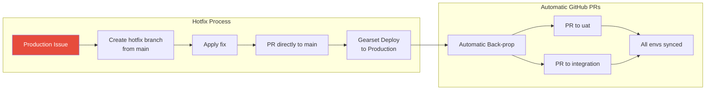

---

## 6. Feature Comparison Table (GitHub Focus)

| Feature | sfdx-hardis | Gearset |
|---------|-------------|---------|
| **Licensing** | Open-source (Free) | Commercial (Paid) |
| **GitHub Integration** | Native GitHub Actions | Native API integration |
| **PR Creation** | Manual (developer creates PRs) | Automatic (promotion branches) |
| **PR Validation** | GitHub Actions workflow | Gearset CI jobs |
| **Branch Strategy** | BUILD/RUN separation | Expanded branching model |
| **Promotion Branches** | Not used | Automatic (gs-pipeline/*) |
| **Conflict Resolution** | Standard Git (manual) | Semantic merge (automated) |
| **Back-sync Mechanism** | Retrofit (scheduled GitHub Action) | Back-propagation (automatic PRs) |
| **Release Branches** | Implicit (UAT state) | Explicit release branch with PRs |
| **PR Comments** | Deployment results posted | Validation results posted |
| **Branch Protection** | Standard GitHub rules | Respects GitHub rules |
| **Status Checks** | Via GitHub Actions | Via Gearset webhooks |
| **Quick Deploy** | Supported | Supported |
| **PR Review Integration** | Native GitHub reviews | Native GitHub reviews |
| **GitHub App** | Not required | Gearset GitHub App |

---

## 7. Pros and Cons Analysis (GitHub Context)

### 7.1 sfdx-hardis with GitHub

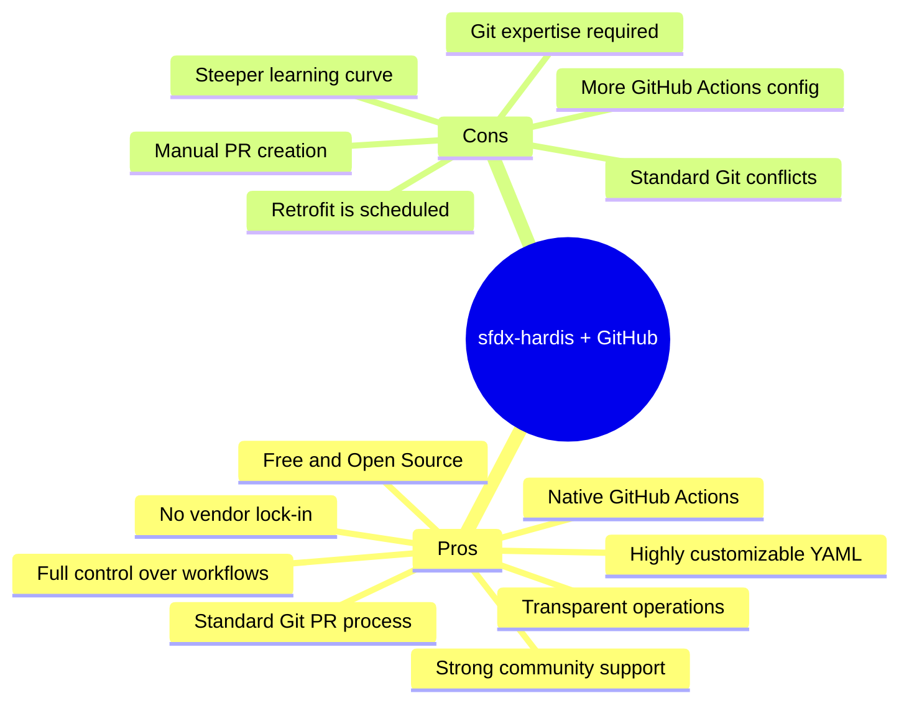

#### Detailed Pros:
1. **Cost-effective**: No licensing costs, uses free GitHub Actions minutes
2. **Native GitHub Actions**: Auto-generated workflows, easy to customize
3. **Standard PR workflow**: Developers use familiar GitHub PR process
4. **Transparency**: All operations visible in GitHub Actions logs
5. **Flexibility**: YAML configuration adapts to any org structure
6. **No vendor lock-in**: Standard Git and Salesforce CLI commands
7. **BUILD/RUN separation**: Clear distinction for production pipeline

#### Detailed Cons:
1. **Manual PR creation**: Developers must create PRs between branches
2. **Git expertise required**: Team needs solid Git fundamentals
3. **Standard conflicts**: No intelligent Salesforce metadata merge
4. **Retrofit timing**: Scheduled jobs, not real-time synchronization
5. **Setup investment**: Initial GitHub Actions configuration required

### 7.2 Gearset with GitHub

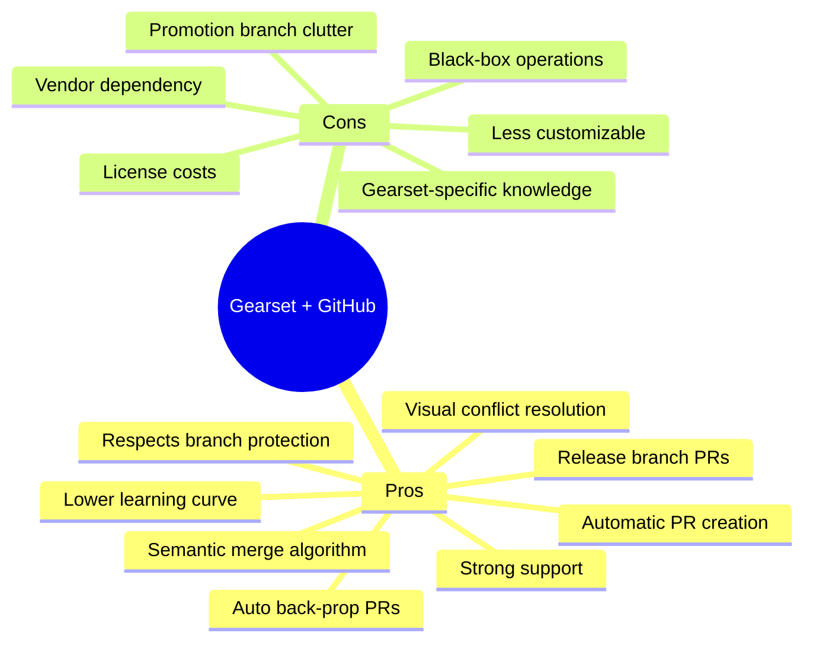

#### Detailed Pros:
1. **Automatic PR creation**: Promotion PRs created automatically in GitHub
2. **Semantic merge**: Understands Salesforce metadata, reduces PR conflicts
3. **Automatic back-propagation**: PRs created automatically after production merge
4. **Visual tools**: Conflict resolution UI integrated with GitHub PRs
5. **Release management**: Explicit release branches with scheduled PR merges
6. **Branch protection**: Respects all GitHub branch protection rules
7. **Lower barrier**: Admins can work without deep Git/GitHub knowledge

#### Detailed Cons:
1. **Cost**: Significant licensing investment
2. **Promotion branches**: gs-pipeline/* branches can clutter repository
3. **Vendor lock-in**: Workflow depends on Gearset infrastructure
4. **Learning curve**: Must understand Gearset's branching model
5. **Reduced transparency**: Some operations abstracted from GitHub

---

## 8. GitHub PR Workflow Comparison

### 8.1 PR Lifecycle Comparison

```mermaid
flowchart TB
    subgraph "sfdx-hardis PR Flow"
        SH_DEV[Developer creates PR]
        SH_GHA[GitHub Actions validates]
        SH_REVIEW[Manual review]
        SH_MERGE[Merge PR]
        SH_DEPLOY[GitHub Actions deploys]
        SH_NEXT[Developer creates next PR]
        
        SH_DEV --> SH_GHA --> SH_REVIEW --> SH_MERGE --> SH_DEPLOY --> SH_NEXT
    end
    
    subgraph "Gearset PR Flow"
        GS_PUSH[Developer pushes]
        GS_AUTO[Gearset auto-creates PR]
        GS_SEMANTIC[Semantic merge check]
        GS_VALIDATE[Gearset validates]
        GS_REVIEW[Manual review]
        GS_PROMOTE[Click Promote in Gearset]
        GS_DEPLOY[Gearset deploys]
        GS_NEXT[Gearset auto-creates next PR]
        
        GS_PUSH --> GS_AUTO --> GS_SEMANTIC --> GS_VALIDATE --> GS_REVIEW --> GS_PROMOTE --> GS_DEPLOY --> GS_NEXT
    end
```

### 8.2 Key GitHub PR Differences

| Aspect | sfdx-hardis | Gearset |
|--------|-------------|---------|
| **PR Creation** | Manual by developer | Automatic by Gearset |
| **PR Source Branch** | Feature branch directly | Promotion branch (gs-pipeline/*) |
| **PR Target** | Next environment branch | Next environment branch |
| **Validation Trigger** | PR open event | PR open + Gearset webhook |
| **Merge Action** | GitHub UI or CLI | Gearset UI (Promote button) |
| **Post-merge Deploy** | GitHub Actions on push | Gearset CI job |
| **Next Environment** | Manual PR creation | Automatic PR creation |
| **Conflict Detection** | Standard Git | Semantic merge |
| **PR Comments** | GitHub Actions results | Gearset validation results |

---

## 9. Decision Matrix

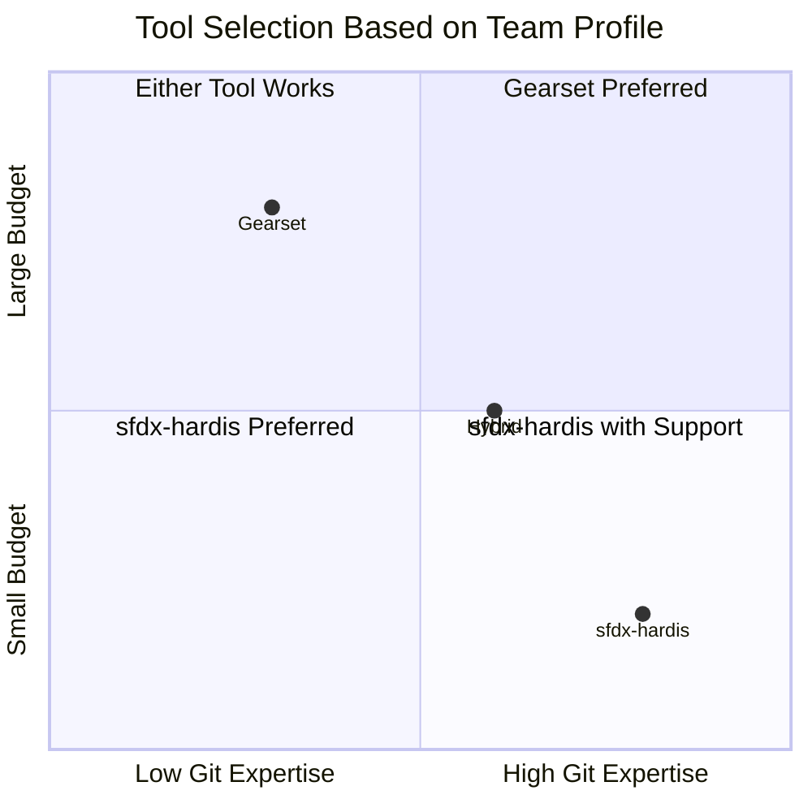

### When to Choose sfdx-hardis with GitHub:
- ✅ Budget constraints or cost-conscious organizations
- ✅ Teams with strong Git and GitHub expertise
- ✅ Need for maximum flexibility in GitHub Actions
- ✅ Preference for standard GitHub PR workflows
- ✅ Already comfortable with GitHub CLI and Actions
- ✅ Multiple projects (reusable workflow templates)

### When to Choose Gearset with GitHub:
- ✅ Teams with mixed technical expertise (admins + devs)
- ✅ Organizations prioritizing automation over customization
- ✅ Need for automatic PR creation and back-propagation
- ✅ Complex release management with bundled features
- ✅ Requirement for semantic merge capabilities
- ✅ Preference for visual tools while using GitHub

---

## 10. Validation & Problem Analysis Comparison

### 10.1 Validation Flow Overview

```mermaid
flowchart TB
    subgraph "sfdx-hardis Validation Pipeline"
        SH_PR[PR Created]
        SH_GHA[GitHub Actions Triggered]
        SH_DELTA[Delta Detection<br/>sfdx-git-delta]
        SH_CLEAN[Auto-Clean Sources<br/>autoCleanTypes]
        SH_DEP[Add Dependencies<br/>Delta with Dependencies]
        SH_VALIDATE[sf project deploy validate]
        SH_ASSISTANT[Deployment Assistant<br/>Error Analysis]
        SH_TIPS[Display Tips & Solutions]
        SH_COMMENT[Post PR Comment]
        
        SH_PR --> SH_GHA --> SH_DELTA --> SH_CLEAN --> SH_DEP --> SH_VALIDATE
        SH_VALIDATE -->|Errors| SH_ASSISTANT --> SH_TIPS --> SH_COMMENT
        SH_VALIDATE -->|Success| SH_COMMENT
    end
    
    subgraph "Gearset Validation Pipeline"
        GS_PR[PR Created]
        GS_WEBHOOK[Gearset Webhook]
        GS_COMPARE[Metadata Comparison]
        GS_ANALYZERS[Problem Analyzers<br/>100+ Analyzers]
        GS_SUGGEST[Suggest Fixes<br/>Add/Remove Items]
        GS_AUTO[Auto-Apply Fixes<br/>if configured]
        GS_VALIDATE[Salesforce Validation]
        GS_COMMENT[Post PR Comment]
        
        GS_PR --> GS_WEBHOOK --> GS_COMPARE --> GS_ANALYZERS --> GS_SUGGEST
        GS_SUGGEST -->|Manual| GS_VALIDATE
        GS_SUGGEST -->|Auto| GS_AUTO --> GS_VALIDATE
        GS_VALIDATE --> GS_COMMENT
    end
```

### 10.2 Problem Detection Capabilities

#### Key Difference: Proactive vs Reactive

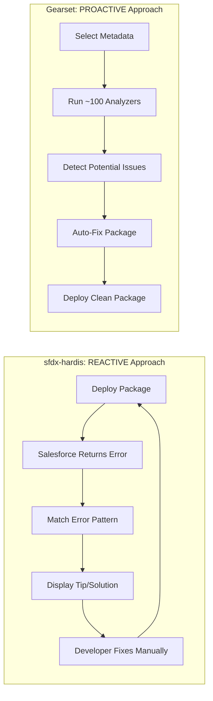

| Aspect | sfdx-hardis | Gearset |
|--------|-------------|---------|
| **Approach** | **Reactive** - Post-error analysis | **Proactive** - Pre-deployment prevention |
| **When it runs** | After Salesforce deployment fails | Before package is sent to Salesforce |
| **Detection method** | Pattern matching on SF error messages | Semantic analysis of metadata relationships |
| **Number of patterns/analyzers** | 100+ error patterns | ~100 specialized analyzers |
| **Can prevent errors?** | ❌ No (reacts to errors) | ✅ Yes (prevents errors) |
| **Auto-fix capability** | Pre-commit cleaning only | Pre-deployment package modification |

#### sfdx-hardis: Deployment Assistant (Reactive)

The Deployment Assistant provides a **predefined list of 100+ error patterns** that match Salesforce deployment error messages and provide human-readable tips and solutions.

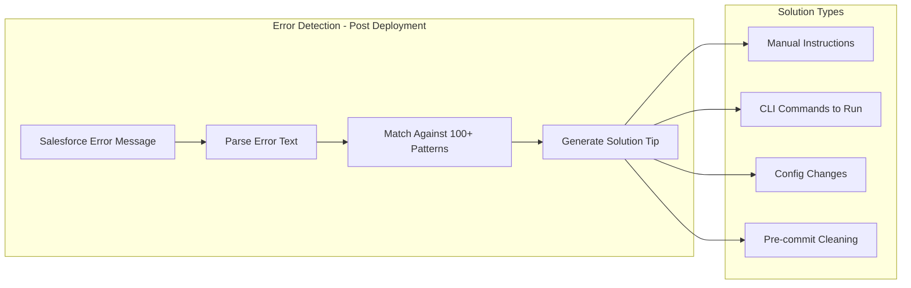

**How it works:**
1. Developer attempts deployment via GitHub Actions
2. Salesforce returns error (e.g., `Field Account.Rating__c does not exist`)
3. Deployment Assistant matches error against pattern database
4. Tip is displayed: "Add the custom field to your package.xml or create it in target org"
5. Developer manually fixes and retries

**Example Error Patterns & Solutions:**

| Error Type | Pattern Matched | Auto-Fix Available |
|------------|-----------------|-------------------|
| Missing Custom Field | `Field {X} does not exist` | ❌ Manual: Add field to package |
| Empty Items | Retrieved empty metadata | ✅ `sf hardis:project:clean:emptyitems` |
| Invalid References | Reference to deleted field | ✅ `sf hardis:project:clean:references` |
| API Version Mismatch | `not valid in version {X}` | ❌ Manual: Update XML apiVersion |
| Profile Permissions | `Permission not found` | ✅ `minimizeProfiles` pre-commit clean |
| ListView Scope Mine | `Cannot deploy Mine scope` | ✅ Auto-change + post-deploy fix |
| Data.com References | `Data.com not enabled` | ✅ `datadotcom` pre-commit clean |
| Sharing Rules Conflict | Multiple rules deployment | ❌ Manual: Use deployment plan |

#### Gearset: Problem Analyzers (Proactive)

Gearset provides **~100 specialized problem analyzers** that run **BEFORE deployment** to catch and fix issues proactively - preventing errors rather than reacting to them.

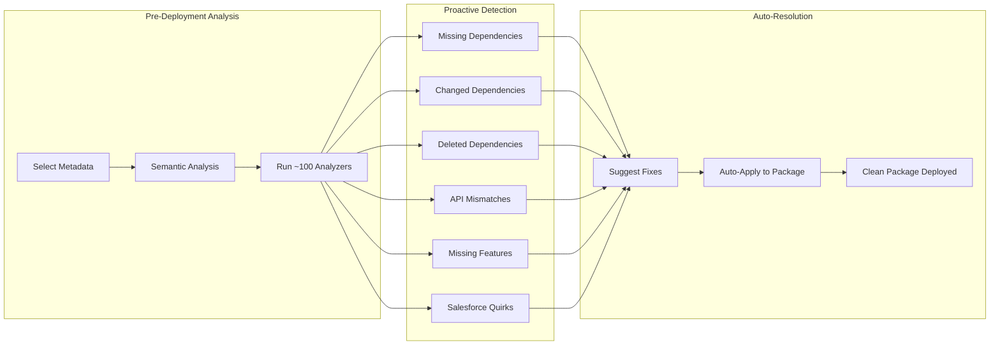

**How it works:**
1. Developer selects metadata in Gearset UI
2. Before any deployment, ~100 analyzers scan the package
3. Issues detected: "Missing dependency: Account.Rating__c"
4. Gearset suggests: "Add Account.Rating__c to deployment"
5. One checkbox click → dependency added automatically
6. Clean package deployed → no Salesforce error

**Gearset Problem Analyzers Categories:**

| Analyzer Category | Examples | Auto-Fix |
|-------------------|----------|----------|
| **Dependencies** | Missing, Changed, Deleted, Unresolved dependencies | ✅ Add/Remove from package |
| **API Versions** | Apex API mismatch, Flow version issues | ⚠️ Warning + suggestion |
| **Profiles/Permissions** | Missing field permissions, Invalid tabs | ✅ Add/Remove permissions |
| **Flows** | Deleted active flows, Flow definitions | ✅ Exclude from package |
| **Objects** | Master-detail relationships, History tracking | ✅ Add parent objects |
| **Special Cases** | Connected apps keys, Skills deletion | ⚠️ Warning + guidance |
| **Layouts** | Invalid action sort orders, Missing overrides | ✅ Auto-correct XML |
| **Features** | Feature not enabled in target org | ⚠️ Warning only |
| **CPQ** | CPQ record relationships, Config dependencies | ✅ Auto-manage relationships |

### Why Proactive is More Powerful

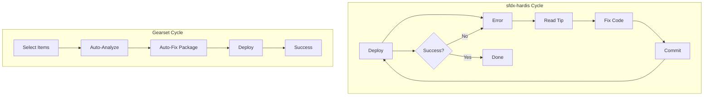

| Scenario | sfdx-hardis | Gearset |
|----------|-------------|---------|
| Missing 5 dependencies | 5 deploy cycles (SF shows 1 error at a time) | 1 cycle (all detected upfront) |
| Profile with invalid permission | Fail → Read tip → Clean → Retry | Auto-removed before deploy |
| Changed field dependency | Fail → Manual investigation | Auto-suggested to include |
| API version mismatch | Fail → Manual XML edit | Warning before deploy |

### 10.3 Auto-Correction Mechanisms

#### sfdx-hardis Auto-Clean Types

Configured in `.sfdx-hardis.yml`:

```yaml
# Auto-cleaning configuration
autoCleanTypes:
  - destructivechanges    # Remove files in destructiveChanges.xml
  - datadotcom           # Remove Data.com references
  - minimizeProfiles     # Remove permissions not in package
  - listViewsMine        # Convert Mine scope to Everything
  - emptyItems           # Remove empty retrieved items
  - hiddenFlowPositions  # Clean Flow position metadata
  - flowPositions        # Normalize Flow positions
  - managedbydcpermissions # Remove DCP-managed permissions

# Auto-remove specific user permissions from profiles
autoRemoveUserPermissions:
  - ViewAllData
  - ModifyAllData
  - ManageUsers
```

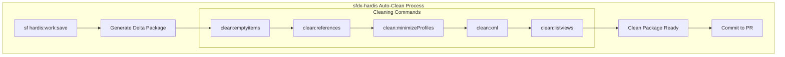

#### Gearset Auto-Apply Fixes

```mermaid
flowchart TB
    subgraph "Gearset Problem Resolution"
        DETECT[Analyzer Detects Issue]
        
        subgraph "Fix Options"
            MANUAL[Manual Selection]
            AUTO[Auto-Apply Enabled]
        end
        
        subgraph "Actions"
            ADD[Add Missing Items]
            REMOVE[Remove Invalid Items]
            MODIFY[Modify XML Content]
        end
        
        PACKAGE[Updated Package]
        AUDIT[Audit Trail Updated]
    end
    
    DETECT --> MANUAL
    DETECT --> AUTO
    MANUAL --> ADD
    MANUAL --> REMOVE
    AUTO --> ADD
    AUTO --> REMOVE
    AUTO --> MODIFY
    ADD --> PACKAGE
    REMOVE --> PACKAGE
    MODIFY --> PACKAGE
    PACKAGE --> AUDIT
```

### 10.4 Delta Deployment with Dependencies (sfdx-hardis)

sfdx-hardis includes a sophisticated **Delta with Dependencies** mode that automatically detects and includes related metadata.

```mermaid
flowchart TB
    subgraph "Delta with Dependencies Processors"
        DELTA[Delta Package]
        
        subgraph "Dependency Processors"
            P1[CustomFieldPicklistProcessor]
            P2[CustomFieldProcessor]
            P3[ObjectProcessor]
            P4[ProfilePermissionProcessor]
            P5[FlowProcessor]
            P6[ApexProcessor]
        end
        
        ENRICHED[Enriched Package]
    end
    
    DELTA --> P1
    P1 --> P2 --> P3 --> P4 --> P5 --> P6
    P6 --> ENRICHED
    
    P1 -.->|"Adds"| RT[Record Types]
    P1 -.->|"Adds"| TRANS[Translations]
    P2 -.->|"Adds"| LAYOUT[Layouts]
    P2 -.->|"Adds"| VR[Validation Rules]
    P3 -.->|"Adds"| TRIGGER[Triggers]
    P3 -.->|"Adds"| SHARING[Sharing Rules]
    P4 -.->|"Adds"| PERM[Permission Sets]
```

**Configuration:**
```yaml
# Enable delta with dependencies
useDeltaDeployment: true
useDeltaDeploymentWithDependencies: true
```

### 10.5 Detailed Comparison Table

| Capability | sfdx-hardis | Gearset |
|------------|-------------|---------|
| **Approach** | 🔄 Reactive (post-error) | ⚡ Proactive (pre-deployment) |
| **Analysis Timing** | After Salesforce returns error | Before package sent to Salesforce |
| **Problem Database** | 100+ error patterns (text matching) | ~100 semantic analyzers |
| **Can Prevent Errors?** | ❌ No - reacts to errors | ✅ Yes - prevents errors |
| **Missing Dependencies** | Delta with Dependencies mode | Missing Dependencies analyzer |
| **Changed Dependencies** | Manual detection | Changed Dependencies analyzer |
| **Deleted Dependencies** | Via destructiveChanges.xml | Deleted Dependencies analyzer |
| **API Version Issues** | Tips to fix manually | API mismatch analyzer + warning |
| **Profile Cleaning** | Pre-commit minimizeProfiles | Pre-deploy auto-add/remove |
| **Empty Items** | Pre-commit clean:emptyitems | Built into comparison |
| **Invalid References** | Pre-commit clean:references | Problem analyzers |
| **Flow Issues** | Tips + manual fix | Flow analyzers + auto-exclude |
| **Auto-Fix Mechanism** | Pre-commit cleaning (before PR) | Pre-deploy modification (in UI) |
| **Deployment Cycles** | Multiple (SF shows 1 error at a time) | Usually 1 (all issues detected upfront) |
| **Audit Trail** | Git commit history | Deployment summary |
| **CI Integration** | GitHub Actions logs + PR comments | PR comments + Gearset UI |
| **Customization** | YAML configuration | UI templates + analyzer selection |
| **Learning Required** | Config file + CLI knowledge | UI familiarity |

### 10.6 PR Comment Examples

#### sfdx-hardis PR Comment (GitHub)

```markdown
## 🚀 Deployment Validation Results

**Status:** ❌ Failed
**Target Org:** UAT
**Components:** 47 | **Errors:** 3

### Errors Found:

1. **CustomField: Account.Rating__c**
   - Error: `Field Account.Rating__c does not exist`
   - 💡 **Tip:** Add the custom field to your package.xml or create it in target org
   
2. **Profile: Sales User**
   - Error: `Field permission not found: Account.CustomField__c`
   - 💡 **Tip:** Run `sf hardis:project:clean:minimizeprofiles` to remove invalid permissions
   
3. **Flow: Lead_Assignment**
   - Error: `Property not valid in version 57.0`
   - 💡 **Tip:** Update apiVersion in Flow XML or retrieve with older API version

### Auto-Fix Available:
Run: `sf hardis:project:clean:references` to automatically clean invalid references
```

#### Gearset PR Comment (GitHub)

```markdown
## Gearset Validation Results

**Status:** ⚠️ Issues Found
**Pipeline:** UAT Environment

### Problem Analysis:

| Issue | Severity | Auto-Fix |
|-------|----------|----------|
| Missing dependency: Account.Rating__c | 🔴 High | ✅ Added |
| Changed dependency: Account object | 🟡 Medium | ✅ Added |
| API version mismatch: Lead_Assignment flow | 🟡 Medium | ❌ Manual |

### Actions Taken:
- ✅ Added 2 components to deployment package
- ⚠️ 1 issue requires manual resolution

**Validation Status:** Ready for re-validation
```

### 10.7 Validation Strategy Recommendations

```mermaid
flowchart TB
    subgraph "Recommended Validation Strategy"
        START[PR Created]
        
        subgraph "sfdx-hardis Approach"
            SH1[Enable Delta with Dependencies]
            SH2[Configure autoCleanTypes]
            SH3[Run sf hardis:work:save before commit]
            SH4[Let CI catch remaining issues]
            SH5[Use Deployment Assistant tips]
        end
        
        subgraph "Gearset Approach"
            GS1[Enable all Problem Analyzers]
            GS2[Configure auto-apply for safe fixes]
            GS3[Review suggested fixes in UI]
            GS4[Manual intervention for complex issues]
            GS5[Use deployment summary for audit]
        end
    end
    
    START --> SH1 --> SH2 --> SH3 --> SH4 --> SH5
    START --> GS1 --> GS2 --> GS3 --> GS4 --> GS5
```

---

## 10B. Flow Comparison & Visualization Tools

### Overview

Both tools provide Flow visualization capabilities, but with fundamentally different approaches:

| Aspect | sfdx-hardis | Gearset |
|--------|-------------|---------|
| **Technology** | Open-source (Mermaid.js) | Proprietary (Flow Navigator) |
| **Display Type** | Static diagrams (Markdown/PDF) | Interactive UI (mirrors Flow Builder) |
| **Integration** | VS Code + Markdown viewers | Built into Gearset web UI |
| **Cost** | Free | Included with Gearset license |
| **Interactivity** | View only | Click, drill-down, navigate |

### sfdx-hardis: Mermaid-based Flow Visualization

sfdx-hardis uses **Mermaid.js** (open-source diagramming library) to generate static but powerful flow visualizations.

```mermaid
flowchart TB
    subgraph "sfdx-hardis Flow Tools"
        CMD1["sf hardis:doc:flow2markdown"]
        CMD2["sf hardis:project:generate:flow-git-diff"]
        
        subgraph "Outputs"
            MD[Markdown File]
            MERMAID[Mermaid Diagram]
            PDF[PDF Export]
            HISTORY[Git History Diff]
        end
        
        subgraph "Viewing Options"
            VSCODE[VS Code + Mermaid Extension]
            WEB[mermaid.live website]
            MKDOCS[MkDocs documentation site]
        end
    end
    
    CMD1 --> MD --> MERMAID
    CMD1 --> PDF
    CMD2 --> HISTORY
    
    MERMAID --> VSCODE
    MERMAID --> WEB
    MD --> MKDOCS
```

**Key Commands:**

```bash
# Generate Flow documentation with Mermaid diagram
sf hardis:doc:flow2markdown --inputfile "force-app/main/default/flows/MyFlow.flow-meta.xml"

# Generate Flow Visual Git Diff (compare commits)
sf hardis:project:generate:flow-git-diff \
  --flow "force-app/main/default/flows/MyFlow.flow-meta.xml" \
  --commit-before 8bd290e9 \
  --commit-after e0835251
```

**Features:**
- ✅ Mermaid diagram generation (flowchart visualization)
- ✅ Git history diff (compare any two commits)
- ✅ Color highlighting: 🔴 Red = deleted, 🟢 Green = added
- ✅ PDF export for documentation/archiving
- ✅ AI integration for flow descriptions (optional)
- ✅ Detailed node information (variables, elements, etc.)
- ✅ Free and open-source

**Example Output (Mermaid in Markdown):**

```markdown
## Flow: Account_After_Update

### Flow Diagram
​```mermaid
flowchart TB
    Start([Start]) --> Decision1{Check Status}
    Decision1 -->|Active| Action1[Update Related Contacts]
    Decision1 -->|Inactive| Action2[Send Notification]
    Action1 --> End1([End])
    Action2 --> End2([End])
    
    style Action1 fill:#90EE90
    style Decision1 fill:#FFB6C1
​```
```

**Limitations:**
- ⚠️ Static display (no click interaction)
- ⚠️ Requires Mermaid-compatible viewer
- ⚠️ Manual command execution needed
- ⚠️ Not integrated into deployment workflow

### Gearset: Flow Navigator (Proprietary)

Gearset's **Flow Navigator** (released August 2024) is a proprietary, interactive visualization tool that mirrors Salesforce Flow Builder.

```mermaid
flowchart TB
    subgraph "Gearset Flow Navigator"
        COMPARE[Run Comparison]
        SELECT[Select Flow]
        
        subgraph "Interactive UI"
            DIAGRAM[Interactive Diagram]
            SIDEBAR[Element Sidebar]
            DRILLDOWN[Drill-down Details]
            VERSIONS[Version Switcher]
        end
        
        subgraph "Actions"
            DEPLOY[Deploy Flow]
            ACTIVATE[Activate in Target]
            ROLLBACK[Rollback Version]
        end
    end
    
    COMPARE --> SELECT --> DIAGRAM
    DIAGRAM --> SIDEBAR
    SIDEBAR --> DRILLDOWN
    DIAGRAM --> VERSIONS
    DIAGRAM --> DEPLOY --> ACTIVATE
```

**Features:**
- ✅ Interactive diagram (mirrors Flow Builder UI)
- ✅ Click elements to drill down into details
- ✅ Side-by-side visual comparison
- ✅ Color highlighting: New/Changed/Deleted elements
- ✅ Switch between Flow versions instantly
- ✅ Activate Flow during deployment (no manual step)
- ✅ Integrated into deployment workflow
- ✅ Real-time navigation (zoom, pan, full-screen)

**Workflow Integration:**
1. Run comparison in Gearset
2. Select a Flow with differences
3. Flow Navigator opens automatically
4. Visual diagram shows all changes
5. Click any element to see detailed diff
6. Deploy directly from the same UI
7. Option to activate Flow in target

**Limitations:**
- ⚠️ Requires Gearset license (paid)
- ⚠️ Proprietary - no offline/standalone use
- ⚠️ Web-based only (no VS Code integration)

### Side-by-Side Comparison

```mermaid
flowchart LR
    subgraph "sfdx-hardis"
        SH_IN[Flow XML] --> SH_PARSE[Parse Metadata]
        SH_PARSE --> SH_GEN[Generate Mermaid]
        SH_GEN --> SH_OUT[Static Diagram]
        SH_OUT --> SH_VIEW[View in VS Code/Web]
    end
    
    subgraph "Gearset"
        GS_IN[Flow Metadata] --> GS_COMPARE[Compare Source/Target]
        GS_COMPARE --> GS_RENDER[Render Interactive UI]
        GS_RENDER --> GS_INTERACT[Click/Navigate/Deploy]
    end
```

### Detailed Feature Comparison

| Feature | sfdx-hardis (Mermaid) | Gearset (Flow Navigator) |
|---------|----------------------|--------------------------|
| **Diagram Style** | Flowchart (Mermaid syntax) | Flow Builder replica |
| **Interactivity** | None (static image) | Full (click, zoom, pan) |
| **Diff Visualization** | Red/Green highlighting | New/Changed/Deleted badges |
| **Element Details** | In Markdown text below | Click to drill-down |
| **Version Comparison** | Git commit comparison | Version switcher in UI |
| **Deployment Integration** | Separate step | Integrated in same UI |
| **Activate Flow** | Manual in org | One-click during deploy |
| **Offline Use** | ✅ Yes (Markdown files) | ❌ No (web-based) |
| **VS Code Integration** | ✅ Yes (Mermaid extension) | ❌ No |
| **Documentation Output** | ✅ Markdown + PDF | ❌ No export |
| **AI Descriptions** | ✅ Optional integration | ❌ Not available |
| **Cost** | Free (open-source) | Included with license |
| **Learning Curve** | Medium (CLI commands) | Low (visual UI) |

### When to Use Which

| Scenario | Best Choice | Reason |
|----------|-------------|--------|
| **Quick deployment review** | Gearset | Interactive, integrated |
| **Documentation generation** | sfdx-hardis | Markdown/PDF export |
| **Offline analysis** | sfdx-hardis | Static files work anywhere |
| **Git history comparison** | sfdx-hardis | Native git commit diff |
| **Non-technical stakeholders** | Gearset | More intuitive UI |
| **Compliance/Audit documentation** | sfdx-hardis | Exportable artifacts |
| **Deployment activation** | Gearset | One-click activation |
| **Budget constraints** | sfdx-hardis | Free |

### Visual Example: Same Flow, Different Tools

**sfdx-hardis Output (Mermaid):**
```
┌─────────────────────────────────────────┐
│  Flow: Lead_Assignment                  │
├─────────────────────────────────────────┤
│  ┌───────┐                              │
│  │ Start │                              │
│  └───┬───┘                              │
│      ▼                                  │
│  ┌───────────┐  (NEW - Green)           │
│  │ Get Lead  │ ████████████             │
│  └─────┬─────┘                          │
│        ▼                                │
│  ┌─────────────┐ (CHANGED - Yellow)     │
│  │ Check Region│ ████████████           │
│  └──────┬──────┘                        │
│         ▼                               │
│    ┌────────┐   (DELETED - Red)         │
│    │ Assign │   ████████████            │
│    └────────┘                           │
└─────────────────────────────────────────┘
Static Markdown file viewable in VS Code
```

**Gearset Flow Navigator:**
```
┌─────────────────────────────────────────────────────────────┐
│  Flow Navigator: Lead_Assignment          [🔍] [⛶] [Deploy] │
├────────────────────┬────────────────────────────────────────┤
│ Elements           │                                        │
│ ├─ 🟢 Get Lead     │      ┌───────┐                        │
│ ├─ 🟡 Check Region │      │ Start │ ← Click to drill down  │
│ └─ 🔴 Assign       │      └───┬───┘                        │
│                    │          │                             │
│ Resources          │      🟢┌─▼─────┐                       │
│ ├─ Variables (2)   │        │Get Lead│ ← NEW (green)       │
│ └─ Formulas (1)    │        └───┬───┘                       │
│                    │            │                           │
│ Versions ▼         │      🟡┌───▼───┐                       │
│ • v3 (Active) ←    │        │Check  │ ← CHANGED (yellow)   │
│ • v2               │        │Region │                       │
│ • v1               │        └───────┘                       │
│                    │                                        │
│ [☑️ Activate after │  Interactive - click any element      │
│    deployment]     │  to see detailed changes              │
└────────────────────┴────────────────────────────────────────┘
```

---

## 11. Conclusion

Both sfdx-hardis and Gearset provide robust GitOps solutions for Salesforce CI/CD with GitHub, long-lived branches, and permanent orgs. The choice depends on:

| Factor | Favor sfdx-hardis | Favor Gearset |
|--------|-------------------|---------------|
| Budget | Limited | Available |
| GitHub Actions expertise | High | Low-Medium |
| PR automation needs | Standard is fine | Maximum automation |
| Conflict resolution | Standard Git OK | Need semantic merge |
| Team GitHub skills | Strong | Mixed |
| Customization needs | High | Standard |
| **Validation approach** | **Post-error tips + pre-commit cleaning** | **Pre-deployment analyzers + auto-fix** |
| **Problem detection** | **100+ error patterns** | **100+ specialized analyzers** |
| **Auto-correction** | **YAML-configured cleaning** | **UI checkbox selection** |

### Key Validation Differences Summary:

| Aspect | sfdx-hardis | Gearset |
|--------|-------------|---------|
| **Approach** | 🔄 **Reactive** - post-error tips | ⚡ **Proactive** - pre-deployment prevention |
| **When** | After Salesforce returns errors | Before package sent to Salesforce |
| **How** | Pattern matching on error messages | Semantic metadata analysis |
| **Problem Database** | 100+ error patterns | ~100 specialized analyzers |
| **Can Prevent Errors?** | ❌ No (reacts after failure) | ✅ Yes (prevents before failure) |
| **Deployment Cycles** | Multiple (fix → retry → fix → retry) | Usually 1 (all fixed upfront) |
| **Auto-Fix Scope** | Pre-commit source cleaning | Pre-deploy package modification |
| **Learning Curve** | Config files + CLI knowledge | UI-based, more intuitive |

**Key Takeaway**: 
- **sfdx-hardis** provides a **reactive, developer-centric approach**: pre-commit source cleaning prevents *some* issues, but most problem resolution happens *after* Salesforce returns errors via pattern-matched tips
- **Gearset** provides a **proactive, user-friendly approach**: ~100 analyzers detect potential issues *before* deployment, auto-fix packages in one click, typically requiring only one deployment cycle

The **retrofit (sfdx-hardis)** and **back-propagation (Gearset)** mechanisms serve the same fundamental purpose—keeping environments synchronized via GitHub PRs—but differ in automation level:
- **Retrofit**: Scheduled GitHub Action creates a PR from production changes
- **Back-propagation**: Immediate automatic PRs after merge to main
