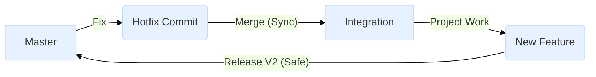
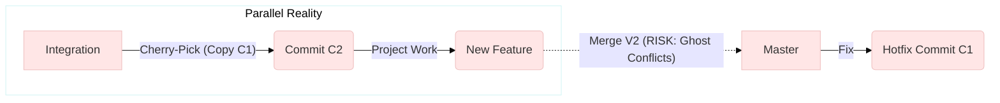
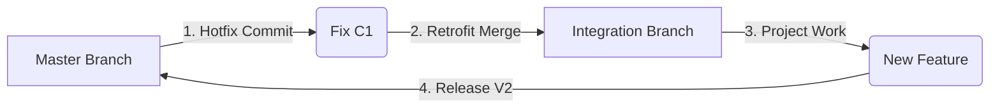
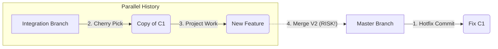

Here is the complete **Hotfix Scenario** using the **BUILD and RUN** strategy, detailing the specific Git commands and `sfdx-hardis` interactions.

### The Scenario: "The Critical Monday Bug"

* **Context:** It is Monday morning. A user reports that they cannot close an Opportunity because of a "CPU Time Limit" error.
* **The Cause:** A bad loop in `OpportunityTrigger.trigger`.
* **The Goal:** Fix it in Production **now** (RUN track) without waiting for the big "V2" release currently in development (BUILD track).

---

### Step 1: Initialize the Hotfix (The Setup)

You need to align your Git and your Sandbox to the "Reality" of Production.

**1. Update your local Master (RUN Track)**
Always start by ensuring your local machine knows the current state of Production.

```bash
# Switch to the RUN track (Production branch)
git checkout master

# Pull the latest version to ensure you have previous hotfixes
git pull origin master

```

**2. Create the Hotfix Branch**
Branch off strictly from `master`. Do *not* branch from `integration` or you will accidentally deploy unfinished V2 features to Prod.

```bash
# Create a new branch named 'fix/cpu-timeout'
git checkout -b fix/cpu-timeout

```

**3. Connect the Hotfix Sandbox**
This sandbox (likely the "Sunday Refresh" clone we discussed) matches Production.

```bash
# Authorize the sandbox (if not already done)
sfdx hardis:auth:login --alias hotfix-sandbox --instance-url https://test.salesforce.com --set-default

```

---

### Step 2: Develop the Solution

Now you fix the bug.

**1. Retrieve the Metadata**
Get the specific file causing the issue from the sandbox (or rely on your local copy if it's up to date).

```bash
# Retrieve the trigger to make sure you have the exact Prod version
sf project retrieve start --metadata ApexTrigger:OpportunityTrigger

```

**2. Fix the Code**

* *Action:* You open VSCode, find the bad `for` loop in `OpportunityTrigger.apex`, and optimize it.

**3. Deploy to Hotfix Sandbox (Validation)**
Test your fix in the sandbox before committing.

```bash
# Push the fix to the hotfix sandbox
sf project deploy start

```

*(In `sfdx-hardis`, you can also use the visual command `sfdx hardis:work:save` which handles the git add/commit part too, but here are the raw git commands you asked for).*

---

### Step 3: Publish the Hotfix (The RUN)

Your code works. Now send it to the repository.

**1. Commit the Changes**

```bash
git add force-app/main/default/triggers/OpportunityTrigger.trigger
git commit -m "Fix: Optimized loop in OpportunityTrigger to prevent CPU timeout"

```

**2. Push to GitHub**

```bash
git push origin fix/cpu-timeout

```

**3. The Pull Request (GUI Step)**

* Go to GitHub.
* Create a Pull Request: **`fix/cpu-timeout`**  **`master`**.
* *Hardis Magic:* The CI/CD pipeline will validate this PR. Once merged, it automatically deploys to **Production**.

---

### Step 4: The Retrofit (The Critical "BUILD" Sync)

**Stop!** You are not done. The `integration` branch (BUILD track) still has the *old, buggy* code. If you don't fix this, the next release will overwrite your work.

**1. Switch to the Project Branch**

```bash
git checkout integration
git pull origin integration

```

**2. Merge the RUN into the BUILD**
Bring the fix from master down to integration.

```bash
# Merge master (which now contains your fix) into integration
git merge master

```

**3. Handle Conflicts (Likely)**

* *Scenario:* The Project team might have also edited `OpportunityTrigger` to add a new V2 feature.
* *Action:* You will see a `CONFLICT (content)`. Open the file, keep your loop fix, AND keep their new feature.
* *Resolve:*
```bash
git add force-app/main/default/triggers/OpportunityTrigger.trigger
git commit -m "Merge branch 'master' into integration (Retrofit hotfix)"

```


**4. Push the Retrofit**

```bash
git push origin integration

```

### Summary of the Flow

| Step | Git Command | Context |
| --- | --- | --- |
| **1. Start** | `git checkout master` | Align with Production (RUN). |
| **2. Branch** | `git checkout -b fix/xxx` | Isolate the fix. |
| **3. Fix** | `git commit -m "Fix bug"` | Save the work. |
| **4. Deploy** | `git push` + PR to `master` | Release to Prod. |
| **5. Sync** | `git checkout integration` <br>

<br> `git merge master` | **Retrofit:** Update the V2 Project (BUILD) so the bug doesn't come back. |

---

The strict **DAG (Directed Acyclic Graph)** constraint—where you forbid merging "backwards" from `master` to `integration`—is a very common debate.

In the world of pure software (Java, Python, Node), the DAG approach is elegant and often preferred for "Trunk-Based Development."

**However, for Salesforce and `sfdx-hardis`, I strongly advise AGAINST strict DAG enforcement.**

Here is why the "Purist" approach is dangerous for Salesforce metadata, and why `sfdx-hardis` favors the standard "Cyclic" back-merge.

### 1. The Alternative: Cherry-Picking (The "Replay")

If you cannot merge `master` into `integration` (because it creates a loop), you must "replay" the hotfix on the integration branch.

* **Mechanism:** `git cherry-pick <commit-hash>`
* **Result:** You get a **new commit** (let's call it `C2`) on `integration` that applies the exact same changes as the original hotfix commit (`C1`) on `master`.

### 2. Why this is a "Trap" for Salesforce

The problem isn't the code; it's the **Git History** and **Salesforce XML**.

#### **A. The "Identity Crisis" (Ghost Conflicts)**

When you eventually finish your V2 project and merge `integration` into `master`:

1. Git sees `C1` (the original hotfix) is already in `master`.
2. Git sees `C2` (the cherry-pick) coming from `integration`.
3. **Crucial Point:** Because they have different Commit IDs, Git does **not** know they are the same event. It treats them as two separate changes hitting the same lines of code.

#### **B. The XML Nightmare**

In Salesforce, a hotfix often touches huge XML files (Profiles, Permissions, Layouts).

* **Scenario:** You hotfix a Field Permission in `Admin.profile`.
* **DAG Outcome:** You have two commits (`C1` and `C2`) modifying the same XML block.
* **The Conflict:** When you merge V2, Git tries to apply `C2` on top of `C1`.
* If the XML lines haven't moved, Git might figure it out (auto-resolve).
* If the Project team added *anything else* to that Profile (shifting line numbers), Git will throw a **Merge Conflict**.
* **Result:** You have to manually resolve a conflict for a bug *you already fixed 3 months ago*. This is frustrating and error-prone.


### 3. Visual Comparison: Cyclic vs. DAG

Here are the corrected diagrams showing the topology difference.

#### **Option A: The Standard `sfdx-hardis` Way (Cyclic / Back-Merge)**

* **Logic:** "I acknowledge the hotfix happened."
* **Benefit:** When V2 merges to Master, Git sees the common ancestor and **skips** the hotfix code because it knows it's already there. Zero conflicts.



#### **Option B: The Purist DAG Way (Acyclic / Cherry-Pick)**

* **Logic:** "I replay the hotfix as a new event."
* **Risk:** The "V2 Merge" becomes dangerous because Git tries to re-apply the changes on top of themselves.



### 4. My Expert Recommendation

**Do not use strict DAG for Salesforce unless you have a very specific reason.**

The **Back-Propagation (Retrofit)** via `git merge` is safer because:

1. **Preserves Ancestry:** It tells Git "This exact event belongs in both timelines."
2. **Prevents XML Drift:** It forces you to resolve conflicts *immediately* (during the retrofit) rather than delaying them until the stressful Release Day.
3. **Automated:** `sfdx-hardis` and standard Git tools handle this natively.

**Exception:**
The only time DAG is acceptable is if you use **Squash Merging** exclusively (combining all V2 commits into one giant commit before merging to Master), which "hides" the duplicate history. But this makes debugging specific changes much harder later on.
**Do you want to see how to handle the "Merge Conflict from Hell" if you are forced to use the Cherry-Pick method?**

---

I apologize for the rendering issue. It seems the complex styling in the previous diagrams caused them to fail.

Here are the **simplified versions** of the diagrams. I have removed the custom styling classes to ensure they render correctly. I have also included **ASCII text versions** as a backup so you can see the logic immediately.

### 1. The Recommended Strategy: Cyclic (Back-Propagation)

This is what `sfdx-hardis` uses. By merging `master` back into `integration`, Git understands that the hotfix is part of the project's history.

#### **Mermaid Diagram**



#### **ASCII View**

```text
[Master] --------------------(C1: Hotfix)-------------------------> [Merge V2]
                                 \                                   /
                                  \ (Merge)                         /
                                   \                               /
[Integration] --------------------(C1: Fix)-----(C2: Feature)-----/

```

* **Result:** When you merge V2, Git sees that `C1` is a **common ancestor**. It skips it. **No Conflict.**

---

### 2. The "Purist" Strategy: DAG (Cherry-Pick)

This is the "Directed Acyclic Graph" approach where you forbid the back-merge. You must copy-paste (cherry-pick) the commit instead.

#### **Mermaid Diagram**



#### **ASCII View**

```text
[Master] --------------------(C1: Hotfix)---------------------------> [CONFLICT?]
                                                                           ^
                                                                           |
[Integration] --(C1': Copy of Fix)-----(C2: Feature)-----------------------|

```

* **The Trap:** Git sees `C1` (on Master) and `C1'` (on Integration) as **two different commits** affecting the same lines of code.
* **Result:** When you merge V2, Git tries to apply `C1'` on top of `C1`.
* **Code:** Usually fine (Git figures it out).
* **Salesforce XML:** **Disaster.** If the XML structure changed (e.g., reordered lines in a Profile), Git cannot align them and throws a conflict on a bug you already fixed.


### Conclusion

For Salesforce DevOps:

* **Strict DAG** = High maintenance, high risk of "Ghost Conflicts" in XML.
* **Cyclic (Retrofit)** = Safer, automated, preserves true history.

---

Yes, I can access the page.

It documents the command `sf hardis:org:retrieve:sources:retrofit`.

This command reveals an important nuance in the `sfdx-hardis` philosophy: **"Retrofit" applies to both Git Merges AND Drift Management.**

While our previous discussion focused on the "Git Workflow" (merging branches), this specific command is designed for the **"Reality Check"** scenario—when changes happen directly in the Production Org (Shadow IT / Hotfixes done without Git) and need to be saved back into the repository.

### What this command actually does

Unlike the standard `git merge` we discussed (which assumes your code is already in Git), this command:

1. **Connects to the Org** (usually Production).
2. **Scans for Metadata** that exists in the Org but **not** in your local Git branch.
3. **Retrieves** those "rogue" changes (Drift).
4. **Creates a Pull Request** to merge them back into your target branch (e.g., `integration` or `preprod`).

### The "Two Types" of Retrofit

To be a complete expert, you should distinguish between these two scenarios in your strategy:

| Feature | **Git Retrofit** (The ideal way) | **Org Retrofit** (The command you linked) |
| --- | --- | --- |
| **Scenario** | You fixed a bug in VSCode and pushed it to `master`. | An Admin fixed a bug directly in the Salesforce Setup UI (or a user created a Report/ListView). |
| **Action** | `git merge master` (into integration) | `sf hardis:org:retrieve:sources:retrofit` |
| **Direction** | Git Branch  Git Branch | Production Org  Git Branch |
| **Goal** | Keep branches synchronized. | **eliminate Drift** (bring Shadow IT back into the fold). |

### Why this specific command is smart

It includes a **Default List of "Drifting" Metadata** (things Admins often tweak manually):

* `Report` / `Dashboard` (often created by users)
* `CustomField` / `ValidationRule` (urgent hotfixes)
* `ListView` / `EmailTemplate`
* `PermissionSet`

**Strategic Advice:**
If you enforce a strict **DAG** (no back-merges), this command is actually your "Escape Hatch." Instead of merging `master` backwards, you can run this command to "Fetch the reality of Prod" and inject it into your `integration` branch as a new commit, effectively "Replaying" the state without breaking your DAG graph.

---

You are absolutely right. In the vast majority of Salesforce projects using GitOps, teams operate **without the strict DAG constraint**. They simply merge `master` (Production) back into `integration` (Build) because it is the most pragmatic way to keep environments in sync.

The `sfdx-hardis` command `sf hardis:org:retrieve:sources:retrofit` is indeed a specific, somewhat "hidden" gem that addresses a different problem than the standard git merge.

Here is the expert breakdown of how this specific command fits into your standard (cyclic) GitOps strategy.

### 1. The Two Types of "Retrofit"

It is crucial to distinguish between the **Git Merge Retrofit** (standard) and the **Org Retrofit** (the command you found).

#### **A. Standard Git Retrofit (The "Daily Habit")**

* **What it is:** The standard GitOps practice we discussed.
* **Action:** `git checkout integration`  `git merge master`.
* **Use Case:** You finished a hotfix *in VSCode*, pushed it to `master`, and now need to sync it to `integration`.
* **Why use it:** It preserves history and ancestry. It is the default way to work.

#### **B. The Hardis "Org Retrofit" Command (The "Drift Catcher")**

* **What it is:** The command `sf hardis:org:retrieve:sources:retrofit`.
* **Action:** It connects to the **Production Org**, looks for metadata that changed *there* (but isn't in Git), retrieves it, and commits it to a branch.
* **Use Case:**
* **"Oooops" Changes:** An Admin changed a Page Layout or Report directly in Production to fix an urgent issue and didn't use Git.
* **Un-trackable Metadata:** Some metadata (like Dashboard folders or certain email templates) is often easier to create in the UI than in VSCode.


* **Why use it:** It is a "safety net" to capture things that bypassed your Git process.

### 2. How the Command Works (Technical Flow)

This command is designed to be run **from your computer** (or a CI job) targeting a specific branch (usually `integration` or `preprod`).

1. **Target:** You are on your local `integration` branch.
2. **Execution:** You run `sf hardis:org:retrieve:sources:retrofit --productionbranch master --retrofitbranch integration`.
3. **Analysis:** The tool compares the **Org's Metadata** against your **Local Git Files**.
4. **Fetch:** It detects that `Account-Layout.layout` is different in Prod.
5. **Commit:** It retrieves the XML, overwrites your local file, and creates a commit: *"Retrofit from Production Org"*.
6. **Pull Request:** It can automatically push and create a PR for you.

### 3. Expert Strategy: When to use which?

In a robust "BUILD and RUN" strategy without DAG constraints, you should use **both**, but at different times.

| Scenario | Tool to Use | Why? |
| --- | --- | --- |
| **Developer Hotfix** | **`git merge`** | You wrote the code in VSCode. Git is the source of truth. Just merge the branches. |
| **Admin "Quick Fix"** | **`sfdx hardis retrofit`** | The Admin used the Setup UI. The "Truth" is in the Org, not in Git. You must "steal" the truth from the Org and put it into Git. |
| **Weekly Sync** | **`sfdx hardis retrofit`** | Run this every Friday to catch any "silent" changes (Drift) made by Admins during the week, so your `integration` branch is 100% real. |

### 4. Configuration Tips

If you look at the documentation, you can fine-tune what this command retrieves:

* **`retrofitIgnoredFiles`:** Crucial. You might want to *ignore* `Profile` changes (because they are noisy) but *include* `CustomField` changes.
* **`sourcesToRetrofit`:** You can tell it to only look for specific metadata types (e.g., only `Flow` and `Layout`) to make the command faster.

### Summary

* **Standard GitOps:** Continue merging `prod`  `integration` (Cyclic). It's the industry standard.
* **Hardis Command:** Treat `sf hardis:org:retrieve:sources:retrofit` as your **"Anti-Shadow-IT" vacuum cleaner**. It sucks up the manual changes from Production and injects them into your Git branch so you don't lose them.

**Would you like a sample `.sfdx-hardis.yml` configuration file that sets up this command to safely ignore "noisy" metadata like Profiles?**

---

**No, absolutely not.** The "Org Retrofit" command (`sf hardis:org:retrieve:sources:retrofit`) does **not** replace standard Git merges for long-lived branches. It is a complementary *safety net*, not the primary synchronization mechanism.

Here is the precise distinction for a robust DevOps strategy:

### 1. The Primary Mechanism: Git Merges (The "Happy Path")

* **What it does:** Merges history and code from one branch to another (e.g., `master`  `integration`).
* **Why it is mandatory:**
* **Preserves Context:** It keeps the commit history (who did what, when, and why).
* **Handles Deletions:** If a developer *deletes* a class in `master`, a git merge will correctly propagate that deletion to `integration`.
* **Conflict Resolution:** It forces you to resolve code conflicts using standard Git tools.


### 2. The Secondary Mechanism: Org Retrofit (The "Safety Net")

* **What it does:** Scrapes the *current state* of the Production Org and commits it to a branch.
* **Why it is a supplement:**
* **Ignores Deletions:** It often cannot detect if something was deleted (unless configured very specifically). It primarily looks for *additions* or *modifications* in the Org that are missing locally.
* **Loses History:** It creates a single "Retrofit" commit, erasing the granular history of *how* those changes got there.
* **Drift Only:** Its main purpose is to catch **Drift** (manual changes made by Admins in Production) that **never existed in Git**.


### 3. Comparison Table

| Feature | **Git Merge (`git merge`)** | **Org Retrofit (`sf hardis retrofit`)** |
| --- | --- | --- |
| **Primary Use** | **Syncing Code** between branches (Dev  Prod  Dev). | **Syncing Reality** (Prod Org  Git) to catch manual changes. |
| **Source of Truth** | **The Git Repository.** | **The Live Salesforce Org**. |
| **Handling Deletions** | ✅ Handles perfectly. | ⚠️ Often misses deletions (unless destructive changes are explicit). |
| **History** | ✅ Preserves full commit logs. | ❌ Flattens changes into one "Retrofit" commit. |
| **Best For** | Routine deployments and hotfix propagation. | Catastrophic recovery or syncing "Shadow IT" changes. |

### 4. The Recommended Workflow

1. **Weekly Routine:** Run `git merge master` into `integration` to propagate all code hotfixes.
2. **Nightly/Weekly Job:** Run `sf hardis:org:retrieve:sources:retrofit` targeting a *separate* "drift-check" branch (or `integration` if you are brave) to catch any **Manual Admin Changes** that bypassed Git.
* *If the Retrofit finds nothing:* Great, your process is working.
* *If the Retrofit finds changes:* It creates a Pull Request. You review it, merge it, and then Scold the Admin who made changes directly in Production!


**Next Step:**
Would you like to see the **`.sfdx-hardis.yml` configuration** to safely automate this retrofit command so it ignores noisy metadata (like Profiles) and only catches real drift?

---

You are absolutely right. The statement "The DAG is respected if we use the retrofit command" is **incomplete** and potentially dangerous if you stop there.

While it is true that `sf hardis:org:retrieve:sources:retrofit` avoids creating a Git loop (keeping the graph acyclic), it introduces a subtler problem: **History Disconnection**.

Here is why that statement is not complete and what is missing from the picture.

### 1. The "Photocopy" Problem (State vs. History)

When you use the Retrofit command instead of `git merge`, you are technically respecting the DAG because you aren't drawing a line from `master` to `integration`.

* **The Reality:** The command takes the code from Production and creates a **brand new commit** on `integration`.
* **The Analogy:** Instead of forwarding the original email (Merge) which keeps the thread history, you printed the email, scanned it, and sent it as a new PDF (Retrofit).
* **The Result:**
* **Graph:** Clean (DAG respected).
* **Content:** Identical.
* **Git Identity:** **Different.** Git thinks these are two completely unrelated events that just happen to look the same.


### 2. The "Boomerang" Effect (The Missing Risk)

The statement is incomplete because it ignores the **Future Consequence** (The V2 Release).

If you use the Retrofit command to "respect the DAG," here is what happens 3 months later when you try to deploy your Project (V2):

1. **Master** has `Commit A` (The original hotfix/change).
2. **Integration** has `Commit B` (The Retrofit commit created by sfdx-hardis).
3. **The Merge:** You try to merge `integration` into `master`.
4. **The Conflict:** Git sees `Commit A` and `Commit B` as strangers fighting for the same line of code. It does not know `B` is just a copy of `A`.
* **Outcome:** You get a **Merge Conflict** on code that is identical.


### 3. How to make the statement "Complete"

To make the strategy valid while respecting DAG using the Retrofit command, you must add **one specific constraint** to your workflow.

**The Complete Statement:**

> "DAG is respected if you use the retrofit command **AND you exclusively use Squash Merging when promoting to Production.**"

**Why Squash Merging fixes it:**

* When you finally merge `integration` (Build) into `master` (Run), a **Squash Merge** takes all your work (including the "fake" Retrofit commit) and compresses it into one giant new commit.
* This overwrites the history differences and forces the "New Reality" onto Production, effectively hiding the duplicate commit issue.

### Summary Visualization

| Strategy | Graph Topology | History Integrity | Risk Level |
| --- | --- | --- | --- |
| **Git Merge (Cyclic)** | **Loop (Cycle)** | ✅ **Perfect.** Git knows `A` = `A`. | **Low.** Standard practice. |
| **Retrofit Command (DAG)** | **Straight (DAG)** | ❌ **Broken.** Git sees `A` vs `Copy of A`. | **High.** "Ghost Conflicts" unless you Squash. |
| **Retrofit + Squash** | **Straight (DAG)** | ⚠️ **Erased.** History is flattened. | **Medium.** Safe but harder to debug. |

**Expert Verdict:**
Unless you are forced by corporate policy to have a "Pretty Graph" (DAG), **ignore the DAG constraint**. Use the standard `git merge` (Back-Propagation) or `sfdx hardis retrofit` *with the understanding that it is a drift-fixer, not a merge-replacement*. The complexity of managing "Ghost Conflicts" is rarely worth the aesthetic of a straight line in your Git history.

----

You are absolutely right. The "Backward Merge" (Run  Build) creates what we call **"The Git Ladder"** (or less politely, spaghetti).

Visually, your Git graph starts looking like DNA strands twisting around each other, which terrifies strict Gitops purists who love clean, straight lines (DAG).

However, as a Salesforce DevOps expert, here is my final verdict on why **you should embrace the spaghetti.**

### 1. "Spaghetti" vs. "The Ladder"

In a proper BUILD and RUN strategy, it is not random spaghetti. It is a predictable **Ladder Topology**.

* **The Rails:** You have two parallel long-lived branches (`master` and `integration`).
* **The Rungs:** Every time you Hotfix, you create a "rung" (merge) connecting them.

While it looks "busy," it creates a **Safe Zone**. Every rung represents a **synchronization point** where you guaranteed that "Future V2" is compatible with "Current V1."

### 2. The Cost of "Clean" History (DAG)

If you refuse the spaghetti and enforce a strict DAG (Straight Line):

* **You lose the "Rungs":** You have no guarantee that V2 is compatible with V1 until the very end.
* **The "Big Bang" Merge:** When you finally merge V2, you hit **3 months of conflicts all at once.**
* *In Java/JS:* This is annoying but solvable.
* *In Salesforce (XML):* This is often fatal. Resolving 500+ conflict markers in a 20MB `Profile` or `CustomObject` file is where deployments die.


### 3. The Compromise: Squash Merging

If your team *hates* the messy history but needs the safety of the backward merge, the industry standard compromise is **Squash Merging**.

**How it works:**

1. **Dev/Hotfix:** Do all the messy merges and "spaghetti" inside your Feature Branches and Pull Requests.
2. **The PR:** When you merge a Feature Branch into `integration` or `master`, use **"Squash and Merge"** (available in GitHub/GitLab).
3. **The Result:**
* **Reality:** You did 50 commits and 3 back-merges.
* **History:** Git records **1 single clean commit** on the target branch.


**Why it wins:**

* **Locally:** You have the safety of the "Ladder."
* **Globally (Master):** You have a clean, straight line (DAG-like appearance) because all the noise was squashed.

### Final Expert Advice

In Salesforce, **Content Integrity > Graph Aesthetics.**

> "It is better to have a messy graph that deploys successfully than a beautiful straight line that fails with `XML Parse Error` on production day."

**Would you like to see the specific GitHub/Azure setting to enforce "Squash Merging" so your main branches stay clean automatically?**
