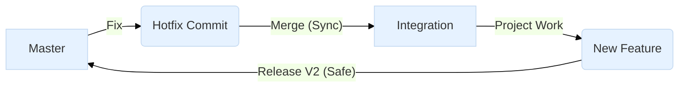
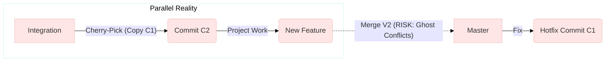

Here is the complete **Hotfix Scenario** using the **BUILD and RUN** strategy, detailing the specific Git commands and `sfdx-hardis` interactions.

### The Scenario: "The Critical Monday Bug"

* **Context:** It is Monday morning. A user reports that they cannot close an Opportunity because of a "CPU Time Limit" error.
* **The Cause:** A bad loop in `OpportunityTrigger.trigger`.
* **The Goal:** Fix it in Production **now** (RUN track) without waiting for the big "V2" release currently in development (BUILD track).

---

### Step 1: Initialize the Hotfix (The Setup)

You need to align your Git and your Sandbox to the "Reality" of Production.

**1. Update your local Master (RUN Track)**
Always start by ensuring your local machine knows the current state of Production.

```bash
# Switch to the RUN track (Production branch)
git checkout master

# Pull the latest version to ensure you have previous hotfixes
git pull origin master

```

**2. Create the Hotfix Branch**
Branch off strictly from `master`. Do *not* branch from `integration` or you will accidentally deploy unfinished V2 features to Prod.

```bash
# Create a new branch named 'fix/cpu-timeout'
git checkout -b fix/cpu-timeout

```

**3. Connect the Hotfix Sandbox**
This sandbox (likely the "Sunday Refresh" clone we discussed) matches Production.

```bash
# Authorize the sandbox (if not already done)
sfdx hardis:auth:login --alias hotfix-sandbox --instance-url https://test.salesforce.com --set-default

```

---

### Step 2: Develop the Solution

Now you fix the bug.

**1. Retrieve the Metadata**
Get the specific file causing the issue from the sandbox (or rely on your local copy if it's up to date).

```bash
# Retrieve the trigger to make sure you have the exact Prod version
sf project retrieve start --metadata ApexTrigger:OpportunityTrigger

```

**2. Fix the Code**

* *Action:* You open VSCode, find the bad `for` loop in `OpportunityTrigger.apex`, and optimize it.

**3. Deploy to Hotfix Sandbox (Validation)**
Test your fix in the sandbox before committing.

```bash
# Push the fix to the hotfix sandbox
sf project deploy start

```

*(In `sfdx-hardis`, you can also use the visual command `sfdx hardis:work:save` which handles the git add/commit part too, but here are the raw git commands you asked for).*

---

### Step 3: Publish the Hotfix (The RUN)

Your code works. Now send it to the repository.

**1. Commit the Changes**

```bash
git add force-app/main/default/triggers/OpportunityTrigger.trigger
git commit -m "Fix: Optimized loop in OpportunityTrigger to prevent CPU timeout"

```

**2. Push to GitHub**

```bash
git push origin fix/cpu-timeout

```

**3. The Pull Request (GUI Step)**

* Go to GitHub.
* Create a Pull Request: **`fix/cpu-timeout`**  **`master`**.
* *Hardis Magic:* The CI/CD pipeline will validate this PR. Once merged, it automatically deploys to **Production**.

---

### Step 4: The Retrofit (The Critical "BUILD" Sync)

**Stop!** You are not done. The `integration` branch (BUILD track) still has the *old, buggy* code. If you don't fix this, the next release will overwrite your work.

**1. Switch to the Project Branch**

```bash
git checkout integration
git pull origin integration

```

**2. Merge the RUN into the BUILD**
Bring the fix from master down to integration.

```bash
# Merge master (which now contains your fix) into integration
git merge master

```

**3. Handle Conflicts (Likely)**

* *Scenario:* The Project team might have also edited `OpportunityTrigger` to add a new V2 feature.
* *Action:* You will see a `CONFLICT (content)`. Open the file, keep your loop fix, AND keep their new feature.
* *Resolve:*
```bash
git add force-app/main/default/triggers/OpportunityTrigger.trigger
git commit -m "Merge branch 'master' into integration (Retrofit hotfix)"

```


**4. Push the Retrofit**

```bash
git push origin integration

```

### Summary of the Flow

| Step | Git Command | Context |
| --- | --- | --- |
| **1. Start** | `git checkout master` | Align with Production (RUN). |
| **2. Branch** | `git checkout -b fix/xxx` | Isolate the fix. |
| **3. Fix** | `git commit -m "Fix bug"` | Save the work. |
| **4. Deploy** | `git push` + PR to `master` | Release to Prod. |
| **5. Sync** | `git checkout integration` <br>

<br> `git merge master` | **Retrofit:** Update the V2 Project (BUILD) so the bug doesn't come back. |

---

The strict **DAG (Directed Acyclic Graph)** constraint—where you forbid merging "backwards" from `master` to `integration`—is a very common debate.

In the world of pure software (Java, Python, Node), the DAG approach is elegant and often preferred for "Trunk-Based Development."

**However, for Salesforce and `sfdx-hardis`, I strongly advise AGAINST strict DAG enforcement.**

Here is why the "Purist" approach is dangerous for Salesforce metadata, and why `sfdx-hardis` favors the standard "Cyclic" back-merge.

### 1. The Alternative: Cherry-Picking (The "Replay")

If you cannot merge `master` into `integration` (because it creates a loop), you must "replay" the hotfix on the integration branch.

* **Mechanism:** `git cherry-pick <commit-hash>`
* **Result:** You get a **new commit** (let's call it `C2`) on `integration` that applies the exact same changes as the original hotfix commit (`C1`) on `master`.

### 2. Why this is a "Trap" for Salesforce

The problem isn't the code; it's the **Git History** and **Salesforce XML**.

#### **A. The "Identity Crisis" (Ghost Conflicts)**

When you eventually finish your V2 project and merge `integration` into `master`:

1. Git sees `C1` (the original hotfix) is already in `master`.
2. Git sees `C2` (the cherry-pick) coming from `integration`.
3. **Crucial Point:** Because they have different Commit IDs, Git does **not** know they are the same event. It treats them as two separate changes hitting the same lines of code.

#### **B. The XML Nightmare**

In Salesforce, a hotfix often touches huge XML files (Profiles, Permissions, Layouts).

* **Scenario:** You hotfix a Field Permission in `Admin.profile`.
* **DAG Outcome:** You have two commits (`C1` and `C2`) modifying the same XML block.
* **The Conflict:** When you merge V2, Git tries to apply `C2` on top of `C1`.
* If the XML lines haven't moved, Git might figure it out (auto-resolve).
* If the Project team added *anything else* to that Profile (shifting line numbers), Git will throw a **Merge Conflict**.
* **Result:** You have to manually resolve a conflict for a bug *you already fixed 3 months ago*. This is frustrating and error-prone.


### 3. Visual Comparison: Cyclic vs. DAG

Here are the corrected diagrams showing the topology difference.

#### **Option A: The Standard `sfdx-hardis` Way (Cyclic / Back-Merge)**

* **Logic:** "I acknowledge the hotfix happened."
* **Benefit:** When V2 merges to Master, Git sees the common ancestor and **skips** the hotfix code because it knows it's already there. Zero conflicts.



#### **Option B: The Purist DAG Way (Acyclic / Cherry-Pick)**

* **Logic:** "I replay the hotfix as a new event."
* **Risk:** The "V2 Merge" becomes dangerous because Git tries to re-apply the changes on top of themselves.



### 4. My Expert Recommendation

**Do not use strict DAG for Salesforce unless you have a very specific reason.**

The **Back-Propagation (Retrofit)** via `git merge` is safer because:

1. **Preserves Ancestry:** It tells Git "This exact event belongs in both timelines."
2. **Prevents XML Drift:** It forces you to resolve conflicts *immediately* (during the retrofit) rather than delaying them until the stressful Release Day.
3. **Automated:** `sfdx-hardis` and standard Git tools handle this natively.

**Exception:**
The only time DAG is acceptable is if you use **Squash Merging** exclusively (combining all V2 commits into one giant commit before merging to Master), which "hides" the duplicate history. But this makes debugging specific changes much harder later on.
**Do you want to see how to handle the "Merge Conflict from Hell" if you are forced to use the Cherry-Pick method?**
