Here are the precise details for the **Retrofit** and **Monitoring** phases in the `sfdx-hardis` strategy. These are the two safety nets that keep your dual-track system from falling apart.

### 1. The Retrofit (Back-Propagation)

This is the **"Anti-Regression"** process. If you fix a bug in Production today but don't Retrofit, that bug will reappear the moment you deploy your new Project V2 next month.

* **Goal:** Merge the "Run" reality back into the "Build" fantasy.
* **Timing:** Immediately after a Hotfix deployment to Production.

| Component | Details |
| --- | --- |
| **Source Branch** | **`master`** (or `main`)  

  *Contains the hotfix code you just released.* |
| **Target Branch** | **`integration`** (or `develop`)  

  *Contains your unreleased V2 project.* |
| **Target Org** | **Integration Sandbox**  

  *You must deploy the result of the merge here to prove the hotfix doesn't break your new V2 features.* |
| **Command** | `git merge master` (into integration)  

  *Followed by a standard deployment to the Integration Sandbox.* |
| **Key Challenge** | **Merge Conflicts.**  

  *Example:* The hotfix modified an Apex Class that the Project team completely rewrote.  

  *Solution:* `sfdx-hardis` recommends enabling the **`sf-git-merge-driver`**. This tool intelligently handles XML merges (like permissions or profiles) so you don't have to fix 500 lines of XML manually. |

**The Workflow:**

1. **Checkout:** Switch to `integration`.
2. **Merge:** `git merge master`.
3. **Resolve:** Fix conflicts (if any).
4. **Deploy:** Push to `integration`  CI/CD deploys to **Integration Sandbox**.

---

### 2. Monitoring (Drift & Health)

In `sfdx-hardis`, "Monitoring" is primarily about detecting **Drift** (changes made directly in the Org without Git) and **Health** (limits, tests).

* **Goal:** Ensure the "Source of Truth" is actually true and that Production isn't breaking silently.
* **Timing:** Scheduled Nightly (e.g., 3 AM).

| Component | Details |
| --- | --- |
| **Monitored Org** | **Production**  

  *This is the only org that really matters for drift.* |
| **Reference Branch** | **`master`**  

  *The pipeline compares the live Org Metadata against this branch.* |
| **Process** | **Scheduled CI Job** (GitHub Action / Azure Pipeline). |
| **What it Checks** | 1. **Drift:** "Is there a new Field/Flow in Prod that is NOT in Git?" (Shadow IT detection). 

 2. **Tests:** "Do all Apex tests pass?" (Silent regression detection). 

 3. **Limits:** "Are we close to hitting API or Storage limits?" |

**The Workflow (Nightly Job):**

1. **Retrieve:** The CI pipeline retrieves metadata from **Production**.
2. **Compare:** It runs `sfdx hardis:org:diagnose` or a git diff against the **`master`** branch.
3. **Alert:**
* **If identical:** Green checkmark ✅.
* **If different:** Sends an alert (Slack/Email) saying "⚠️ **Drift Detected**: Admin Alice modified Flow X directly in Production."

4. **Action:** You must then decide to either **revert** the change in Prod or **back-promote** it into Git (hotfix branch) to make it official.

### Summary Visualization

```mermaid
%%{init: {'theme': 'base', 'themeVariables': { 'primaryColor': '#fff0f0', 'edgeLabelBackground':'#ffffff', 'tertiaryColor': '#e6f2ff'}}}%%
graph TD
    classDef git fill:#f9f9f9,stroke:#333,stroke-width:2px;
    classDef org fill:#ffffff,stroke:#666,stroke-width:2px,stroke-dasharray: 5 5;
    classDef action fill:#ffe6cc,stroke:#d79b00,stroke-width:2px;

    %% RETROFIT PROCESS
    subgraph RETROFIT ["1.RETROFIT(Manual/Triggered)"]
        direction TB
        Master("Git Branch: master<br/>(Contains Hotfix)"):::git
        Integration("Git Branch: integration<br/>(Contains Project V2)"):::git
        IntOrg("Org: Integration SBX<br/>(Test Environment)"):::org
        
        %% Corrected Arrow Syntax
        Master ==>|"git merge"| Integration
        Integration -->|"Deploy Result"| IntOrg
    end

    %% MONITORING PROCESS
    subgraph MONITORING ["2.MONITORING(Scheduled/Nightly)"]
        direction TB
        ProdOrg("Org: Production<br/>(Live)"):::org
        MasterRef("Git Branch: master<br/>(Reference)"):::git
        Alert("🚨 Alert: DRIFT DETECTED"):::action
        
        ProdOrg -.->|"1. Retrieve Metadata"| MasterRef
        MasterRef -.->|"2. If Diff > 0"| Alert
    end

    class Master,Integration,MasterRef git;
    class IntOrg,ProdOrg org;
    class Alert action;

```

