# The DAG Illusion & Optimal Hotfix Flow with sfdx-hardis

You've hit on something **critical** that the documentation obscures:

## 🎯 **The Truth About DAG in sfdx-hardis**

### **What You See (The Diagram):**
```
master → integration → uat → master
   ↓         ↓         ↓
  PROD      INT      UAT
```
Clean arrows. One direction. Beautiful DAG.

### **What Actually Happens (The Reality):**
```
master ←──────┐
  ↓            │
PROD          │ (Retrofit merge - hidden from diagram)
              │
integration ──┘
  ↓
INT sandbox
```

**The Secret:** The backward merge (`master → integration`) is **NOT shown in sfdx-hardis pipeline diagrams** because:
1. It's considered "maintenance," not "deployment"
2. It happens in GitHub/GitLab, not in Salesforce
3. The diagrams focus on "what deploys WHERE," not "how branches sync"

---

## 💡 **Why This Matters**

**sfdx-hardis doesn't enforce DAG** - it just doesn't draw the backward arrows in its documentation.

The tool is **agnostic** about your merge strategy. You can:
- ✅ Do backward merges (recommended)
- ✅ Use cherry-pick (if you hate yourself)
- ✅ Use squash merging
- ✅ Do manual retrofits via `sf hardis:org:retrieve:sources:retrofit`

**Nicolas Vuillamy's philosophy:**
> "I'll give you the tracks (RUN/BUILD). You choose how to keep them synchronized."

---

## 🏆 **My Optimal Hotfix Scenario (Pure sfdx-hardis)**

Here's the **complete, production-ready workflow** I'd implement:

### **Prerequisites (One-Time Setup)**

```yaml
# .sfdx-hardis.yml
productionBranch: master
developmentBranch: integration

# Sandbox definitions
orgs:
  production:
    type: production
    instanceUrl: https://login.salesforce.com
  
  hotfix:
    type: sandbox
    instanceUrl: https://test.salesforce.com
    # Refreshed from production weekly (manual or scripted)
  
  integration:
    type: sandbox
    instanceUrl: https://test.salesforce.com

# Retrofit settings
sourcesToRetrofit:
  - CustomObject
  - ApexClass
  - ApexTrigger
  - Flow
  - ValidationRule
  - PermissionSet

# Ignore noisy metadata
retrofitIgnoredFiles:
  - force-app/main/default/profiles/Admin.profile
  - force-app/main/default/settings/Security.settings
```

---

### **The Optimal Flow (Step-by-Step)**

#### **PHASE 1: Hotfix Development** (Monday 9 AM - Bug Reported)

```bash
# 1. Start from production reality
git checkout master
git pull origin master

# 2. Create hotfix branch (sfdx-hardis convention)
sfdx hardis:work:new

# This prompts you for:
# - Work type: "hotfix" 
# - Description: "Fix CPU timeout in OpportunityTrigger"
# Creates branch: hotfix/cpu-timeout-opportunitytrigger

# 3. Authorize hotfix sandbox
sfdx hardis:auth:login

# Select: hotfix sandbox
# This stores credentials in .sfdx/

# 4. CRITICAL: Check for drift
sfdx hardis:project:deploy:sources:dx \
  --check-only \
  --target-org hotfix

# If this shows differences:
# → Someone deployed to production since sandbox refresh
# → Deploy those differences FIRST before making changes

# 5. Make your code changes in VSCode
# Edit: force-app/main/default/triggers/OpportunityTrigger.trigger

# 6. Deploy and test iteratively
sfdx hardis:work:save

# This does:
# - Deploys changed files to hotfix sandbox
# - Runs relevant Apex tests
# - Commits changes to your local branch
# - Prompts: "Ready to push?" (say NO until fully tested)

# 7. Final validation
sfdx hardis:work:save --auto-push

# This does:
# - Final deployment check
# - Git commit
# - Git push origin hotfix/cpu-timeout-opportunitytrigger
```

---

#### **PHASE 2: Deployment to Production** (Monday 11 AM - Fix Ready)

```bash
# 8. Create Pull Request (GitHub UI or CLI)
gh pr create \
  --base master \
  --head hotfix/cpu-timeout-opportunitytrigger \
  --title "Fix: CPU timeout in OpportunityTrigger" \
  --body "Optimized SOQL loop to prevent CPU limit errors on large datasets"

# 9. CI/CD Pipeline Runs (GitHub Actions)
# Automatic validation:
# - sfdx-hardis validates deployment to production (check-only)
# - Runs all Apex tests
# - Code quality check (PMD/ESLint)

# 10. Approval & Merge (Manual step)
# Team lead approves PR
# GitHub merges: hotfix/cpu-timeout-opportunitytrigger → master

# 11. Automatic Deployment (CI/CD)
# GitHub Action triggers:
# - sfdx hardis:project:deploy:sources:dx --target-org production
# - Deployment to PRODUCTION happens automatically
```

---

#### **PHASE 3: Retrofit (IMMEDIATE - Same Day)**

This is where the "hidden backward merge" happens:

**Option A: Automated (Recommended)**

```yaml
# .github/workflows/retrofit.yml
name: Auto-Retrofit Hotfix

on:
  push:
    branches:
      - master

jobs:
  retrofit:
    runs-on: ubuntu-latest
    steps:
      - uses: actions/checkout@v3
        with:
          fetch-depth: 0  # Full history needed
          token: ${{ secrets.PAT_TOKEN }}  # Personal Access Token for push

      - name: Configure Git
        run: |
          git config user.name "GitHub Actions Bot"
          git config user.email "actions@github.com"

      - name: Merge master into integration
        run: |
          git checkout integration
          git pull origin integration
          git merge origin/master --no-ff -m "chore: retrofit hotfix from production [skip ci]"
          
          # If conflicts, fail the build
          if [ $? -ne 0 ]; then
            echo "MERGE CONFLICT: Manual resolution required"
            exit 1
          fi

      - name: Push retrofit merge
        run: git push origin integration

      - name: Notify team
        if: failure()
        uses: slackapi/slack-github-action@v1
        with:
          payload: |
            {
              "text": "⚠️ Retrofit merge conflict detected. Manual intervention required.",
              "blocks": [
                {
                  "type": "section",
                  "text": {
                    "type": "mrkdwn",
                    "text": "Hotfix retrofit failed. Someone needs to resolve conflicts in `integration` branch."
                  }
                }
              ]
            }
        env:
          SLACK_WEBHOOK_URL: ${{ secrets.SLACK_WEBHOOK }}
```

**Option B: Manual (If automation fails)**

```bash
# Developer executes locally
git checkout integration
git pull origin integration
git merge origin/master

# If conflicts appear:
# 1. Open conflicted files in VSCode
# 2. Resolve (usually keep BOTH changes)
# 3. Test in integration sandbox

sfdx hardis:project:deploy:sources:dx \
  --target-org integration \
  --check-only

# If validation passes:
git add .
git commit -m "chore: retrofit hotfix (resolved conflicts in OpportunityTrigger)"
git push origin integration
```

---

#### **PHASE 4: Validation** (Monday Afternoon - Verify Retrofit)

```bash
# Deploy retrofit merge to integration sandbox
# (This should happen automatically via CI/CD on integration branch)

# Verify integration sandbox has the fix
sfdx hardis:org:retrieve:sources:retrofit \
  --target-org integration \
  --retrofitbranch integration

# This checks if integration ORG matches integration BRANCH
# If differences found → someone made manual changes in sandbox
```

---

## 🎯 **The Hidden sfdx-hardis Commands**

These are **rarely documented** but critical for hotfix workflow:

### **1. Check for Drift Before Starting**
```bash
sfdx hardis:org:diagnose:legacyapi \
  --target-org hotfix

# Shows metadata created/modified directly in org
# That's not in Git yet
```

### **2. Smart Test Execution**
```bash
sfdx hardis:project:deploy:smart \
  --target-org hotfix

# Only runs tests for classes you changed
# Faster than full test suite
```

### **3. Post-Deployment Verification**
```bash
sfdx hardis:org:monitor:backup \
  --target-org production

# Takes metadata snapshot after deployment
# Useful for rollback if hotfix breaks something
```

---

## 📊 **The Complete Picture (What Really Happens)**

```mermaid
sequenceDiagram
    autonumber
    participant Dev as Developer
    participant Git as GitHub
    participant HotfixSbx as Hotfix Sandbox
    participant Prod as Production
    participant IntSbx as Integration Sandbox
    
    Note over Dev,IntSbx: MONDAY 9 AM: Bug Reported
    
    Dev->>Git: git checkout master
    Dev->>Git: sfdx hardis:work:new (hotfix)
    Dev->>HotfixSbx: sfdx hardis:auth:login
    
    Note over Dev,HotfixSbx: Check for drift first!
    Dev->>HotfixSbx: sfdx hardis:project:deploy:sources:dx --check-only
    
    Dev->>Dev: Make code changes
    Dev->>HotfixSbx: sfdx hardis:work:save (iterative testing)
    Dev->>Git: sfdx hardis:work:save --auto-push
    
    Note over Git: PR Created: hotfix → master
    
    Git->>Git: CI/CD validates deployment
    Git->>Git: Team approves PR
    Git->>Prod: Auto-deploy to Production
    
    Note over Git,IntSbx: IMMEDIATE RETROFIT (Same Day)
    
    Git->>Git: GitHub Action: git merge master → integration
    
    alt Merge Success
        Git->>IntSbx: Auto-deploy to Integration Sandbox
        Git->>Dev: ✅ Slack: "Retrofit completed"
    else Merge Conflict
        Git->>Dev: ⚠️ Slack: "Manual resolution needed"
        Dev->>Git: Resolve conflicts locally
        Dev->>IntSbx: Deploy to validate
        Dev->>Git: Push resolved merge
    end
    
    Note over Dev,IntSbx: TUESDAY: Verify Integration
    Dev->>IntSbx: sfdx hardis:org:retrieve:sources:retrofit
    IntSbx->>Dev: Report: "No drift detected" ✅
```



---

## 🔧 **My Recommended Guardrails**

### **1. Pre-Hotfix Checklist**
```bash
#!/bin/bash
# scripts/hotfix-preflight.sh

echo "🔍 Hotfix Preflight Checks..."

# Check 1: Am I on master?
CURRENT_BRANCH=$(git rev-parse --abbrev-ref HEAD)
if [ "$CURRENT_BRANCH" != "master" ]; then
    echo "❌ ERROR: Must start hotfix from master branch"
    exit 1
fi

# Check 2: Is master up to date?
git fetch origin master
LOCAL=$(git rev-parse master)
REMOTE=$(git rev-parse origin/master)
if [ "$LOCAL" != "$REMOTE" ]; then
    echo "❌ ERROR: Local master is behind origin/master"
    echo "   Run: git pull origin master"
    exit 1
fi

# Check 3: Is hotfix sandbox fresh?
SANDBOX_AGE=$(sfdx data query \
  --query "SELECT LastModifiedDate FROM SandboxInfo WHERE SandboxName = 'hotfix'" \
  --target-org production \
  --json | jq -r '.result.records[0].LastModifiedDate')

AGE_DAYS=$(( ($(date +%s) - $(date -d "$SANDBOX_AGE" +%s)) / 86400 ))

if [ "$AGE_DAYS" -gt 7 ]; then
    echo "⚠️  WARNING: Hotfix sandbox is $AGE_DAYS days old"
    echo "   Consider refreshing before starting"
fi

echo "✅ All checks passed. Ready for hotfix development."
```

### **2. Post-Deployment Verification**
```bash
#!/bin/bash
# scripts/verify-retrofit.sh

echo "🔍 Checking if hotfix was retrofitted..."

# Get commits in master not in integration
MISSING=$(git log integration..master --oneline)

if [ -n "$MISSING" ]; then
    echo "❌ RETROFIT INCOMPLETE"
    echo "These commits in master are NOT in integration:"
    echo "$MISSING"
    echo ""
    echo "Action required: Run retrofit merge ASAP"
    exit 1
else
    echo "✅ All hotfixes have been retrofitted to integration"
fi
```

---

## ⚡ **The One-Command Hotfix** (Advanced)

For teams that want maximum automation:

```bash
# Custom sfdx plugin wrapper
sfdx hotfix:execute \
  --description "Fix CPU timeout" \
  --files "force-app/main/default/triggers/OpportunityTrigger.trigger" \
  --auto-retrofit

# This single command:
# 1. Creates branch from master
# 2. Deploys to hotfix sandbox
# 3. Runs tests
# 4. Creates PR
# 5. Waits for approval
# 6. Deploys to production
# 7. Auto-merges master → integration
# 8. Verifies retrofit deployment
```

---

## 🎯 **Bottom Line**

**The DAG you see in sfdx-hardis docs:**
- Is the **deployment pipeline** (what flows to production)
- Does NOT include maintenance merges (retrofits)

**The reality:**
- Backward merges (`master → integration`) happen via GitHub Actions
- sfdx-hardis doesn't care HOW you sync branches
- The tool focuses on deploying WHAT you tell it to deploy

**My optimal scenario:**
1. Use `sfdx hardis:work:new` for structured hotfix creation
2. Use `sfdx hardis:work:save` for iterative development
3. Use GitHub Actions for automatic retrofit merges
4. Use `sfdx hardis:org:retrieve:sources:retrofit` to catch drift

**The real power:** Combining sfdx-hardis deployment commands with Git automation for branch synchronization.

Want me to show you the **complete GitHub Actions workflow** that ties all of this together?
