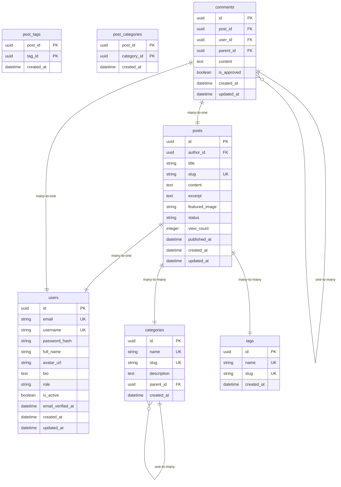

```mermaid
erDiagram
    users {
        uuid id PK
        string email UK
        string username UK
        string password_hash
        string full_name
        string avatar_url
        text bio
        string role
        boolean is_active
        datetime email_verified_at
        datetime created_at
        datetime updated_at
    }
    posts {
        uuid id PK
        uuid author_id FK
        string title
        string slug UK
        text content
        text excerpt
        string featured_image
        string status
        integer view_count
        datetime published_at
        datetime created_at
        datetime updated_at
    }
    categories {
        uuid id PK
        string name UK
        string slug UK
        text description
        uuid parent_id FK
        datetime created_at
    }
    tags {
        uuid id PK
        string name UK
        string slug UK
        datetime created_at
    }
    post_tags {
        uuid post_id PK
        uuid tag_id PK
        datetime created_at
    }
    post_categories {
        uuid post_id PK
        uuid category_id PK
        datetime created_at
    }
    comments {
        uuid id PK
        uuid post_id FK
        uuid user_id FK
        uuid parent_id FK
        text content
        boolean is_approved
        datetime created_at
        datetime updated_at
    }
    posts ||--|| users : "many-to-one"
    posts ||--|| tags : "many-to-many"
    posts ||--|| categories : "many-to-many"
    comments ||--|| posts : "many-to-one"
    comments ||--|| users : "many-to-one"
    comments ||--o{ comments : "one-to-many"
    categories ||--o{ categories : "one-to-many"
```
