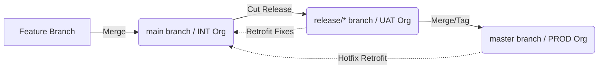
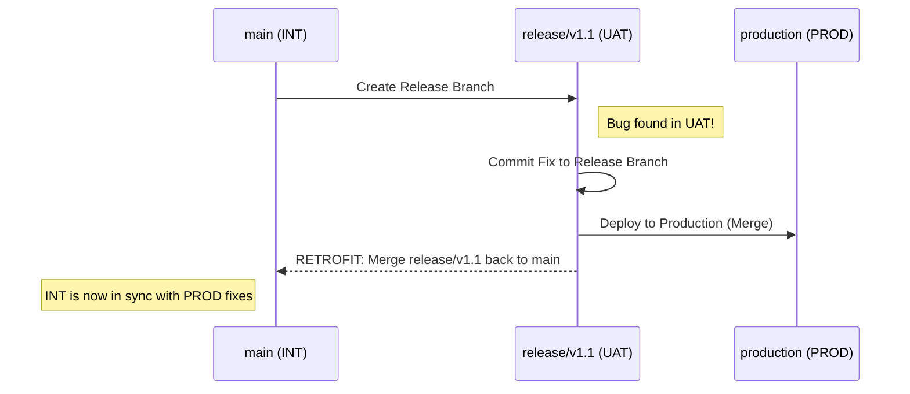

As an expert in **GitOps** and **sfdx-hardis**, I can tell you that the philosophy here is fundamentally different from traditional "Change Set" or "Org-to-Org" mentalities. While tools like Gearset focus on powerful UI-driven comparisons and deployments between environments, `sfdx-hardis` is built to make Salesforce development look and feel like standard application development.

Here is a breakdown of how the **sfdx-hardis** delivery process compares to traditional long-lived branch models and its functional equivalent in Gearset.

---

## 1. The sfdx-hardis Delivery Model

In `sfdx-hardis`, the **Git Repository is the Single Source of Truth**. Unlike Gearset, which often compares two live Orgs to find differences, `sfdx-hardis` compares your **Feature Branch** against the **Target Branch** in Git, then pushes those changes to the Org.

### The Flow: Long-Lived Branches & Retrofit

1. **Development**: Developers work on `feature/` branches and deploy to their own Scratch Orgs or Sandboxes.
2. **Integration (INT)**: Feature branches are merged into `main` (or `develop`). A CI/CD pipeline triggers `sfdx-hardis` to deploy to the INT Org.
3. **Release (UAT)**: When a release is ready, a `release/vX.X` branch is cut from `main`. This triggers deployment to the UAT Org.
4. **Production (PROD)**: Once UAT is signed off, the `release/vX.X` branch is merged into a `production` branch (or tagged), triggering the PROD deployment.
5. **Retrofit**: If a hotfix happens in `release/vX.X` or `production`, `sfdx-hardis` methodologies insist on merging those changes back down to `main` immediately to prevent configuration drift.



---

## 2. Comparison: sfdx-hardis vs. Gearset

While both can achieve GitOps, their "DNA" is different.

| Feature | sfdx-hardis (GitOps Purist) | Gearset (DevOps Platform) |
| --- | --- | --- |
| **Source of Truth** | **Git always.** You never deploy Org-to-Org. | **Hybrid.** Can be Org-to-Org, Git-to-Org, or Org-to-Git. |
| **Comparison Strategy** | Diff between Git branches. Uses `sfdx-hardis` logic to "clean" metadata. | Visual Diff between two environments (Source vs. Target). |
| **Deployment Mechanism** | CLI-based (CI/CD pipelines like GitHub Actions, GitLab CI). | UI-based "Deployment Wizards" or automated CI jobs. |
| **Retrofit / Back-propagation** | Handled via Git merges (e.g., merging `release` back to `main`). | Handled via "Syncing" environments or PRs created via the UI. |
| **Conflict Resolution** | Resolved in Git (Standard Merge Conflicts). | Resolved in Gearset UI during the comparison phase. |

---

## 3. The "Release Branch" & "Retrofit" Process

In the `sfdx-hardis` world, the "Retrofit" is simply a **Git Flow** operation. If a bug is found in UAT, you fix it on the `release/vX.X` branch.

To ensure the `main` branch (INT) doesn't get out of sync, you must **back-merge** that release branch into `main`. This is the equivalent of Gearset's "Back-promotion" or "Environment Syncing."

### Comparison of Retrofit/Sync



---

## 4. Key Differences in "The Comparison"

* **Gearset** excels at **Semantic Comparison**. It understands that the order of XML elements in a `.profile` doesn't matter and hides the noise.
* **sfdx-hardis** handles this via **Pre-processing**. Before committing or deploying, `sfdx-hardis` provides commands to clean, sort, and "pretty-print" metadata so that Git diffs are clean and readable.
* *Example:* `sf hardis:project:clean` ensures your XMLs are formatted identically every time, making the Git comparison as reliable as Gearset's visual diff.


### Which one should you use?

* Use **Gearset** if your team prefers a **GUI** and you frequently need to do "ad-hoc" comparisons between sandboxes without necessarily committing everything to Git first.
* Use **sfdx-hardis** if you want a **pure Git-centric workflow** where every change is audited in code, and you want to avoid license costs by using open-source CLI tools integrated into your existing GitLab/GitHub runners.

**Would you like me to help you draft the GitLab CI or GitHub Actions YAML configuration to automate this sfdx-hardis flow?**

---

Drafting a GitHub Actions configuration for **sfdx-hardis** requires a structure that maps your Git branches to your Salesforce Orgs.

The `sfdx-hardis` philosophy relies heavily on **Environment Variables** to define which Org the CLI should connect to. Below is a robust template following the **GitOps** flow we discussed: `main` (INT), `release/*` (UAT), and `production` (PROD).

### Prerequisites

1. **Sfdx-hardis image**: We use the official Docker image to avoid installing dependencies every time.
2. **Auth URL**: You must store your Salesforce Auth URLs (obtained via `sf org display --verbose`) as GitHub Secrets (`AUTH_URL_INT`, `AUTH_URL_UAT`, `AUTH_URL_PROD`).

---

### The GitHub Actions Workflow (`.github/workflows/deploy.yml`)

```yaml
name: Salesforce GitOps (sfdx-hardis)

on:
  push:
    branches:
      - main          # Integration
      - 'release/**'  # UAT
      - production    # Production

jobs:
  deploy:
    runs-on: ubuntu-latest
    container:
      image: sfdxhardis/sfdx-hardis:latest # Use the pre-configured environment

    steps:
      - name: Checkout Code
        uses: actions/checkout@v4
        with:
          fetch-depth: 0 # Important for delta deployments

      - name: Determine Environment
        run: |
          if [[ "${{ github.ref }}" == "refs/heads/main" ]]; then
            echo "ENV_NAME=INT" >> $GITHUB_ENV
            echo "SFDX_AUTH_URL=${{ secrets.AUTH_URL_INT }}" >> $GITHUB_ENV
          elif [[ "${{ github.ref }}" == "refs/heads/release/"* ]]; then
            echo "ENV_NAME=UAT" >> $GITHUB_ENV
            echo "SFDX_AUTH_URL=${{ secrets.AUTH_URL_UAT }}" >> $GITHUB_ENV
          elif [[ "${{ github.ref }}" == "refs/heads/production" ]]; then
            echo "ENV_NAME=PROD" >> $GITHUB_ENV
            echo "SFDX_AUTH_URL=${{ secrets.AUTH_URL_PROD }}" >> $GITHUB_ENV
          fi

      - name: Authenticate to Target Org
        run: |
          echo "${SFDX_AUTH_URL}" > ./auth_url.txt
          sf org login sfdx-url --sfdx-url-file ./auth_url.txt --set-default --alias target_org
          rm ./auth_url.txt

      - name: Deploy Delta Changes
        run: |
          # sfdx-hardis command to deploy only what changed between commits
          # It automatically handles destructive changes and cleaning
          sf hardis:project:deploy:smart --target-org target_org

```

---

### How this mirrors the Gearset/Long-Branch Logic

#### 1. The "Smart" Deployment

In Gearset, you manually pick items. In this YAML, `sf hardis:project:deploy:smart` calculates the **delta** (the difference) between your current commit and the previous successful deployment. It ensures that only modified metadata is pushed, significantly speeding up the process compared to a full `source push`.

#### 2. Comparison Logic

* **sfdx-hardis**: Uses `git diff` logic. It relies on the fact that you ran `sf hardis:project:clean` locally before pushing, so the XML formatting in Git matches exactly what Salesforce expects.
* **Gearset**: Would run a "Problem Analyzer" here. `sfdx-hardis` performs similar checks during the `smart` deploy to catch missing dependencies.

#### 3. The Retrofit (Back-Merge)

To handle the **Retrofit** automatically (merging `release` back to `main` after a fix), you can add a specialized "Post-Deploy" step.

```yaml
      - name: Retrofit Fixes (UAT to Main)
        if: startsWith(github.ref, 'refs/heads/release/')
        run: |
          git config user.name "github-actions-bi"
          git config user.email "actions@github.com"
          git checkout main
          git merge ${{ github.ref_name }} --no-edit
          git push origin main

```

---

### Comparison Summary for your Pipeline

| Stage | Action in sfdx-hardis Pipeline | Equivalent in Gearset |
| --- | --- | --- |
| **Validation** | `sf hardis:project:deploy:smart --checkonly` | "Compare & Deploy" (Simulation mode) |
| **Deployment** | Triggered by `push` to branch | "CI Job" triggered by PR/Commit |
| **Retrofit** | Git Back-merge step (as shown above) | "Sync Sandbox" / Back-propagation PR |
| **Cleaning** | Automated XML sorting/cleaning in CLI | Gearset's internal metadata "rendering" |

**Would you like me to add a "Quality Gate" step to this YAML that runs Apex Tests and calculates code coverage using sfdx-hardis?**
